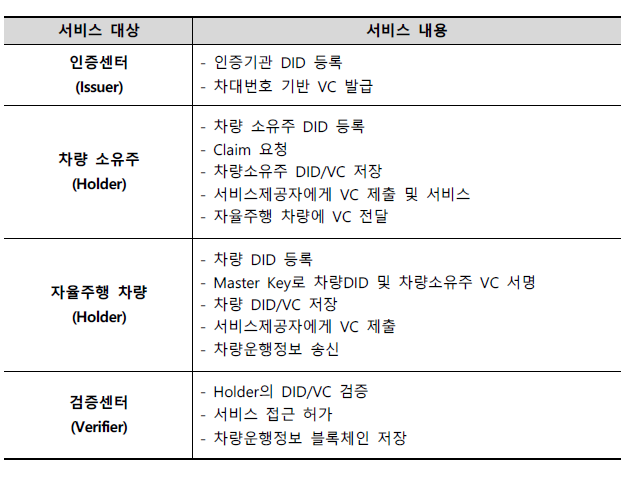
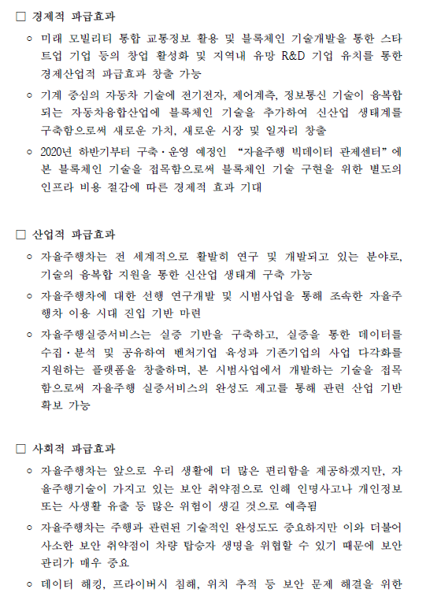

# RFP

## 프로세스

사업 구상 - **제안 요청서** 배포 - 제안서 제출 - 제안서 심사 - 제안서 작성 - 프로젝트 시작 및 수행 - 프로젝트 종료 및 제품인도

## RFP 주요 내용 

1. 목표 설정

2. 요구사항 명세
3. 구현 요소 정리
4. 제약 조건 도출
   * 라떼판다와 Can통신 - device에 대한 제약 조건
5. (현실적으로 가능한) 일정 수립

## 지향요소

1. 명확성 /단순성
2. 가능성
3. 자원 적극 활용

### cf ) 지양요소

1. 불명확
2. 다양한 기능 탑재
   * 일정과 직결
   * 핵심 기능 하나를 기반으로 기획
3. 폐쇄적 기획
   * 여러 의견 적극적으로 반영

## 모범 사례

**블록체인 기반 자율주행자동차 신뢰 플랫폼 구축 시범사업 (세종특별자치시)**

* 구체적인 제안 사항

* 파급 효과 작성

* 멘토 연락처

한 섭 010-9413-7123

icare001@naver.com

이진호 010-6209-6297

jammun@naver.com

김희원 010-2224-6128

futurian@naver.com

* 차량 통신 시 두개의 라떼판다 필요

- ecu 엔진 통신
  - GND,통신선 두개 필요
  - 이를 해결하기 위해 CAN 통신 사용
  - 센서 여러개를 두개의 선으로 연걸한게 CAN 
- CAN데이터 -> 라떼판다(WINDOW)에 입력
  - CAN converter랑 panda보드사이의 serial 통신

* Server 구현(PC) - HTTP , TCP/IP (Android )

* CAN 통신 프로토콜 - [OBD -2 PIDs](https://en.wikipedia.org/wiki/OBD-II_PIDs#Services)

  * OBD-2 Connector

  * PID 

    * 05 : 냉각수 측정

      ack, response를 해야하지만, 주기적으로 데이터 보내는 것 정도로만 구현

  

* Window8 RealSYS