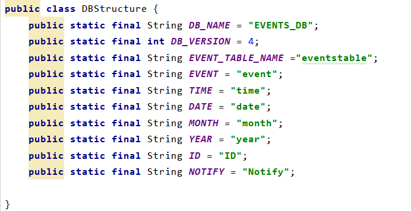

# Among - Calendar

* 프로젝트 Design Editor 안나올 때 
  * sync 맞춰주기


* 매개변수 

```java
Calendar calendar = Calendar.getInstance(Locale.KOREA);
SimpleDateFormat dateFormat = new SimpleDateFormat("YYYY MMMM",Locale.KOREA);
    SimpleDateFormat monthFormat = new SimpleDateFormat("MMMM",Locale.KOREA);
    SimpleDateFormat yearFormat = new SimpleDateFormat("yyyy",Locale.KOREA);
    SimpleDateFormat eventDateFormat = new SimpleDateFormat("yyyy-MM-dd",Locale.KOREA);
```

* Month 이동

```java
PreviousButton.setOnClickListener(new OnClickListener() {
            @Override
            public void onClick(View v) {
                calendar.add(Calendar.MONTH,-1);
                SetupCalendar();
            }
        });
NextButton.setOnClickListener(new OnClickListener() {

            @Override
            public void onClick(View v) {
                calendar.add(Calendar.MONTH,1);
                SetupCalendar();
```

* GridView 
  * 날짜 출력 (작은 네모)


* Calendar `getInstance()`
  * *return **createCalendar**(TimeZone.getDefault(), Locale.getDefault(Locale.Category.FORMAT));*


----> 여기까지 화면 호출 시 발생되는 코드

- 알람 셋팅 시 같이 호출되는 메서드

```java
private int getRequestCode(String date,String event,String time){
    int code = 0;
    DateHelper = new DateHelper(context);
    SQLiteDatabase database = DateHelper.getReadableDatabase();
    Cursor cursor = DateHelper.ReadIDEvents(date,event,time,database);
    while(cursor.moveToNext()){
        code = cursor.getInt(cursor.getColumnIndex(DBStructure.ID));
    }
    cursor.close();
    DateHelper.close();

    return code;
}
```

* 알람 설정 메서드

```java
private  void  setAlarm(Calendar calendar,String event,String time,int RequestCode){
    Intent intent = new Intent(context.getApplicationContext(),AlarmReceiver.class);
    //AlarmReciever에 값 전달.
    intent.putExtra("event",event);
    intent.putExtra("time",time);
    intent.putExtra("id",RequestCode);
    PendingIntent pendingIntent = PendingIntent.getBroadcast(context, 				RequestCode,intent,PendingIntent.FLAG_ONE_SHOT);
    AlarmManager alarmManager = (AlarmManager)context.getApplicationContext().getSystemService(Context.ALARM_SERVICE);
    alarmManager.set(AlarmManager.RTC_WAKEUP,calendar.getTimeInMillis(),pendingIntent);
}
```

* 해당 날짜로 event 불러오기


* event 저장

```java
public void SaveEvent(String event,String time,String date, String month, String year,String notify){
    DateHelper = new DateHelper(context);
    SQLiteDatabase database = DateHelper.getWritableDatabase();
    DateHelper.SaveEvent(event,time,date,month,year,notify,database);
    DateHelper.close();
    Toast.makeText(context,"EVENT가 저장되었습니다 !",Toast.LENGTH_SHORT).show();
}
```

*  페이지 초기화

```java
private void InitializeLayout(){
    LayoutInflater inflater = (LayoutInflater)context.getSystemService(Context.LAYOUT_INFLATER_SERVICE);
    View view = inflater.inflate(R.layout.calendar_layout,this);
    NextButton = view.findViewById(R.id.nextBtn);
    PreviousButton = view.findViewById(R.id.previousBtn);
    CurrentDate = view.findViewById(R.id.currentDate);
    gridView = view.findViewById(R.id.gridView);
}
```

* Calendar 셋팅 메서드

```java
private void SetupCalendar(){
    String currentDate = dateFormat.format(calendar.getTime());
    CurrentDate.setText(currentDate);
    dates.clear();
    Calendar monthCalendar = (Calendar)calendar.clone();
    monthCalendar.set(Calendar.DAY_OF_MONTH,1);
    int FirstDayOfMonth = monthCalendar.get(Calendar.DAY_OF_WEEK)-1;
    monthCalendar.add(Calendar.DAY_OF_MONTH,-FirstDayOfMonth);
    CollectEventsPerMonths(monthFormat.format(calendar.getTime()),yearFormat.format(calendar.getTime()));

    while (dates.size()<MAX_CAlENDAR_DAYS){
        dates.add(monthCalendar.getTime());
        monthCalendar.add(Calendar.DAY_OF_MONTH,1);
    }
    myGridAdapter = new MyGridAdapter(context,dates,calendar,eventsList);
    gridView.setAdapter(myGridAdapter);
}
```

* DB 구조

