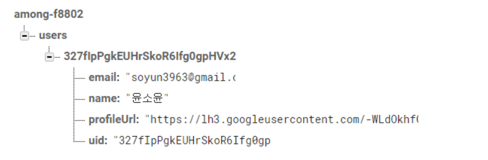
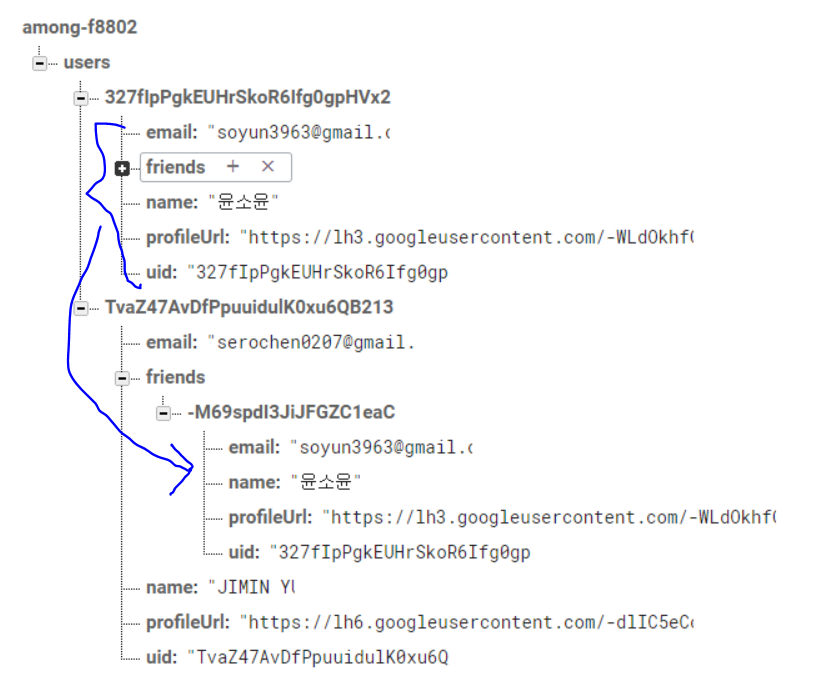

# Among -Chatting

>  RealtimeDatabase를 데이터 실시간 갱신하여 누구나 대화를 하는 로직이 아닌 실제로 친구를 등록하고, 등록한 친구들과 서로 대화를 주고 받도록. 

* SPA: 단일 페이지 웹 어플리케이션으로 첫 페이지로딩 후 화면 갱신 없이 모든 서비스가 한 화면에서 이루어지는 웹 사이트

* 구글 로그인 구현

  * 로그인 정보 수집

  

* 친구 추가

클라이언트끼리 대화하기

프로토콜
- 접두사로 구분한다.
- /로 구분한다.
1. new : 새로운 클라이언트가 입장
2. old : 기존 사용자 정보를 새로 입장한 클라이언트에게 보내는 작업을 수행

<<채팅하기 위한 작업>>
1. 서버
   - 서버는 사용자 접속을 모두 처리할 수 있도록 무한루프로 동작해야 한다.
         기존의 모든 작업과 별도로 수행되어야 하므로 쓰레드로 처리한다.
   - 클라이언트가 접속하면 클라이언트의 정보를 서버의 메모리에 등록하고 모든 서비스를 
          제공할 수 있도록 한다. 이때 유연한 처리를 위해서 User클래스를 만들어서 사용한다.
   - 클라이언트가 입장하면 User클래스가 생성된다.
   - 만약 기존의 서버에 등록된 클라이언트 리스트가 있다면 모든 클라이언트들에게
         새로운 사용자가 접속했음을 알려주어야 한다.
         따라서 서버가 모든 클라이언트들에게 메시지를 보내는 작업 역시 쓰레드로 처리한다.
   - 클라이언트가 보내오는 메시지도 실시간으로 받고 알려주어야 하므로 쓰레드로 처리한다.
   - 클라이언트가 처음 접속했을때 기존 클라이언트들에게도 알려주어야 하지만 
         기존클라이언트에 대한 정보도 새로운 클라이언트에게 알려주어야 한다. 
   
2. 클라이언트
   - 서버가 전송하는 메시지를 받아서 처리, 이때 서버가 전송하는 메시지를 실시간으로 받을
         수 있도록 쓰레드로 처리
   - 서버가 보내오는 모든 메시지를 각각의 경우에 따라 다르게 처리해야 하므로 미리 
          정의한 프로토콜별로 분리해서 처리하는 작업을 구현
     new나 old인 경우 모두 nickname을 저장한 Vector에 등록
     
   
   
   
   
   
   
   
   네트워크
     - url로 요청한다.
     - 인증정보를 보낸다.
   
          * 데이터를 보내야 하는데 JSON을 이용해서 보낸다.
   
             자바스크립트에서 객체를 만들때 사용하는 표현식
     - json parsing : 자바가 이해할 수 있게 변환하는 과정
   
     - Serializable
       
   
   
   
   
   
    