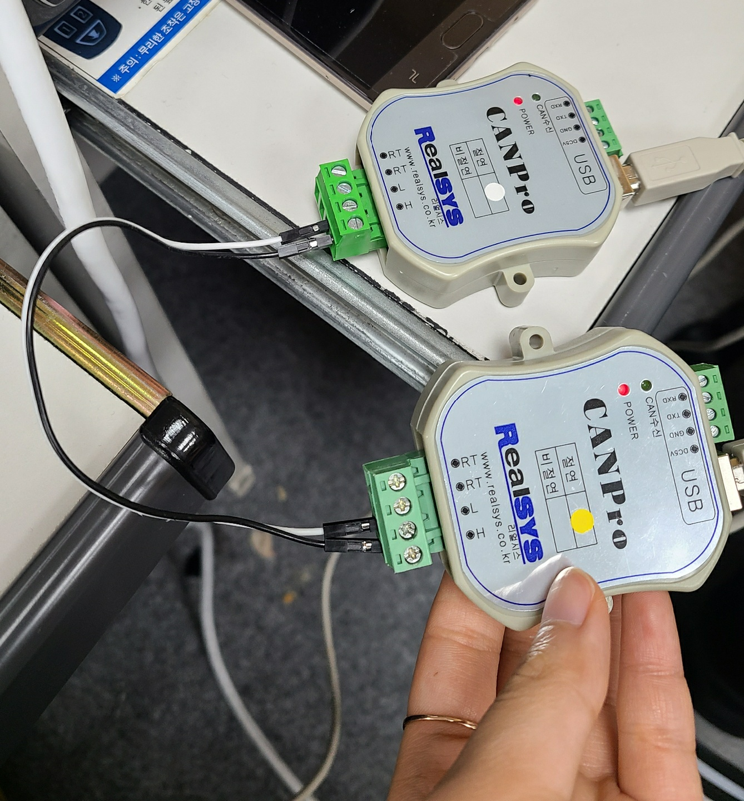

# IoT(Internet of Things)

* **can 통신** : 하나의 장비 안에 여러가지 장치가 존재할 때 이러한 장비를 연결해줄 수 있는 제어 장치 
  * 융합 (기종이 다른 서버끼리 서로 통신 가능) + 보안(시큐어 코드 적용) 

감리? sw 분석 ...


* 동기 통신
* 비동기 통신 *ex) web - ajax / web server 구축 - node.js* 


> socket 


사물을 엮어서 통신을 할 수 있도록..

## CAN 통신

> • 1985년 벤츠의 의뢰로 Bosch사에서 차량 네트워크용으로 최초로 개발
>
> • 1980년대까지 자동차는 대부분 기계식
>
> • 기술의 발전으로 인하여 자동차에 다양한 모듈(ECU) 들이 생기기 시작
>
> • UART의 통신은 각 모듈이 1:1 통신을 해서 모듈이 추가될 때마다 더 많은 연결선이 필요


* CAN 프로토콜 :  Multi Master 통신

  * 원래는 Master 1개지만 can은 master가 여러개가 될 수 있다.
  * 양방향 / 브로드캐스트 통신

  

* CAN 통신에서 데이터는 **메시지 프레임**을 사용하여 송수신이 이루어진다

  * Head tail 단(페이로드)에 메시지가 존재
* 각각의 Message는 자신의 고유 ID를 갖는다
  
  * CAN 2.0B = 29bit
  
  * Message 충돌의 **중재**는 ID를 통하여 우선 순위 결정
  * 수신 node는 message ID를 check 하여 무시 또는 저장
* 각 ECU는 고유의 ID가 존재하는데 이 ID값이 작을 수록 우선순위가 높다.
  * 메시지 프레임은 하나 또는 그 이상의 송신 노드로부터 데이터를 수신 노드로 전송한다


* 장치 연결
  * `RealSYS USB CANPro Analyzer Device` 확인


* CANPro


* 환경설정


* CAN 통신의 시작 문자  : `:`
* 끝문자 : `0X0d`


* 프로토콜 `CAN2.0B`로 설정

  * 연결된 can장비는 모두 동일한 bps를 가지고 있어야 한다.
  * `Hex` : 통신 구분 ID
  * `Hex`값 통해서 데이터 송수신
    * 악성코드가 들어가지 않게 작업해야 한다.(해석하지 못하게 만들 수도 있음) 

  \

* Can 연결




* CAN 장비가 포트를 전부 사용하기 때문에 켜져있으면 JAVA를 사용할 수 없으니 조심


### CheckSum

* 에러 검출 코드

* 통신 프로토콜 Frame에서 시작 문자, 끝 문자를 제외한 나머지를 모두 더한 후 0xff로 And 연산한 결과의 1바이트 값에 대응하는 Hex ASCII 문자열

  *ex) 통신 프로토콜 Frame(시작 문자, 끝 문자 제외) : “G10”인 경우* 

   *Check Sum = (‘G’ + ‘1’ + ‘0’) & 0xff한 Hex ASCII 문자열*

```text
1111
1101
-------
`&` 1101 
`|` 1111
```


### 데이터 수신

* 보내고 싶은 메시지를 조합해서 `HexString` 으로 보낸다.


### 데이터 송신

