# 라떼 판다

Pos, 키오스크...

window 10기반, arduino : 8bit

라즈베리파이 - 라즈베리 전용 os/32bit\

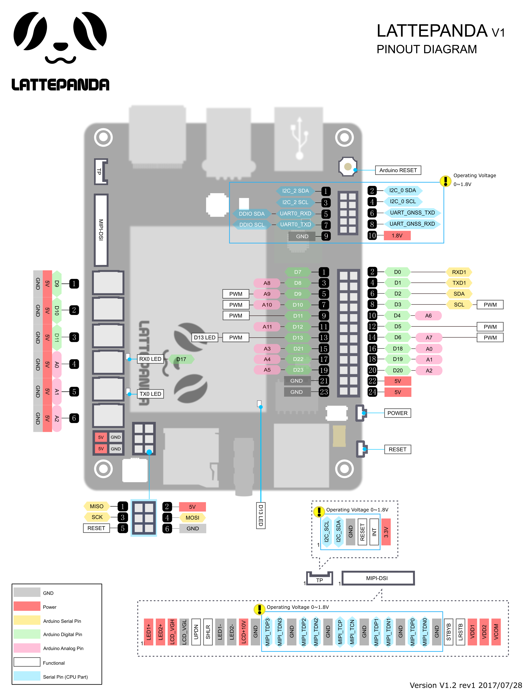

## [Arduino](https://www.arduino.cc/)


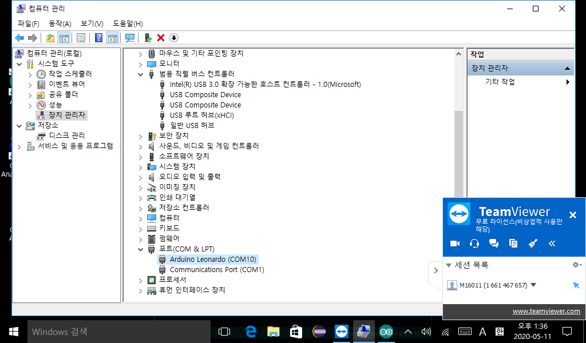

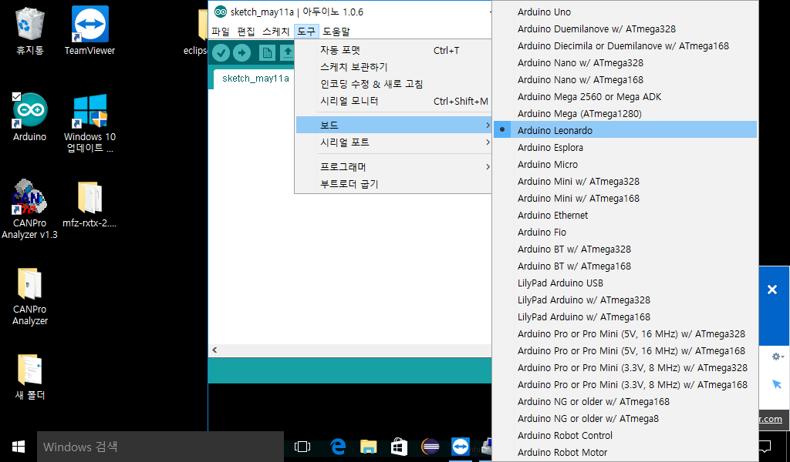

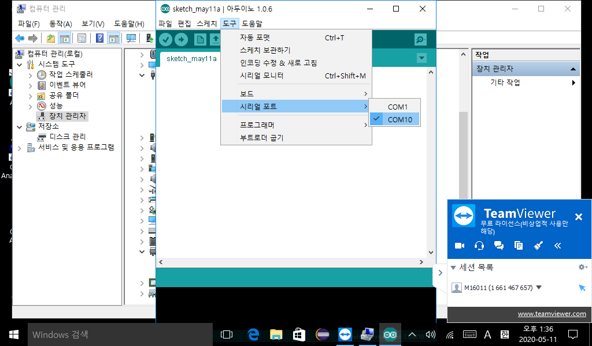


* 컴파일 설정 

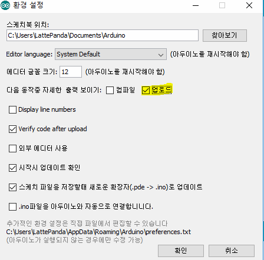

* 프로그램 작성 - > sketch

  * [reference](https://www.arduino.cc/reference/en) 참고

  * 시리얼 모니터 

    * 시리얼 통신 : 직렬 통신

    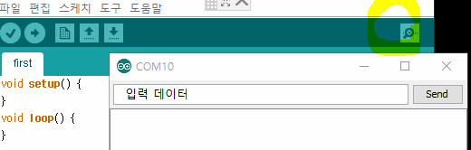

  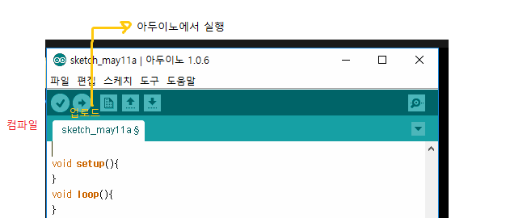

  * void setup()  : init 메서드 - 한번만 실행된다
    * Pin setting

  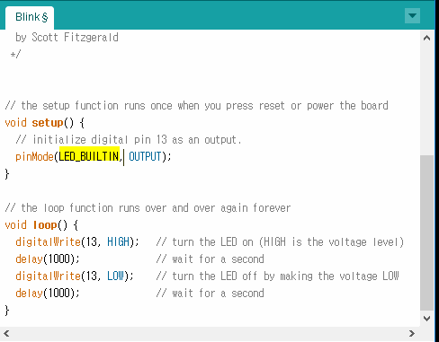

  * 내장된 LED-BUILTIN을 사용해서 동작
  * loop 계속 반복되는 동작
    * HIGH - 5V : ON
    * LOW - 0V : OFF
    * delay (!000) : 1초에 한번씩 blink 됨

```c
void setup(){
    //시리얼 통신 시작하겠다는 의미
    //시리얼 통신의 기본 작업 준비
    Serial.begin(9600); //통신속도(baud)
} void loop() {
  Serial.println("Hello arduino");
  delay(1000);
}
```

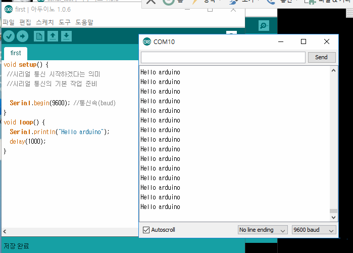

```c
void setup(){
  Serial.begin(9600);
}
void loop(){
  Serial.println("READY ....");
  delay(3000);
    if(Serial.availa ble()>0){
    //Serial.read() 는 한 바이트씩 읽고 읽은 바이트를 버퍼에서 지운다.
    // 읽을 값이 없으면 -1 리턴
    //버퍼의 맨 앞에 바이트를 하나 읽고
   // 읽을 때마다 읽은 바이트가 사라지면서 버퍼에 남은 데이터가 하나씩 담겨진다.
    if(Serial.read()=='s'){
	//센서나 led 등 엑추에이터 장치를 동작하라고 명령
     Serial.println("start,,,");
    }else{
      //센서나 led 등 엑추에이터 장치를 stop하라고 명령
        Serial.println("stop....");
       
    }
}
```

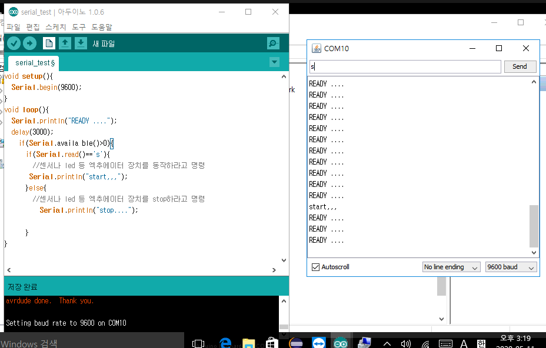

* 행동을 실행할 수 있는 장치 : 엑추에이터
* `Serial.available()`: 입력값이 있는 지 판단 
  * 통신으로 입력받는 값을 읽기 전에 반드시 체크하고 시작,
  * 시리얼 통신이 가능한지 체크

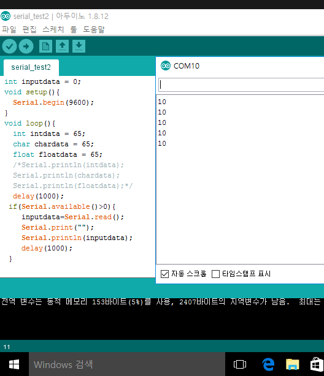

* read는 1byte읽고 나머지를 읽는다

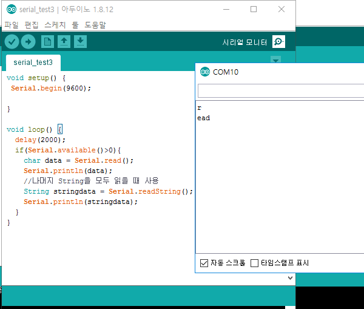