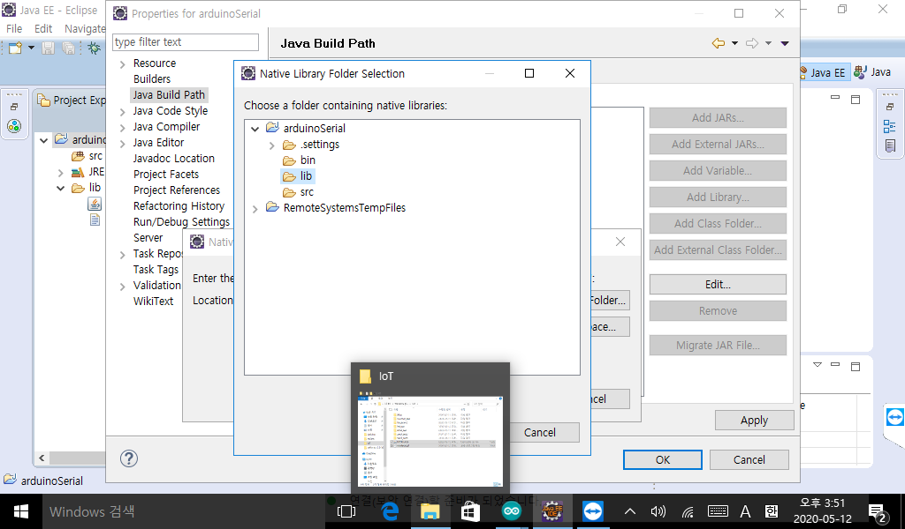

## Led

변수 선언 시 센서 커넥터 이름(PIN number) 그대로 정의

외부에서 아두이노로 들어오는 값을 입력 받는 시리얼 모니터 

디지털 데이터 사용 - digitalWrite

```C
int pin = A2;
void setup() {
  //아두이노의 입출력핀을 초기화
  //pinMode(사용하는 핀 번호, 핀의 용도)
  //핀의 용도 : OUTPUT => OUTPUT용 핀  INPUT => INPUT용 핀
  pinMode(pin,OUTPUT);
}

void loop() {
  //디지털 핀의 전압을 LOW,HIGH로 설정 
  //LOW : 0V, HIGH : 5V
  digitalWrite(pin,HIGH);
  delay(1000);
  digitalWrite(pin,LOW);
  delay(1000);
}
```


* Pin 3개 번갈아서 띄우기

```c
int pin[3] = {A0,A1,A2};
int pin_length = sizeof(pin)/sizeof(int);

void setup() {
  for(int i =0;i<pin_length;i++){
  	pinMode(pin[i],OUTPUT);
 }
}

void loop() {
  for(int i=0;i<pin_length;i++){
    digitalWrite(pin[i],HIGH);
    delay(1000);
    digitalWrite(pin[i],LOW);
    delay(1000);
  }
}
```

* `readStringUtil('\n')` : `\n`을 제외하고 읽기
  * `\n`의 앞 문자열만 읽기


## Can 과 장비의 Serial 통신

* 라떼판다와 아두이노 사이의 시리얼 통신
  * 

* 아두이노와 can 사이의 통신
  * led on /led off

* [rxtx](http://rxtx.qbang.org/wiki/index.php/Download) 





```c
package basic;

import gnu.io.CommPort;
import gnu.io.CommPortIdentifier;
import gnu.io.NoSuchPortException;
import gnu.io.PortInUseException;

public class SerialConnectionTest {
	public SerialConnectionTest(){
		
	}
	public void connect(String portName){
		try {
			//COM포트가 실제 존재하고 사용가능한 상태인지 확인
			CommPortIdentifier comportIdentifier = 
					CommPortIdentifier.getPortIdentifier(portName);
			if(comportIdentifier.isCurrentlyOwned()){
				System.out.println("포트 사용할 수 없습니다 ");
			}else{
				System.out.println("포트 사용 가능");
				//port가 사용 가능하면 포트 열고 포트 객체 얻어오기
				//매개변수 1 : 포트를 열고 사용하는 프로그램의 이름(문자열)
				//매개변수2 : 포트를 열고 통신하기 위해 기다리는 시간(밀리세컨드)
				CommPort commPort = comportIdentifier.open("basic_serial",3000);
				System.out.println(commPort);
			}
		} catch (NoSuchPortException e) {
			e.printStackTrace();
		} catch (PortInUseException e) {
			e.printStackTrace();
		}
		
	}
	public static void main(String[] args) {
		new SerialConnectionTest().connect("COM10");
	}

}

```

