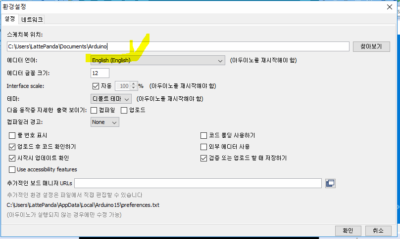

## Led 조작

변수 선언 시 센서 커넥터 이름(PIN number) 그대로 정의

외부에서 아두이노로 들어오는 값을 입력 받는 시리얼 모니터 

디지털 데이터 사용 - digitalWrite

```C
int pin = A2;
void setup() {
  //아두이노의 입출력핀을 초기화
  //pinMode(사용하는 핀 번호, 핀의 용도)
  //핀의 용도 : OUTPUT => OUTPUT용 핀  INPUT => INPUT용 핀
  pinMode(pin,OUTPUT);
}

void loop() {
  //디지털 핀의 전압을 LOW,HIGH로 설정 
  //LOW : 0V, HIGH : 5V
  digitalWrite(pin,HIGH);
  delay(1000);
  digitalWrite(pin,LOW);
  delay(1000);
}
```


* Pin 3개 번갈아서 띄우기

```c
int pin[3] = {A0,A1,A2};
int pin_length = sizeof(pin)/sizeof(int);

void setup() {
  for(int i =0;i<pin_length;i++){
  	pinMode(pin[i],OUTPUT);
 }
}

void loop() {
  for(int i=0;i<pin_length;i++){
    digitalWrite(pin[i],HIGH);
    delay(1000);
    digitalWrite(pin[i],LOW);
    delay(1000);
  }
}
```

* `readStringUtil('\n')` : `\n`을 제외하고 읽기
  * `\n`의 앞 문자열만 읽기


## Can 과 장비의 Serial 통신

> App -> was (server) 요청 -> Pad 
>
> 		* Iot - can 사이의 serial 통신
> 		* 나머지는 tcp 통신


* 차량 내부 통신 : 시리얼 통신

* 차량 외부와 통신 : tcp 통신


* 라떼판다와 아두이노 사이의 시리얼 통신
* 아두이노와 can 사이의 통신
  * led on /led off
* 라즈베리 파이에 Os 설치 - 서버 제작 
  * 몽고디비에 데이터 저장
  * Ajax 이용해서 실시간 데이터 호출 (ex 계기판)

### 라이브러리 추가

* [rxtx](http://rxtx.qbang.org/wiki/index.php/Download) 다운로드


```c
public class SerialConnectionTest {
	public SerialConnectionTest(){
		
	}
	public void connect(String portName){
		try {
			//COM포트가 실제 존재하고 사용가능한 상태인지 확인
			CommPortIdentifier comportIdentifier = 
					CommPortIdentifier.getPortIdentifier(portName);
			if(comportIdentifier.isCurrentlyOwned()){
				System.out.println("포트 사용할 수 없습니다 ");
			}else{
				System.out.println("포트 사용 가능");
				//port가 사용 가능하면 포트 열고 포트 객체 얻어오기
				//매개변수 1 : 포트를 열고 사용하는 프로그램의 이름(문자열)
				//매개변수2 : 포트를 열고 통신하기 위해 기다리는 시간(밀리세컨드)
				CommPort commPort = comportIdentifier.open("basic_serial",3000);
				System.out.println(commPort);
			}
		} catch (NoSuchPortException e) {
			e.printStackTrace();
		} catch (PortInUseException e) {
			e.printStackTrace();
		}
	}
	public static void main(String[] args) {
		new SerialConnectionTest().connect("COM10");
	}
}
```


* 환경 설정 (언어)




## 시리얼 통신

1. `CommportIdentifier`를 포트의 유효성과 통신 가능상태인지 점검

2. `CommportIdentifier`의 open 메소드를 이용해서 시리얼 통신을 할 수 있는 준비상태로 셋팅

   - 시리얼 통신을 하기 위해 필요한 포트객체가 리턴

3. `CommPort`는 종류가 2가지

   * Serial
   * Parallel

   * **Can통신** : Serial 통신, 아두이노와 라떼판다도 Serial 통신
     * 각 상황에 맞는 `CommPort` 객체를 얻어야 작업할 수 있다.

4. `Commport`를 `SerialPort `로 casting

5. `SerialPort` 객체의 `setSerialPortParams` 메소드를 이용해서 Serial통신을 위한 기본 내용을 설정

   * Serial포트를 open하고 설정을 잡아놓은 상태
   * 전달되는 데이터를(data frame) 받을 수 있는 상태

   ```java
   serialPort.setSerialPortParams(9600, //시리얼 포트의 속도(9600baud)
   					SerialPort.DATABITS_8, ///전송하는 데이터의 길이
                       SerialPort.STOPBITS_1, //STOP BIT 설정
                       SerialPort.PARITY_NONE); ///PARITY비트를 사용하지 않겠다고 설정
   												---------오류 식별자
   ```

6. 데이터를 주고받을 수 있도록 SerialPort객체에서 Input/Output스트림을 얻는 작업

   * **byte**단위(io클래스 관점)로 데이터가 송수신되므로 `Reader`, `Writer` 계열의 스트림을 사용할 수 없고

     inputStream, OutputSream객체를 사용해야 한다. 

   * `시리얼포트객체.getInputStream()`

     `시리얼포트객체.getOutputStream()`

7. 데이터 수신과 송신에 대한 처리

   1) 쓰레드로 처리

   2) 이벤트에 반응하도록 처리