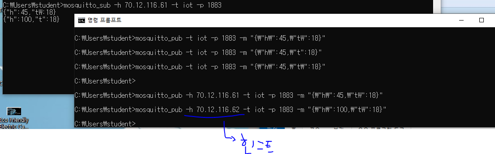

ConnectedCar - 연결 지향성

Android, Web으로 요청 

web - was 동작

android - tcp 서버 제작 - 장치 제어 (Serial 통신)

기술 센서 이용한 데이터 Oracle에 저장할 수 없음

node.js - javascript 기반 비동기 방식

자동 import

# [MQTT](http://mosquitto.org/download/)

>  **MQTT**(Message Queuing Telemetry Transport) : 발행-구독 기반의 메시징 프로토콜이다.

* TCP/IP 프로토콜 위에서 동작한다.
  * IOT와 모바일 어플리케이션 등의 통신에 매우 적합한 프로토콜
* `Broker`, `Publisher`, `Subscriber` 구조

* subscribe (sub) 
* publish(pub) 

* IoT장비 연결 시 사용하는 MQTT

* MQTT 서버

*실행이 되고 있는지 확인해준다.*

sub 1

sub 2

* 서버
  * sub 수신

* pub 

* 메시지 전달

* json 을 이용한 값 전달

* -h : 호스트 주소

