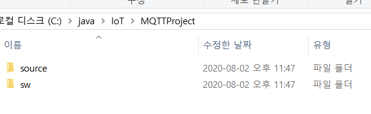
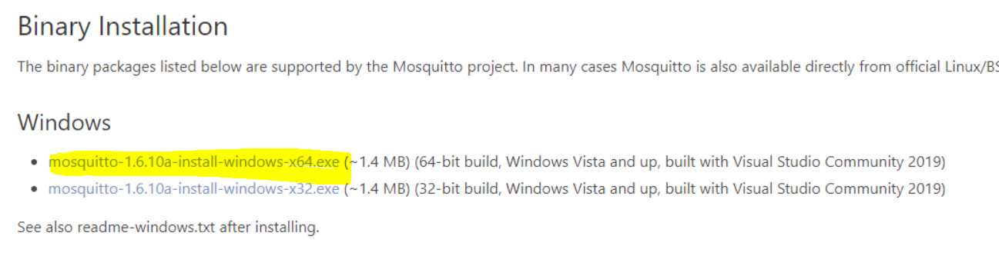
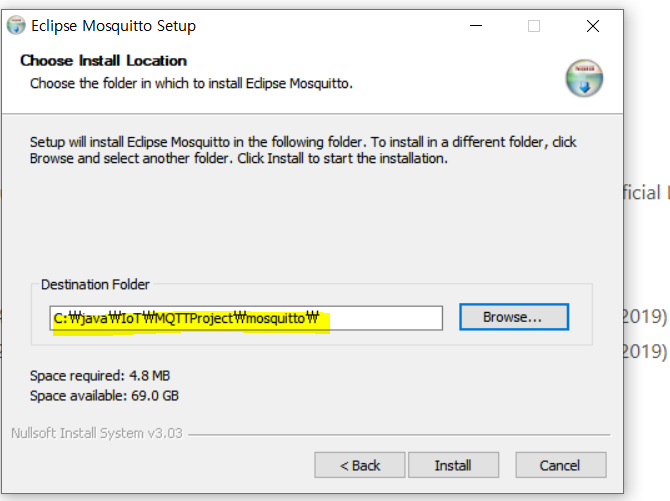
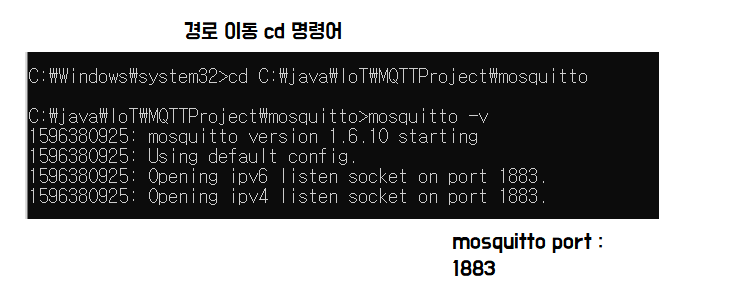
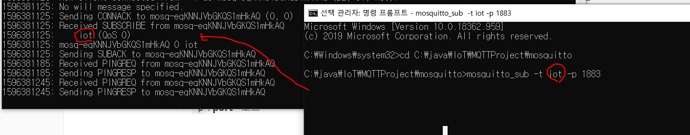

* 준비물

  * DHT11 Sensor : 온습도 센서

    브래드 보드

    LED

    저항 (220Ohm)

    점퍼케이블, 전원케이블

    디렉토리

```markdown
C:\java\IoT\MQTTProject
  ㄴ source
  ㄴ sw
```



* 설치 프로그램
  
  * MQTT
  * Arduino IDE
  * Node.js - 센서데이터 수신
  * MongoDB
  
* 통신 연결주소
  * Wifi 이름, 비밀번호
  
  * IP 주소(ipconfig)
  
    IPv4 주소 . . . . . . . . . : 192.168.35.233


## [MQTT](http://mosquitto.org/)

> pub - 데이터 발행자
>
> sub - 데이터 수신자

* 센서 데이터를 중계해주는 통신 규약
* 센서가 어떤 센서인지 알기 어렵기 때문에 센서를 구별하기 위해 데이터 앞에 센서의 의미를 부여해서 전송한다
* 보드 - MQTT - Node.js





* cmd(관리자 권한으로 실행)에서 서버 구동 -> 서버 구동 창

  

  * 서버는 계속 구동을 시켜놓는다.

* subscriber(구독자) -> 수신 대기창

  * `-t` : **topic** - 임의로 만들어도 된다.
  * `-p` : **port** - 포트

  > mosquitto_sub -t iot -p 1883

  

* 외부에서 연결하는 방법

  * `-h` : **host**

  > mosquitto_sub -h MQTT서버IP주소 -t iot -p 1883

* publisher 실행 -> 메시지 발행창

  > mosquitto_pub -t iot -m "hello"
  >
  > mosquitto_pub -t iot -m "{\"tmp\":25, \"hum\":70}


ip주소와 port번호 - > 소켓 -> 통신


센서 데이터 발행 (pub)

**topic**이라는 이름으로 센서 구별

MQTT가 발행된 데이터를 받아서, topic이름으로 sub


수신자 여러개 만들어도 된다 (sub)


센서 데이터 보낼 대 json데이터 

> mosquitto_pub -t iot -m "{\"tmp\":25,\"hum\":70}"
>
> {"tmp":25,"hum":70}

실제 발행은 아두이노 안에서 api이용해서 구독자 쪽으로 데이터를 보낸다.