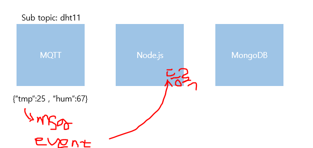
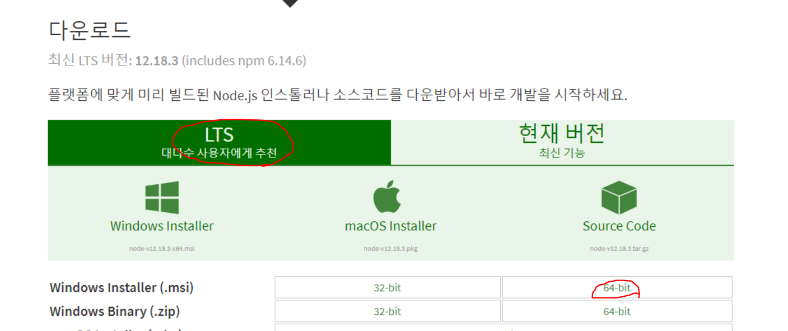
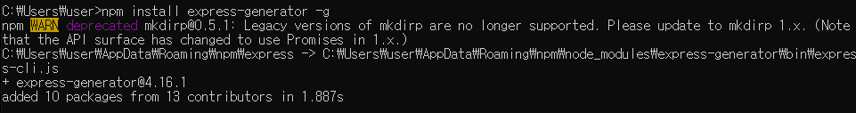
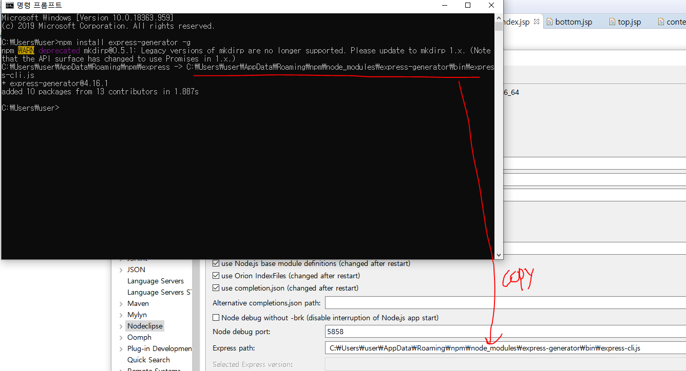
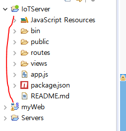

# Node.js

JS기반의 C라이브러리 활용해서 모바일용 서버, 모바일에서 할 수 있는 웹 사이트 구현하는 데 사용하는 서버용 프로그램



* [Node.Js 설치](https://nodejs.org/ko/download/)



* Node.js plugin 설치

> Help - MarketPlace - p2f 설치

* Node.js 개발 

  * 자동으로 Node.js 설치 Path가 매칭되어 있을 것임

* Express 버전 확인 

  * (3.X -> 4.X 버전으로 변경)
  * npm : 모듈 설치 시 사용하는 명령어

  > npm install express-generator -g

  

  

  

  

  * 4.16.1 버전 설치 완료

jade > 화면에 보여주기 위한 html코드 형식

* 디렉토리 구조



* package설치하기

  * dependency : 모듈 설치

  ```json
  {
    "name": "iotserver",
    "version": "0.0.0",
    "private": true,
    "scripts": {
      "start": "node ./bin/www"
    },
    "dependencies": {
      "cookie-parser": "~1.4.4",
      "debug": "~2.6.9",
      "express": "~4.16.1",
      "http-errors": "~1.6.3",
      "jade": "~1.11.0",
      "morgan": "~1.9.1",
      "mqtt": "^2.14.0",
      "mongodb": "^2.2.33",
      "socket.io": "^2.0.4"
    }
  }
  ```

**1. bin - www** 서버 구동

  * run as - node application
  * `127.0.0.1:3000` 웹 서버가 Listening 한다.

**2. app.js**

* `/` 경로에서 어떤 페이지를 처리해서 응답을 해주어야 할 지에 대한 연결고리 설정

  * indexRouter : 처리해야 할 page

  ```js
  app.use('/', indexRouter);
  ```

  ```js
  var indexRouter = require('./routes/index');
  //index.js 실행하라는 요청 이름
  ```

**3. index.js**

* rendering 페이지

  * get방식

  ```js
  router.get('/', function(reg, res, nex){
      res.render('index',{title:'Express'});
  });
  ```

  > render 

**4. index.jade** 실행


# IoT Server 프로그래밍

**MQTT Server에 연결해서 센서데이터 읽어오기 구현**

```json
//mqtt연결
var mqtt = require("mqtt");
var client=mqtt.connect("mqtt://172.30.1.15");
//connect event발생
client.on("connect",function(){
    //익명의 함수
    client.subscribe("dht11");
});
```

topic - if,else문 구별해서 data 읽기

```js
//message event 발생
client.on("message", function(topic,message){
    //string 객체화
    var obj = JSON.parse(message);
    obj.created_at = new Date(); //센서값 전송된 날짜
    console.log(obj);
    
    var dht11=dbObj.collection("dht11");
    dht11.save(obj, function(err, result){
        if(err) console.log(err);
        else
        console.log(JSON.stringify(result));
    });
});
```

* console창에 찍힌 데이터값을 mongodb에 저장 처리