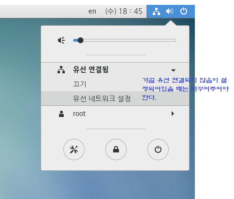
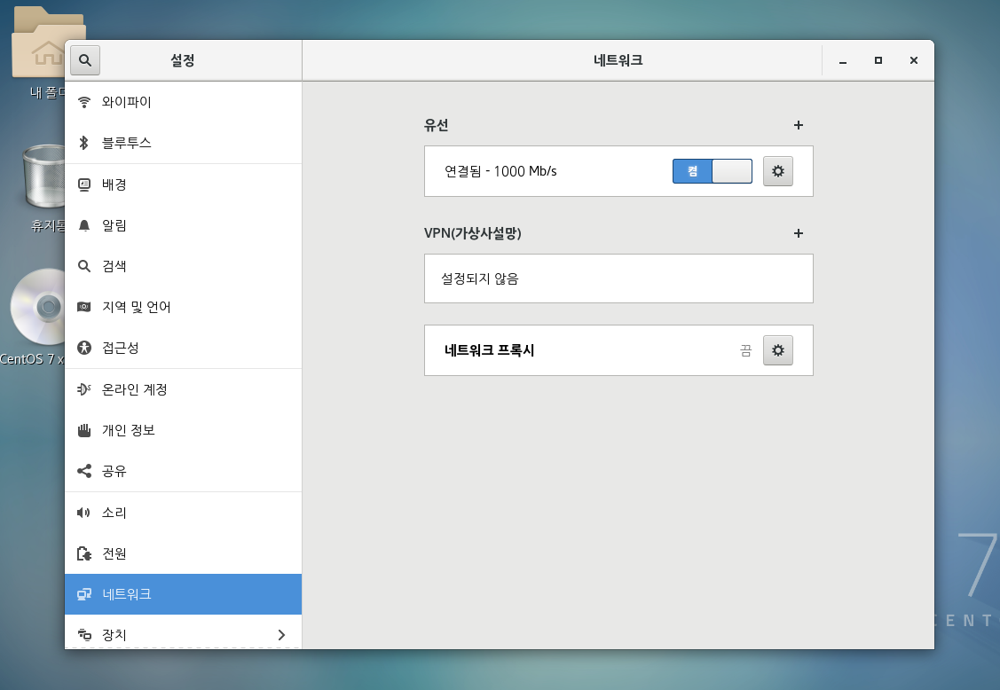
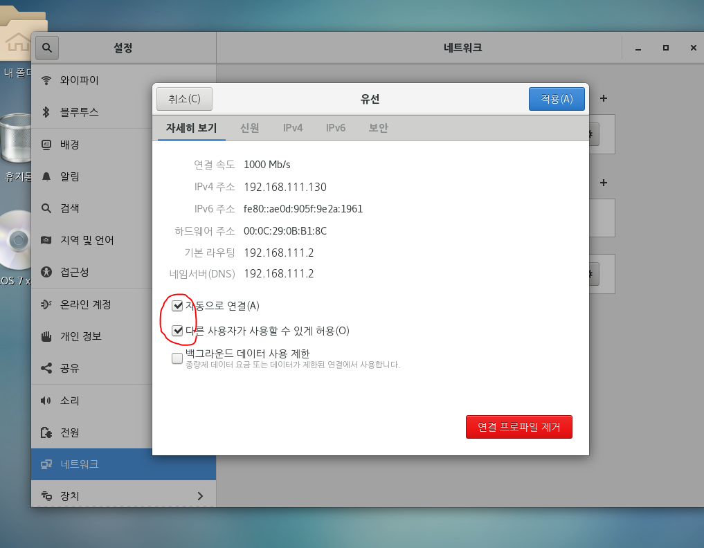

97045410-01163573


<pre>[root@localhost ~]# ls
anaconda-ks.cfg       <font color="#005FFF">공개</font>      <font color="#005FFF">문서</font>      <font color="#005FFF">비디오</font>  <font color="#005FFF">서식</font>
initial-setup-ks.cfg  <font color="#005FFF">다운로드</font>  <font color="#005FFF">바탕화면</font>  <font color="#005FFF">사진</font>    <font color="#005FFF">음악</font>
[root@localhost ~]# 
ls : DIR, 디렉토리를 볼 수 있다.

```LINUX
[root@localhost ~]# su - hadoop							->관리자 계정
[hadoop@localhost ~]$   								-> 일반 계정 
> 계정 접속

```


<pre>[hadoop@localhost ~]$ su -
암호:
마지막 로그인: 화  2월 11 23:18:56 KST 2020 일시 :0
[root@localhost ~]# 
</pre>

home[홈디렉토리]

* 특정 계정으로 로그인 했을 때 자동으로 위치하는 폴더
* 모든 계정은 홈디렉토리를 갖고있다.
* root의 홈 디렉토리 명 root 폴더
* 기본 설정은 홈디렉토리 명이 계정명과 동일


root => 프롬프트 #

일반 계정 => 프롬프트 $

<pre>[root@localhost ~]# cd /
[root@localhost /]# ls
<font color="#00FFFF">bin</font>   <font color="#005FFF">dev</font>  <font color="#005FFF">home</font>  <font color="#00FFFF">lib64</font>  <font color="#005FFF">mnt</font>  <font color="#005FFF">proc</font>  <font color="#005FFF">run</font>   <font color="#005FFF">srv</font>  <span style="background-color:#8AE234"><font color="#000000">tmp</font></span>  <font color="#005FFF">var</font>
<font color="#005FFF">boot</font>  <font color="#005FFF">etc</font>  <font color="#00FFFF">lib</font>   <font color="#005FFF">media</font>  <font color="#005FFF">opt</font>  <font color="#005FFF">root</font>  <font color="#00FFFF">sbin</font>  <font color="#005FFF">sys</font>  <font color="#005FFF">usr</font>
</pre>

계정 @ 호스트명 ~ ]

​								ㄴ `~` 는 홈디렉토리를 말한다.

일반 디렉토리는 파일 시스템의 **/home/** 안에 만들어진다.

<pre>[root@localhost ~]# cd /
[root@localhost /]# ls
<font color="#00FFFF">bin</font>   <font color="#005FFF">dev</font>  <font color="#005FFF">home</font>  <font color="#00FFFF">lib64</font>  <font color="#005FFF">mnt</font>  <font color="#005FFF">proc</font>  <font color="#005FFF">run</font>   <font color="#005FFF">srv</font>  <span style="background-color:#8AE234"><font color="#000000">tmp</font></span>  <font color="#005FFF">var</font>
<font color="#005FFF">boot</font>  <font color="#005FFF">etc</font>  <font color="#00FFFF">lib</font>   <font color="#005FFF">media</font>  <font color="#005FFF">opt</font>  <font color="#005FFF">root</font>  <font color="#00FFFF">sbin</font>  <font color="#005FFF">sys</font>  <font color="#005FFF">usr</font>
[root@localhost /]# cd ~
[root@localhost ~]# ls
anaconda-ks.cfg       <font color="#005FFF">공개</font>      <font color="#005FFF">문서</font>      <font color="#005FFF">비디오</font>  <font color="#005FFF">서식</font>
initial-setup-ks.cfg  <font color="#005FFF">다운로드</font>  <font color="#005FFF">바탕화면</font>  <font color="#005FFF">사진</font>    <font color="#005FFF">음악</font>
</pre>

* directory 만들기

<pre>[hadoop@localhost ~]$ mkdir test
[hadoop@localhost ~]$ ls
<font color="#005FFF">test</font>
</pre>

* 한 단계 빠져나가기

<pre>[hadoop@localhost ~]$ cd test
[hadoop@localhost test]$ cd ..
</pre>

* `/` 는 최상위를 의미

<pre>[hadoop@localhost ~]$ cd /
[hadoop@localhost /]$ cd ~
</pre>







