## 로그 분석

### 적용 사례

* 페이지뷰 분석

* 방문자수 분석

* 신규 방문자 수 , 재 방문자수

* 접속한 날짜와 시간을 로그에 기록한다.

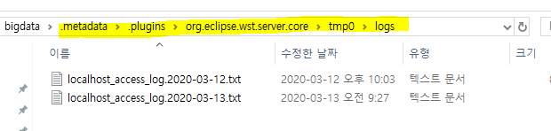

* 모든 access 데이타를 볼 수 있다.

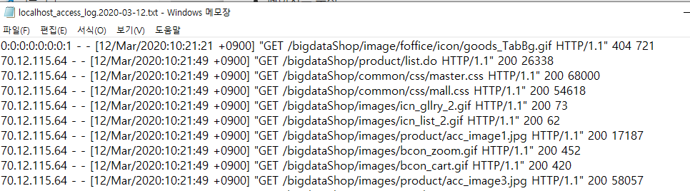

# Apache Flume

* 데이터를 추출하기 위해 사용되는 프로그램으로,

  시스템 로그, 웹 서버의 로그, 클릭 로그, 보안 로그 등 비정형 데이터를 HDFS에 적재하기 위해 사용하는 프로그램.

* 대규모의 로그데이터가 발생하면 효율적으로 수집하고 저장하기 위해 관리

  >  FLUME, CHUKWA, SCRIBE, FLUENTED, SPLUNK (보안)

`source` : 원본 데이터 추출

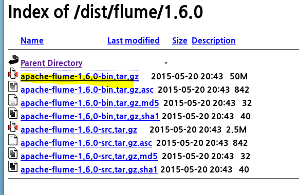

## FLUME 설정

1. **다운로드**

<pre>[hadoop@hadoop01 ~]$ wget http://archive.apache.org/dist/flume/1.6.0/apache-flume-1.6.0-bin.tar.gz
</pre>

2. **.bashrc에 설정 정보 등록**

<pre>[hadoop@hadoop01 ~]$ tar -zxvf apache-flume-1.6.0-bin.tar.gz </pre>

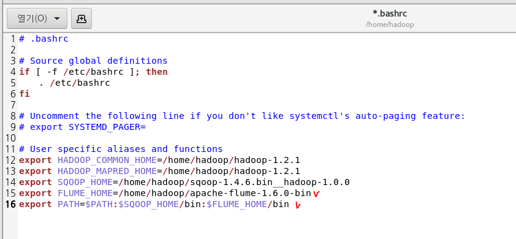

3. **설정파일 설치**
   * flume-env.sh rename하고 정보 등록
     * jdk 홈 디렉토리
     * hadoop 홈디렉토리

<pre>[hadoop@hadoop01 ~]$ source .bashrc
[hadoop@hadoop01 ~]$ cd apache-flume-1.6.0-bin/conf/
[hadoop@hadoop01 conf]$ ls
flume-conf.properties.template  flume-env.ps1.template  flume-env.sh.template  log4j.properties
</pre>

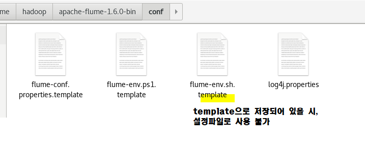

<pre>[hadoop@hadoop01 conf]$ cp flume-env.sh.template flume-env.sh
[hadoop@hadoop01 conf]$ ls
flume-conf.properties.template  flume-env.ps1.template  flume-env.sh  flume-env.sh.template  log4j.properties
</pre>

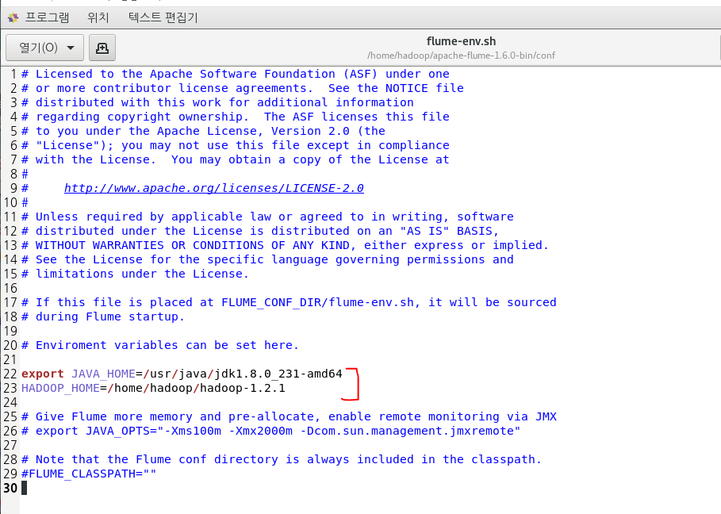

`cp` : 로컬에서 복사

`scp` :  다른 폴더로 복사

4. **flume 설정 파일에 등록**

   <pre>[hadoop@hadoop01 conf]$ cp flume-conf.properties.template console.properties
   </pre>

   - flume-conf.properties.template 을 rename해서 xxxx.properties
   - flume agent의  source,channel,sink에 대한 정보를 등록

###  FLUME의 구성 요소

flume의 **실행 중인 프로세스**를 `agent`라고 부르며, source,channer,sink로 구성

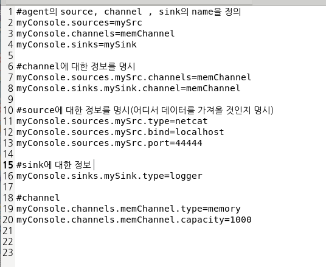

#### 1. source

* 데이터가 유입되는 지정 ( 어떤 방식으로 데이터가 유입되는지 type으로 명시)

  > agent명.sources.source명.type=값

1. type

   * `netcat` : telnet을 통해서 터미널로 들어오는 입력 데이터
     * `bind` : 접속IP, `port` : 접속할 port
   * `spoolDir` : 특정 폴더에 저장된 파일
     * `spoolDir`:폴더명

   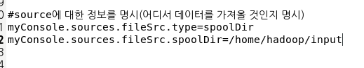

#### 2. channel

* 데이터를 보관하는 곳 (source와 sink 사이의 Queue)

#### 3. sink

* 데이터를 내보내는 곳 ( 어떤 방식으로 내보낼 지)
* 결과물, output을 담당하는 객체

1. type

   * `logger` : flume서버 콘솔에 출력이 전달
     
* flume을 실행할 때 `-Dflume.root.logger=INFO,console`를 추가
  
* `file_roll` : file을 읽어서 가져오는 경우
  
  * `directory` : 읽어온 파일을 저장할 **output폴더**를 명시
  
     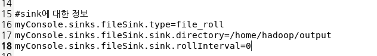

<pre>[hadoop@hadoop01 ~]$ cd apache-flume-1.6.0-bin/
[hadoop@hadoop01 apache-flume-1.6.0-bin]$ ./bin/flume-ng agent -c conf -f ./conf/myfolder.properties -n myConsole
</pre>

* 로그 기록

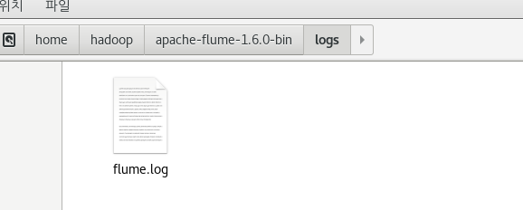

## FLUME의 실행 명령어

* 순서

<pre>
$ bin/flume-ng agent -n $agent_name -c conf -f conf/flume-conf.properties.template
</pre>

* 실행

<pre>[hadoop@hadoop01 apache-flume-1.6.0-bin]$ ./bin/flume-ng agent --conf conf --conf-file ./conf/console.properties --name myConsole
- Dflume.root.logger=INFO,console
----------------------------------source가 telnet으로 입력하는 데이터인 경우
</pre>

*서버이기 때문에 계속 실행 중일 것이다*

* 실행 명령어 : `./bin/flume-ng agent`
* 옵션
  * `--conf` : 설정 파일이 저장된 폴더명 (-c)
  * `--conf-file` :  설정 파일 명(-f)
  * `--name` : agent의 이름(-n)
* `-Dflume.root.logger=INFO,console` : flume의 로그창에 기록

## telnet 설치

: text 통신

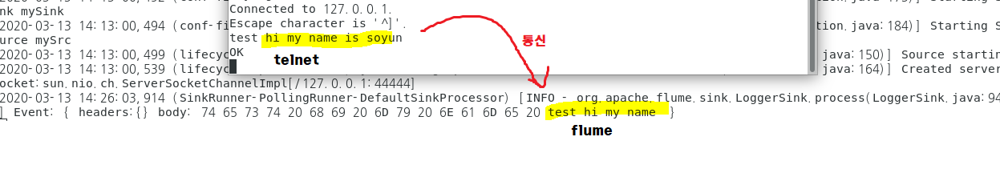

`rmp` : 의존모듈로 설치

<pre>[root@hadoop01 ~]# yum install telnet
</pre>

* telnet - 종료

<pre>^]
telnet&gt; quit
Connection closed.
</pre>

*

<pre>[hadoop@hadoop01 apache-flume-1.6.0-bin]$ cp ./conf/console.properties ./conf/myfolder.properties
[hadoop@hadoop01 apache-flume-1.6.0-bin]$ cd ..
[hadoop@hadoop01 ~]$ mkdir input
[hadoop@hadoop01 ~]$ mkdir output
</pre>

input -> source

output->sinkg

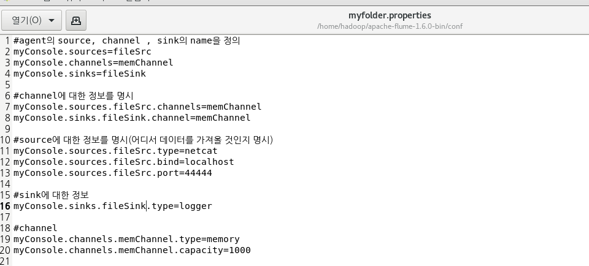

* HDFS.SINK

<pre>[hadoop@hadoop01 apache-flume-1.6.0-bin]$ ./bin/flume-ng agent -c conf -f ./conf/hdfs.properties -n myhdfs
</pre>

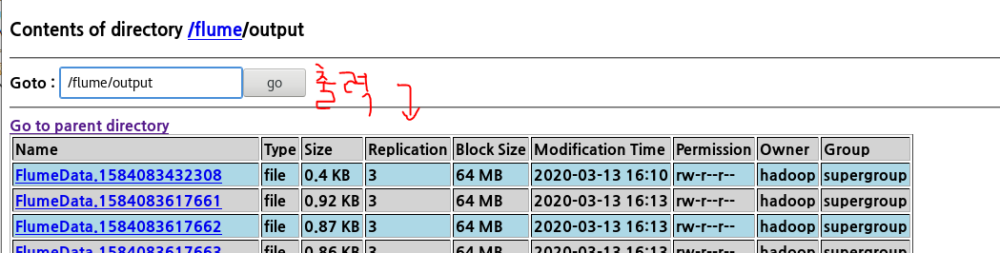

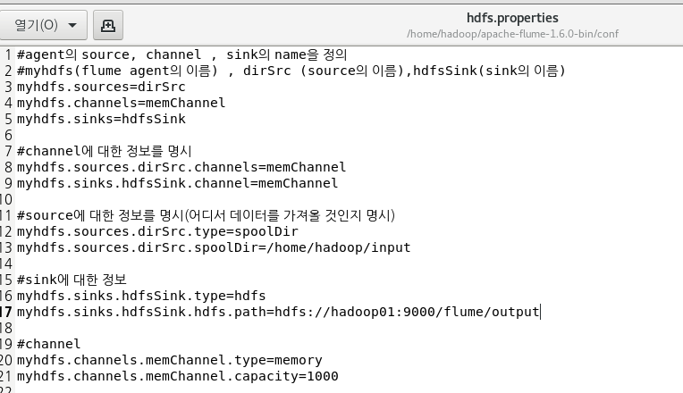

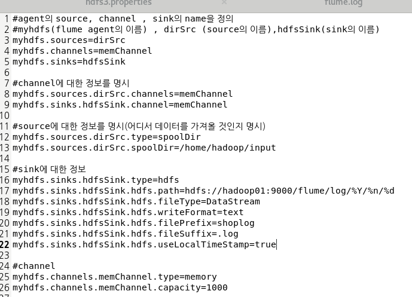

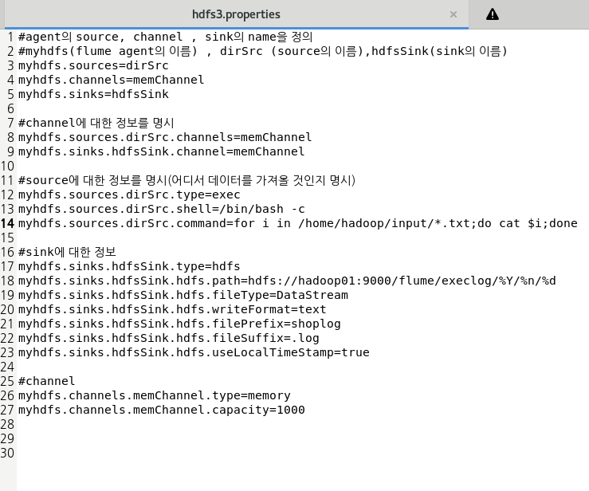

#### 리눅스에서의 한/영 변환

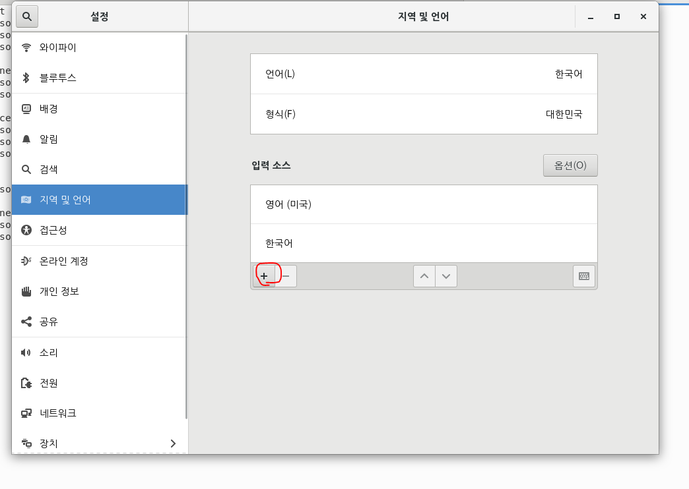

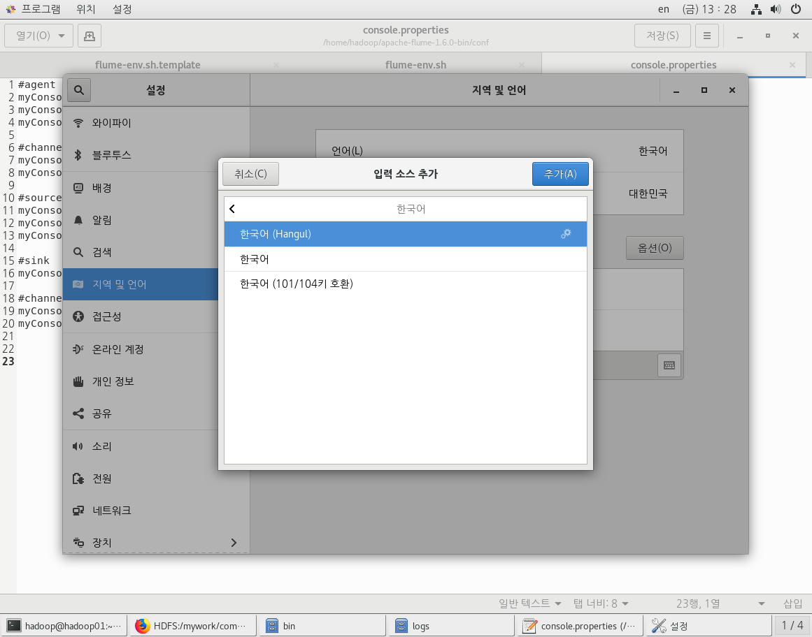

`window - spacebar` or `shift - spacebar(자동 변환)`