## SHELL (셸)

커널과 사용자간의 다리역할, 즉 사용자로부터 명령을 받아 그것을 해석하고 프로그램을 실행.

**bash**  : 현재 리눅스의 표준 셸 

# FLUME

**아파치 플룸**(Apache Flume)은 많은 양의 로그 데이터을 효율적으로 수집, 취합, 이동하기 위한 분산형 소프트웨어이다. 

file - roll 화면에 받아서 씀

# HDFS SINK

* Alias

* DataStream : 텍스트를 있는 그대로 만들기 위함

* 실행

<pre>[hadoop@hadoop01 apache-flume-1.6.0-bin]$ ./bin/flume-ng agent -c ./conf/ -f ./conf/hdfs2.properties -n myhdfs
</pre>

* 로그 분석 

  

  

  이렇게 에러가 난 것을 볼 수 있다.

​     위를 설정 해주어야 위의 에러가 사라진다. 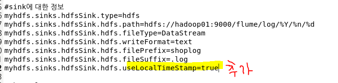

[결과]

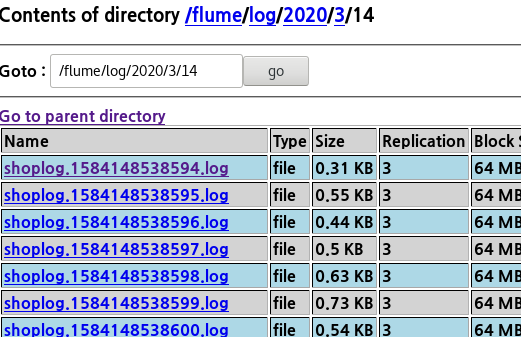

### EXEC SOURCE

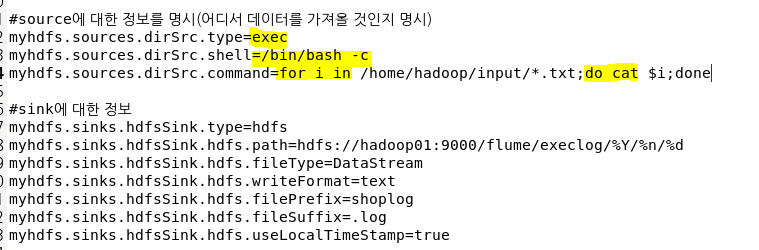

* 실행

<pre>[hadoop@hadoop01 apache-flume-1.6.0-bin]$ ./bin/flume-ng agent -c ./conf/ -f ./conf/hdfs3.properties -n myhdfs
</pre>

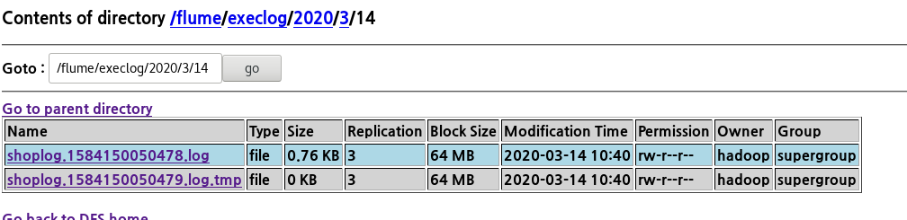

## WAS

**동적** 컨텐츠를 제공하기 위해 만들어진 애플리케이션 서버 (DB조회, 로직처리가 요구되는 컨텐츠)

*server :   요청을 받는 컴퓨터*

#### Static Pages
* Web Server는 파일 경로 이름을 받아 경로와 일치하는 file contents를 반환한다.
* 항상 동일한 페이지를 반환한다.
  *  Ex) image, html, css, javascript 파일과 같이 컴퓨터에 저장되어 있는 파일들
* java 를 실행할 수 없다.

#### Dynamic Pages

* 인자의 내용에 맞게 동적인 contents를 반환한다.
  *  웹 서버에 의해서 실행되는 프로그램을 통해서 만들어진 결과물` Servlet: WAS` 위에서 돌아가는 Java Program
  * 개발자는 Servlet에 doGet()을 구현한다.
* java 실행이 가능하다.

### 설치

* hadoop02를 WAS로 사용할 것이다.
* TOMCAT을 hadoop에 다운받는다.

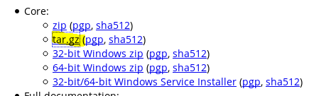

<pre>[hadoop@hadoop02 ~]$ wget http://mirror.navercorp.com/apache/tomcat/tomcat-9/v9.0.31/bin/apache-tomcat-9.0.31.tar.gz
</pre>

* 압푹 풀기

<pre>[hadoop@hadoop02 ~]$ tar
tar        targetcli  targetctl  
[hadoop@hadoop02 ~]$ tar -zxvf apache-tomcat-9.0.31.tar.gz 
</pre>

* hadoop01의 .bashrc 파일 복사

<pre>[hadoop@hadoop01 ~]$ scp .bashrc hadoop@hadoop02:/home/hadoop/
.bashrc                                                                                      100%  500    44.6KB/s   00:00   </pre>

#### 네트워크 확인

<pre>[hadoop@hadoop02 ~]$ cd apache-tomcat-9.0.31/
[hadoop@hadoop02 apache-tomcat-9.0.31]$ cd bin/
</pre>

* 톰캣 실행

<pre>[hadoop@hadoop02 bin]$ ./startup.sh 
Using CATALINA_BASE:   /home/hadoop/apache-tomcat-9.0.31
Using CATALINA_HOME:   /home/hadoop/apache-tomcat-9.0.31
Using CATALINA_TMPDIR: /home/hadoop/apache-tomcat-9.0.31/temp
Using JRE_HOME:        /usr/java/jdk1.8.0_231-amd64
Using CLASSPATH:       /home/hadoop/apache-tomcat-9.0.31/bin/bootstrap.jar:/home/hadoop/apache-tomcat-9.0.31/bin/tomcat-juli.jar
Tomcat started.
</pre>

* **netstat - 네트워크 접속, 라우팅 테이블, 네트워크 인터페이스의 통계 정보를 보여주는 도구**
  * 8080 사용하는 네트워크 있는 지 확인
  * **netstat** [옵션] | **grep** 포트 번호 or 서비스 명]
  * **netstat -nap** : 연결을 기다리는 목록과 프로그램을 보여준다

<pre>
[hadoop@hadoop02 bin]$ netstat -anp | grep 8080 
tcp6       0      0 :::<b>8080</b>                 :::*                    LISTEN      121514/java
</pre>

* 톰캣 종료

<pre>[hadoop@hadoop02 bin]$ ./shutdown.sh 
</pre>

* 종료됐는 지 확인

<pre>
[hadoop@hadoop02 bin]$ netstat -anp | grep 8080 
tcp6       0      0 ::1:54662               ::1:<b>8080</b>                TIME_WAIT   -    </pre>

* 사용자 정보 등록

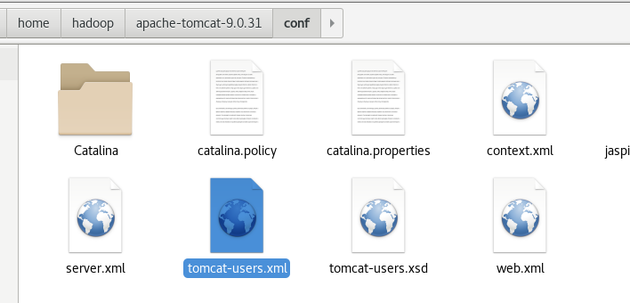

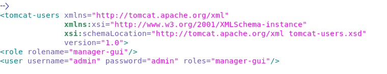

* HDFS에서 실행

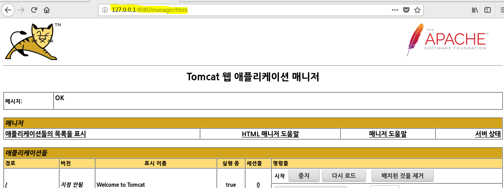

* Crome에서 hadoop02 ip 입력하고 실행

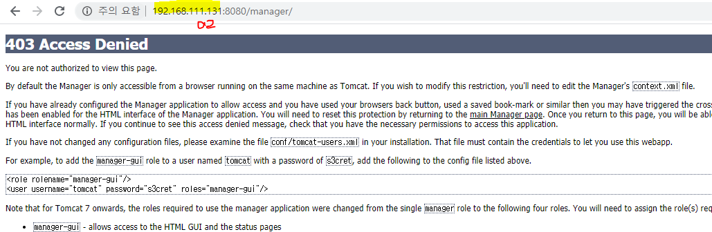

* 이런 오류가 발생함

  ​	META-INF/context.xml 수정

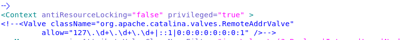

* Spring에서도 IP 주소 변경
  * 127.0.0.1 은 hadoop02를 가르키기 때문에 
  * 70.12.115.64 로 외부에서도 접근 가능하게 변경

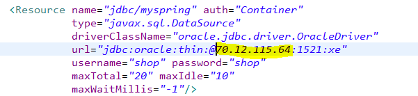

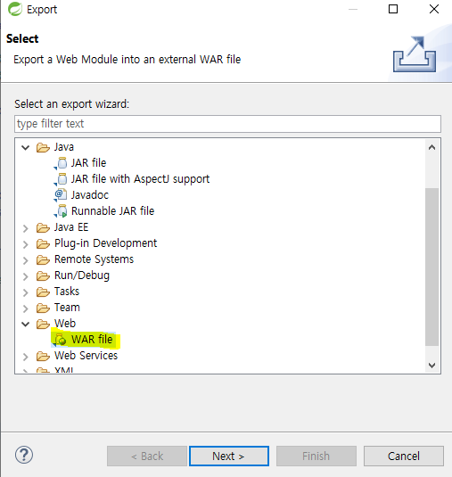

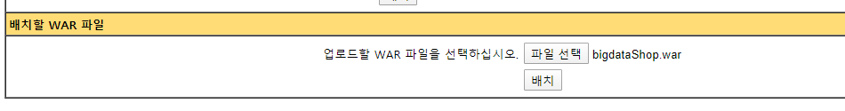

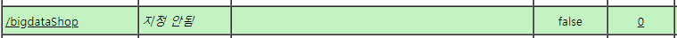

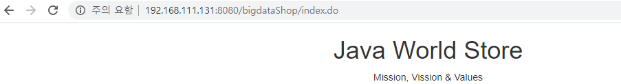

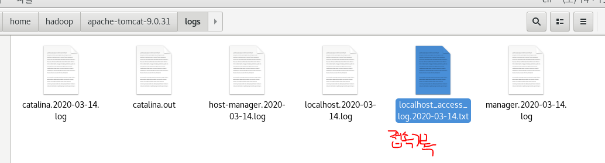

*미션*

1. *hadoop03 was 구축*

2. *was에 bigdatashop 배포*

3. *3번에 flume 설치*

4. *tomcat의 access log를 hdfs에 저장*

   *-avro 통신*

   *-hdfs*

   */flume/tomcatlog*

   

5. *메일로 제출*

   *-3번의 was manager화면에 배포된 목록 캡처*

   *-hdfs에 저장된 access log 캡처*

   *-각 머신의 flume 설정파일*  

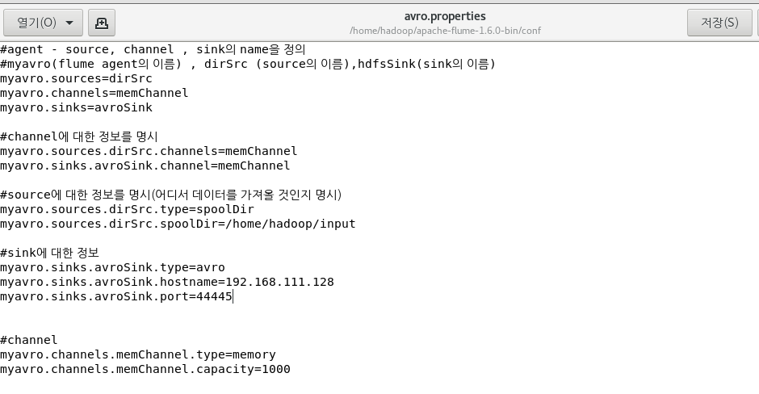

* 1번 머신으로 정보를 전달하기 때문에 Hadoop001의 IP 기입

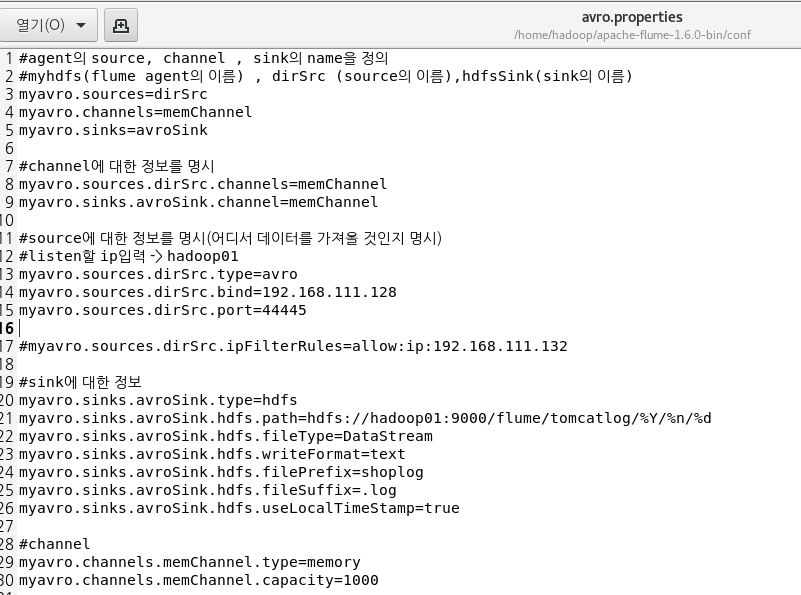

*[테스트 주의사항]*

*하둡 머신의 flume 실행*

*WAS머신의 flume 실행*

*flume_input폴더에 로그파일 copy*