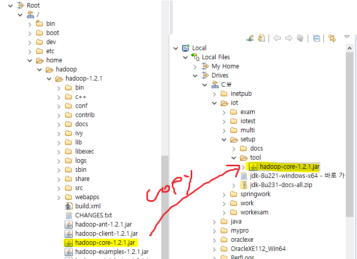
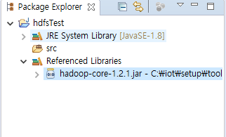
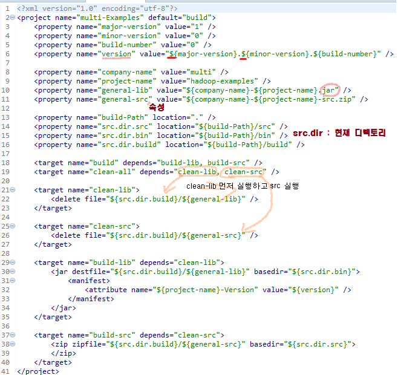
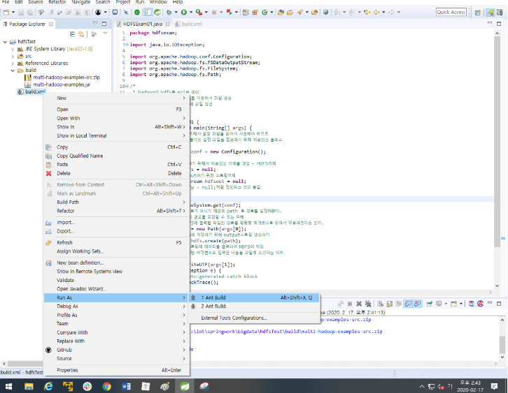
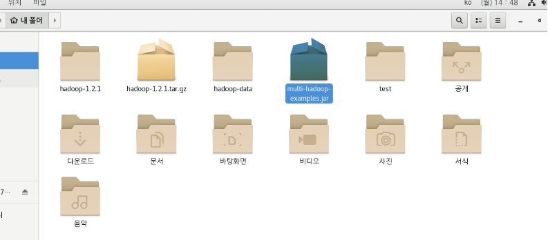
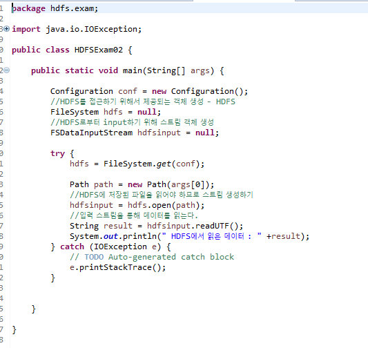
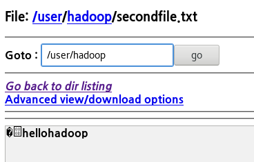

## ※ 빅데이터

**3V** (Volume,Velocity,Variety) - > **5V** (Volume,Velocity,Variety,Value,Veracity)

* 정형 데이터
* 반정형 데이터
* 비정형 데이터

# 하둡 (Hadoop) ?

> 정형 데이터의 경우 기존의 RDBMS에 저장할 수 있지만, 웹 로그 같은 비정형 데이터를 RDBMS에 저장하기에는 데이터 크기가 너무 크다.

* 하둡은 값비싼 유닉스 장비를 사용하지 않고, X86 CPU에 리눅스 서버면 얼마든지 하둡을 설치해서 운영할 수 있다.

* 데이터 저장 용량이 부족한 경우, 필요한 만큼 **리눅스 서버**만 추가하면 된다.
* 데이터의 복제본을 저장하기 때문에 데이터의 유실이나 장애가 발생했을 때에도 데이터 복구가 가능하다.
* *기존의 RDBMS는 데이터가 저장된 서버에서 데이터를 처리하는 방식이지만,* 하둡은 여러 대의 서버에 데이터를 저장하고, 데이터가 저장된 각 서버에서 동시에 데이터를 처리한다.
* RDBMS의 대체가 아닌 **상호보완**적인 특성.
  * 데이터의 무결성이 중요한 데이터는 기존의 RDBMS에서 처리하고, 하둡은 **배치성**으로 데이터를 저장하고 처리한다.
  * 즉, 기업의 핵심 데이터는 RDBMS에, 핵심은 아니지만 데이터를 보관하고 처리해야 하는 경우에는 NoSQL을 이용한다는 의미 

## - 하둡의 에코시스템:revolving_hearts:

* **Sqoop**
  * 대용량 데이터 전송 솔루션
  * 다양한 저장소에 대용량 데이터를 신속하게 전송하는 방법을 제공.
  * 오라클, MS-SQL,DB2 등과 같은 상용 RDBMS와 MySQL과 같은 오픈소스 RDBMS 등을 지원한다.
* **Flume**
  * 분산된 서버에 에이전트가 서치되고, 에이전트로부터 데이터를 전달받는 콜렉터로 구성된다.
  * 전체 데이터 흐름을 관리하는 마스터 서버로 데이터 수집,전송,저장 장소를 동적으로 변경할 수 있다.
* **Spark**
  * 인메모리 기반 범용 데이터 처리 플랫폼
  * 현재 가장 빠르게 성장하고 있는 오픈소스 프로젝트.
* **HIVE**
  * 하둡 기반의 데이터웨어하우징용 솔루션

## 1. 하둡 개발 준비

### 1) 하둡 설치 방법 

* 독립 실행 모드
  * 하둡의 기본 실행모드 (로컬 모드 )
  * 하둡의 데몬을 구동하지 않기 때문에 분산환경 고려한 테스트 불가능.
  * 단순히 맵리듀스 프로그램을 개발하고, 해당 맵리듀스를 디버깅하는 용도로만 적합.
* 가상 분산 모드
  * 하나의 장비에 모든 하둡 환경설정을 한다.
  * HDFS와 맵리듀스와 관련된 데몬을 하나의 장비에서만 실행.

* **완전 분산 모드** ( 내가 사용 할 버전 )

  * 여러 대의 장비에 하둡이 설치된 경우.
| 호스트명 | 하둡 설치 내용           |
| -------- | ------------------------ |
| hadoop01 | 네임노드                 |
| hadoop02 | 보조네임노드, 데이터노드 |
| hadoop03 | 데이터노드               |
| hadoop04 | 데이터노드               |

* 보조네임노드는 네임노드의 장애 발생에 대비하는 용도.

---

### 2) 하둡 실행

* **ROOT 계정으로 로그인 한 뒤 Hadoop계정으로** 사용한다.

* 하둡은 서버 간에 SSH 프로토콜을 이용해 통신한다.

  * SSH로 다른 서버에 접근할 때는 **IP** 혹은 **호스트명**으로 접속할 수 있다.

    

* 인코딩 확인

<pre>[root@hadoop01 ~]# echo $LANG
ko_KR.UTF-8
</pre>

* SSH 설정

  * 공개키는 사용자 계정의 홈디렉터리에 있는 .ssh 폴더에 생성된다.
  * 이렇게 생성된 공개키를 **ssh-copy-id** 명령어를 이용해 다른 서버에 복사한다. 
  * **ssh-copy-id** 를 이용해 모든 데이터노드에 공개키를 복사하고, 암호를 입력하지 않고도 SSH 접속이 가능.

  <pre>[hadoop@hadoop01 ~]$ ssh-copy-id -i /home/hadoop/.ssh/id_rsa.pub haddop@hadoop02</pre>

* 디렉토리 몇 개 있는지 확인  : `fs -ls`

<pre>[hadoop@hadoop01 hadoop-1.2.1]$ /home/hadoop/hadoop-1.2.1/bin/hadoop fs -ls /input
</pre>

* NOTICE.txt 생성 : `copyFromLocal`

<pre>[hadoop@hadoop01 hadoop-1.2.1]$ /home/hadoop/hadoop-1.2.1/bin/hadoop fs -copyFromLocal NOTICE.txt /myinput
</pre>

## 2. 예제 실행

> `wordcount` 라는 단어 갯수를 세는 프로그램을 이용.

### 1) hadoop-env.sh 갯수 세기

* HDFS에 파일 업로드

<pre>[hadoop@hadoop01 hadoop-1.2.1]$ .bin/hadoop fs -put conf/hadoop-env.sh conf/hadoop-env.sh
</pre>

* 하둡 명령어 이용해 jar 파일 실행

<pre>[hadoop@hadoop01 hadoop-1.2.1]$ ./bin/hadoop jar hadoop-examples-1.2.1.jar wordcount conf/hadoop-env.sh wordcount_output
</pre>

* `cat`명령어 이용해 출력값 확인

<pre>[hadoop@hadoop01 hadoop-1.2.1]$ .bin/hadoop fs -cat wordcount_output/part-r-00000
...출력값
</pre>

### 2) STS 

<pre>[hadoop@hadoop01 hadoop-1.2.1]$ ./bin/hadoop jar hadoop-examples-1.2.1.jar wordcount /myinput/NOTICE.txt /wordcount_output
</pre>

* `spring` - `java project` 로 작성
  * 하둡은 자바로 개발되었고, 데몬을 구동할 때 **JAR파일**을 수정하기 때문에 **반드시 자바가 필요**.

* add external library로 lib 추가

* ant

<pre>[hadoop@hadoop01 ~]$ ./hadoop-1.2.1/bin/hadoop jar multi-hadoop-examples.jar hdfs.exam.HDFSExam01 output.txt hellohadoop
</pre>

<pre>[hadoop@hadoop01 ~]$ ./hadoop-1.2.1/bin/hadoop jar multi-hadoop-examples.jar hdfs.exam.HDFSExam02 output.txt
 HDFS에서 읽은 데이터 : hellohadoop
</pre>

<pre>[hadoop@hadoop01 ~]$ ./hadoop-1.2.1/bin/hadoop jar multi-hadoop-examples.jar hdfs.exam.HDFSCopyTest secondfile.txt
hellohadoop
</pre>

