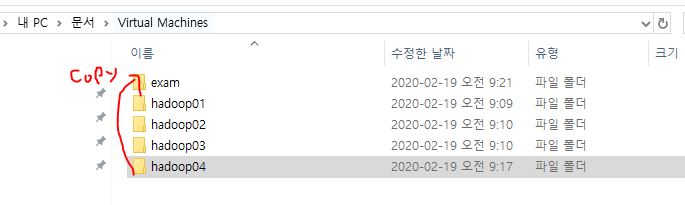
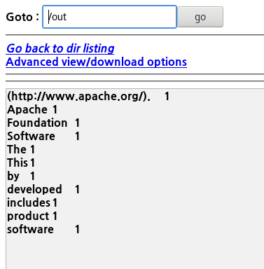
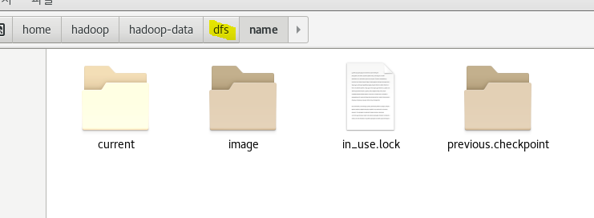
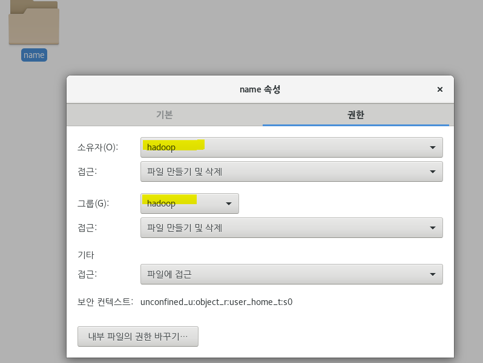
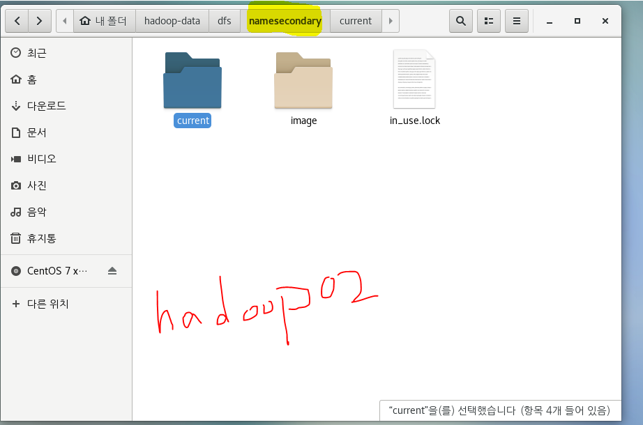

:cactus:  주의 사항

테스트용 계정을 만들 것이다. 

Hadoop04를 복사해서 테스트 계정을 만들어준다. 

단, 복사를 할 경우 사전에 무조건 서버를 **stop-all.sh**을 해주고 power-off 처리를 해주어야 한다.



# HDFS 

> `HDFS ( Hadoop Distributed File System) `   = 하둡의 분산 작업 시스템
>
> 대용량 파일을 분산된 서버에 저장하고, 많은 클라이언트가 저장된 데이터를 빠르게 처리할 수 있게 설계된 파일 시스템
>
> :star: 하둡은 **HDFS**(Hadoop Distributed File System) 에 데이터를 저장하고, **맵리듀스**를 이용해 데이터를 처리한다.
>
> 하둡은 여러 대의 서버에 데이터를 저장하고, 저장된 각 서버에서 동시에 데이터를 처리하는 방식으로, **배치성**으로 데이터를 저장하고 처리하는데 적합한 시스템이다.
>
> HDFS에 저장하는 데이터는 **물리적으로 분산**된 서버의 로컬 디스크에 저장돼있지만, 파일의 읽기 및 저장과 같은 제어는 API를 통해 처리된다.

* 대규모 데이터를 저장하거나, 배치 처리를 하는 경우 HDFS 이용
  * 전자상거래처럼 트랜잭션이 중요한 경우 HDFS가 적합하지 않다.

## - HDFS의 목표

* **장애 복구**
  * HDFS에 데이터를 저장하면, 복제 데이터도 함께 저장되어 데이터 유실을 방지한다.
  * 분산 서버 간에는 주기적으로 상태를 체크해 `(하트비트)` 빠른 시간에 장애를 인지하고 대처한다.
* **스트리밍 방식의 데이터 접근**
  * 클라이언트의 요청을 빠른시간 내에 처리하는 것보다는 **동일한 시간 내에 더 많은 데이터를 처리하는 것**을 목표로 한다. 
  * 랜덤 방식의 데이터 접근을 고려하지 않기 때문에, *인터넷 뱅킹, 인터넷 쇼핑몰과 같은 서비스는 적합X*
* **대용량 데이터 저장**
  * HDFS는 하나의 파일이 기가바이트에서 테라바이트 이상의 크기로 저장될 수 있게 설계됨.
* **데이터의 무결성**
  * 데이터의 입력이나 변경을 제한해 데이터의 안정성을 저해하는 요소를 막는다.
  * HDFS에서 한번 저장한 데이터는 수정이 불가능. (ONLY 읽기만 가능)
  * 대신 `append`가 가능하다.

## - 블록구조 파일 시스템

* 64Mbyte 블럭단위로 나눠저 분산된 서버에 저장된다.

  * 분산된 서버에 나눠서 데이터를 저장하기 때문에 

    로컬 서버의 하드디스크보다 큰 규모의 데이터를 저장가능.

  * 블럭이 커질 수록 메타 데이터가 작아진다.

* **HDFS**는 `네임노드(마스터)`와 `데이터노드(슬레이브)`로 구현되어 있다.

  * 마스터-슬레이브 아키텍처

* **일괄 처리 (batch처리)** :컴퓨터 프로그램 흐름에 따라 순차적으로 자료를 처리

  * (cf. spark는 실시간 처리)

### 1. 네임노드

- **메타데이터관리** : 네임노드는 파일 시스템을 유지하기 위한 메타데이타를 관리한다. 
  - 네임노드는 클라이언트에게 빠르게 응답할 수 있게 메모리에 전체 메타데이터를 로딩,관리
- **데이터노드 모니터링** : 데이터노드는 네임노드에게 3초마다 **하트비트(heartbeat)**를 전송한다. 
  - 하트비트는 데이터노드 상태정보와 데이터노드에 저장되어 있는 블록의 목록으로 구성된다. 
  - `네임노드`는 하트비트를 이용해 데이터노드의 `실행상태`와 `용량`을 체크한다. 
  - 하트비트를 전송하지 않는 데이터노드는 장애서버로 판단.
- **블록관리** 
  - 네임노드는 장애가 발생한 데이터노드를 발견하면 해당 데이터노드의 블록을 새로운 데이터노드로 복제.
- **클라이언트 요청접수**
  - 클라이언트가 HDFS에 접근하려면 반드시 네임노드에 먼저 접속해야 한다.
  - HDFS에 파일을 저장할 경우 기존 파일의 저장여부와 권한 확인 절차를 거쳐 저장을 승인한다.

### 2. 데이터노드

`데이터노드(DataNode)`는 클라이언트가 HDFS에 저장하는 파일을 **로컬 디스크에 유지**한다.

*  실제 저장되는 로우데이터
* 체크섬 OR 파일생성일자 같은 메타데이터가 저장된 파일
  *  업무를 분담하고 관리하는 **tasktracker**와 함께 존재

### 3. 파일 저장

* 클라이언트가 네임노드에게 파일 저장을 요청하는 단계


* 클라이언트가 데이터노드에게 패킷을 전송하는 단계
  * 클라이언트가 네임노드에게서 파일 제어권을 얻으면 파일 저장 진행
  * 이 때, 클라이언트는 파일을 네임노드에게 전송하지 않고 각 데이터노드에 전송한다.
  * 저장할 파일은 패킷 단위로 나눠서 저장.
* 클라이언트가 파일 저장을 완료하는 단계

### 4. 보조네임노드

*네임노드는 메타 데이터를 메모리에서 처리한다.*

*editslog : HDFS의 모든 변경 이력 저장*

*fsimage : 메모리에 저장된 메타데이터의 파일 시스템 이미지를 저장.*

*하지만 메모리에서만 데이터를 유지할 경우 서버 재부팅 시에 모든 메타데이터가 유실될 수 있다.*

*이를 해결하기 위해 HDFS는 보조네임노드를 제공해준다.*

* 보조네임노드는 주기적으로 네임노드의 `fsimage를 갱신`하는 역할 **(체크포인트)**
* 즉, **네임노드의 fsimage를 축소시켜주는 역할.**

* 보조네임노드는 네임노드에게 editslog를 롤링할 것을 요청
  * 로그롤링은 현재 로그 파일의 이름을 변경하고, 원래 이름으로 새 로그 파일을 만드는 것
* 보조네임노드는 네임노드에 저장된 editslog와 fsimage를 다운


## - HDFS명령어

* 하둡은 HDFS를 쉽게 제어할 수 있도록 `셸 명령어`를 제공해준다.
*  fs 셸에서 제공하는 명렁어는 유닉스 계열에서 사용하는 명령어와 비슷하게 사용 가능
  * fs 셸 : 일반적인 파일에 대한 작업 대부분을 지원

* 홈 디렉토리로 이동 `cd~`
  * ~는 굉장히 private 한 폴더

<pre>
[hadoop@hadoop01 root]$ cd ~ 
[hadoop@hadoop01 ~]$
</pre>

* root 디렉토리로 이동 `cd /`

<pre>
[hadoop@hadoop01 ~]$ cd / 
[hadoop@hadoop01 /]$
</pre>

* 현재 작업중인 폴더 보기   `pwd` *(print working directory)* 

<pre>[hadoop@hadoop01 /]$ pwd
/ </pre>

* `.` 는 현재 , `..`는 상위 디렉토리를 의미한다.

<pre>[hadoop@hadoop01 ~]$ cd..
[hadoop@hadoop01 home] $ </pre>

* HDFS의 (특정) 폴더 지우기

<pre>[hadoop@hadoop01 hadoop-1.2.1]$ ./bin/hadoop fs  -rmr  /input</pre>
* 파일 실행시키기
  * hdfs.exam.HDFSCopyTest 는 실행시키고 싶은 클래스명 위치

<pre>[hadoop@hadoop01 hadoop-1.2.1]$ ./bin/hadoop jar ../multi-hadoop-examples.jar hdfs.exam.HDFSCopyTest /user/hadoop/output.txt /copytest</pre>


* shell 스크립트 ?
  * 현재 path를 걸어놓지 않은 상태이기 때문에 실행하고 싶은 파일의 전체 경로를 다 적어주어야 한다.

<pre>
[hadoop@hadoop01 ~]$ /home/hadoop/hadoop-1.2.1/bin/start-all.sh
</pre>

<pre>
[hadoop@hadoop01 ~]$ /home/hadoop/hadoop-1.2.1/bin/hadoop fs -ls
</pre>

- 현재 home디렉토리 (~)에 위치하기 때문에 경로를 full로 다 주어야 한다.

  따라서, `$ cd hadoop-1.2.1`를 통해 경로를 상대경로로 편하게 접근 할 수도 있다.

<pre>
[hadoop@hadoop01 hadoop-1.2.1]$ ./bin/hadoop jar hadoop-examples-1.2.1.jar wordcount /myinput/NOTICE.txt /out
</pre>

[결과]



* HDFS의 시스템 관련 파일이 있는 곳



* 가끔 READONLY 라는 오류가 뜰 경우, 권한 확인하기



* Hadoop02는 namenode를 통해 checkpoint 를 확인하기 때문에 다른 파일 구성을 가진다.



* **hadoop-data**는 실제 데이터를 관리하고 저장하는 폴더


* class의 계층 구조 확인할 수 있다.
  * FileSystem 이 FSInputStream과  FSoutputStream을 만드는데, 모든 정보를 다 갖고 있기 때문에 new 를 이용하는 것이 아닌 open, create해서 만든다. 


## - 리눅스 기본 명령어

### 1. ls

* list의 약자로 `dir`역할
* 현재 디렉토리의 파일 목록 보기

<pre>[root@exam ~]# ls
</pre>

* /etc/sysconfig/ 디렉토리 목록

<pre>[root@exam ~]# ls /etc/sysconfig/
</pre>

* 옵션 :  `-a` or `.` 숨긴 파일까지 모두 볼 수 있다.

<pre>[root@exam ~]# ls -a
<font color="#005FFF">.</font>              .bash_profile  <font color="#005FFF">.dbus</font>      anaconda-ks.cfg          <font color="#005FFF">문서</font>      <font color="#005FFF">음악</font>
<font color="#005FFF">..</font>             .bashrc        .esd_auth  initial-setup-ks.cfg     <font color="#005FFF">바탕화면</font>
.ICEauthority  <font color="#005FFF">.cache</font>         <font color="#005FFF">.local</font>     <font color="#EF2929">jdk-8u231-linux-x64.rpm</font>  <font color="#005FFF">비디오</font>
.bash_history  <font color="#005FFF">.config</font>        <font color="#005FFF">.ssh</font>       <font color="#005FFF">공개</font>                     <font color="#005FFF">사진</font>
.bash_logout   .cshrc         .tcshrc    <font color="#005FFF">다운로드</font>                 <font color="#005FFF">서식</font>
</pre>

* `-l` 현재 디렉토리의 자세한 목록을 볼 수 있다.

<pre>[root@exam ~]# ls -l
합계 174412
-rw-------. 1 root root      2002  2월 11 23:51 anaconda-ks.cfg
...
drwxr-xr-x. 2 root root         6  2월 11 23:53 <font color="#005FFF">음악</font>
</pre>

`d` : directory

`-` : 파일을 의미

- `.conf` 모든 파일 조회

<pre>[root@exam ~]# cd /etc/
[root@exam etc]# ls *.conf
</pre>

* 숨긴 파일과 자세한 내용을 모두 볼 수 있다.

<pre>[root@exam etc]# ls -al
합계 1508
</pre>

<pre>[hadoop@hadoop01 hadoop-1.2.1]$ ./bin/hadoop fs -ls </pre>

* **lsr** : 현재 디렉터리의 하위 디렉터리 정보까지 출력

<pre>[hadoop@hadoop01 hadoop-1.2.1]$ ./bin/hadoop fs -lsr </pre>

### 2. mkdir

* make Directory, 새로운 디렉토리 생성

<pre>[root@exam ~]# cd mytest
[root@exam mytest]# touch myfile1
[root@exam mytest]# ls
myfile1
</pre>

<pre>[hadoop@hadoop01 hadoop-1.2.1]$ ./bin/hadoop fs -mkdir testDir </pre>

### 3. rmdir

디렉토리 삭제

<pre>[root@exam mytest]# mkdir myfolder
[root@exam mytest]# ls
myfile3  myfileTest1  <font color="#005FFF">myfolder</font>  <font color="#005FFF">test</font>  test_ana
[root@exam mytest]# rmdir myfolder/
[root@exam mytest]# ls
myfile3  myfileTest1  <font color="#005FFF">test</font>  test_ana
</pre>

### 4. 파일 복사

* **put** : 시스템의 파일 및 디렉터리를 목적지 경로로 복사 ( 저장 )
  * = **copyFromLocal** 

<pre>[hadoop@hadoop01 hadoop-1.2.1]$ ./bin/hadoop fs -put conf testDir </pre>

#### - cp

* copy의 약자로, 파일이나 디렉토리를 새로 복사한다.

<pre>myfile1  myfile2  myfile3
[root@exam mytest]# cp myfile1 myfileTest1
[root@exam mytest]# ls
myfile1  myfile2  myfile3  myfileTest1
</pre>

* 디렉토리 복사

<pre>[root@exam mytest]# cp -r /etc/sysconfig/ test
[root@exam mytest]# ls
myfile3  myfileTest1  <font color="#005FFF">test</font>
</pre>

* 꼭 복사가 제대로 됐는지 확인.

<pre>[root@exam mytest]# ls ./test
anaconda         httpd             nfs              rsyncd
atd              init              ntpd             rsyslog
....
</pre>

### 5. rm

* remove의 약자로 파일이나 디렉토리를 삭제한다.

<pre>[root@exam mytest]# rm myfile1
rm: remove 일반 빈 파일 `myfile1&apos;? y
[root@exam mytest]# ls
myfile2  myfile3  myfileTest1
</pre>


* 지울건지 물어보지 않는 제거 방법

<pre>[root@exam mytest]# rm -f myfile2
[root@exam mytest]# ls
myfile3  myfileTest1
</pre>

* **rmr** : 디렉터리 삭제 
  * 비어있지 않은 디렉터리도 정상적으로 삭제 가능

### 6. mv

move의 약자로 파일이나 디렉터리의 **이름을 변경**하거나 **다른 디렉토리로 옮길 때** 사용

ex] ./test/anaconda 를 현재 폴더로 이동시킨다

<pre>[root@exam mytest]# mv ./test/anaconda ./
[root@exam mytest]# ls
anaconda  myfile3  myfileTest1  <font color="#005FFF">test</font>
</pre>

ex] anaconda를 test_ana로 이름 변경

<pre>[root@exam mytest]# ls
myfile3  myfileTest1  <font color="#005FFF">test</font>  test_ana
</pre>

예제 ] **계층형 디렉토리** 

```text
mytest1
 +
 |____mytest2
 		+
 		|____mytest3
```

<pre>[root@exam mytest]# mkdir mytest1/mytest2/mytest3
mkdir: `mytest1/mytest2/mytest3&apos; 디렉토리를 만들 수 없습니다: 그런 파일이나 디렉터리가 없습니다
</pre>

<pre>[root@exam mytest]# rm  mytest1
rm: cannot remove `mytest1&apos;: 디렉터리입니다
</pre>

* 생성

<pre>[root@exam mytest]# mkdir -p mytest1/mytest2/mytest3
</pre>

* 삭제

<pre>[root@exam mytest]# rm -r mytest1
rm: descend into directory `mytest1&apos;? y
rm: descend into directory `mytest1/mytest2&apos;? y
rm: remove 디렉토리 `mytest1/mytest2/mytest3&apos;? y
rm: remove 디렉토리 `mytest1/mytest2&apos;? y
rm: remove 디렉토리 `mytest1&apos;? y
</pre>

* 삭제 시 물어보는 여부가 싫을 경우

<pre>[root@exam mytest]# rm -rf test
</pre>

---

<pre>[root@exam ~]# ls /
<font color="#00FFFF">bin</font>   <font color="#005FFF">dev</font>  <font color="#005FFF">home</font>  <font color="#00FFFF">lib64</font>  <font color="#005FFF">mnt</font>  <font color="#005FFF">proc</font>  <font color="#005FFF">run</font>   <font color="#005FFF">srv</font>  <span style="background-color:#8AE234"><font color="#000000">tmp</font></span>  <font color="#005FFF">var</font>
<font color="#005FFF">boot</font>  <font color="#005FFF">etc</font>  <font color="#00FFFF">lib</font>   <font color="#005FFF">media</font>  <font color="#005FFF">opt</font>  <font color="#005FFF">root</font>  <font color="#00FFFF">sbin</font>  <font color="#005FFF">sys</font>  <font color="#005FFF">usr</font>
</pre>

* boot
  * 부팅 될 때 필요한 파일


```text
root 홈 디렉토리에 hadooptest 폴더 생성
-/etc/sysconfig폴더 copy
-/root/의 anaconda-ks.cfg 파일 복사하기
-복사한 후 my-conda.cfg로 rename
-아래의 구조를 갖고있는 서브 디렉토리 생성하기
mytest1
 +
 |____/etc/hosts파일 복사
 |____mytest2
 		+
 		|____mytest3
```

### 7. cat, text

* **cat** : 지정한 파일의 내용을 화면에 출력 ( 텍스트 파일만 출력 )

<pre>[hadoop@hadoop01 hadoop-1.2.1]$ ./bin/hadoop fs -cat conf/hadoop-env.sh </pre>

* **text** : 모든 파일을 텍스트 형태로 출력

<pre>[hadoop@hadoop01 hadoop-1.2.1]$ ./bin/hadoop -text conf/hadoop-env.sh </pre>

:on: 머신 절전 모드

**프로그램** - **시스템 도구** - **설정** - **전원** - **절전** (안함)

