## 리눅스  다운로드

> **다중 사용자, 다중 작업을 지원**하는 유닉스(UNIX)와 유사한 운영체제
>
> 이미 window가 깔려있기 때문에 4대의 가상 머신을 만들어 클러스터링 할 것이다.
>
> 빅데이터 플랫폼 구축을 위해 꼭 필요

### 1.CentOS

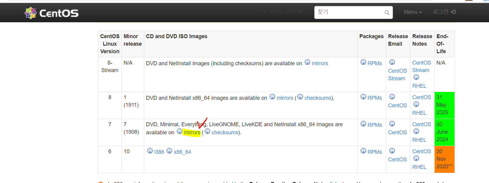

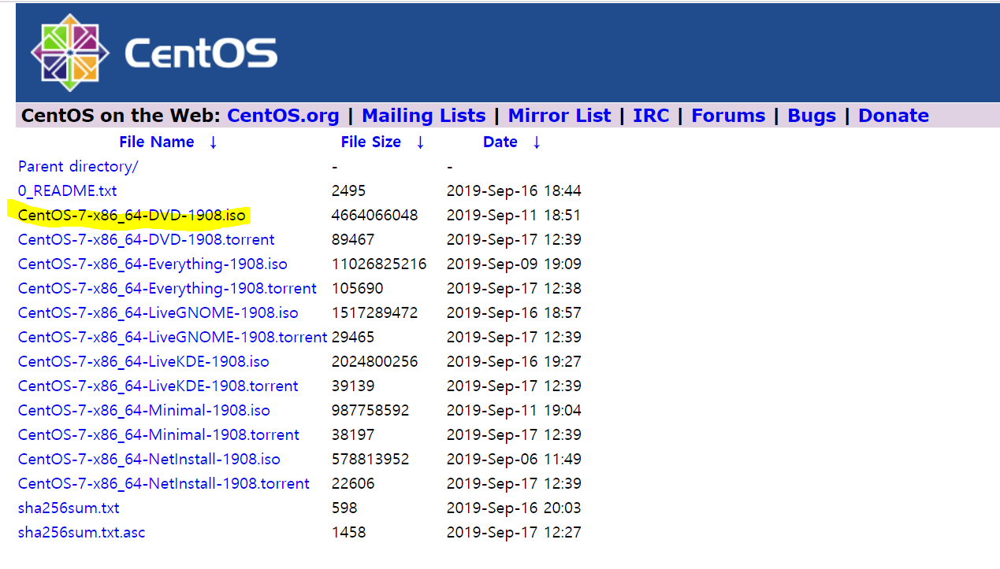

### 2. vmware (가상 머신)

1) Windows용 Workstation 15.5 Player

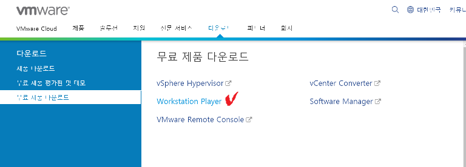

2) **securable**

: 빅데이터 구축하기 위한 사양이 되는 지 확인

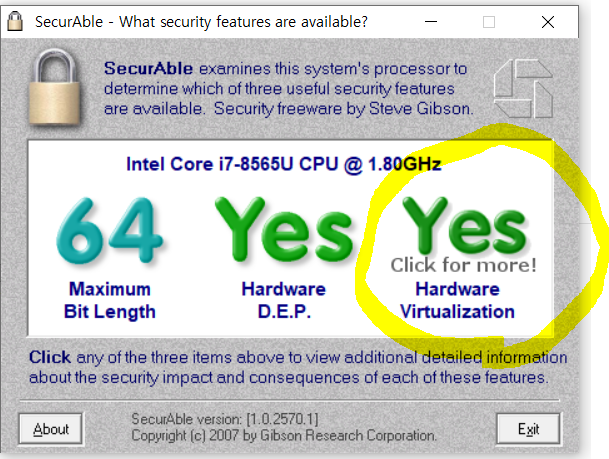

## 가상 머신 ?

*vc재배포 : visual c++ 다시 설치하라는 문구*

**컴퓨터에 설치된 운영체제(호스트OS) 안에 가상의 컴퓨터를 만들고, 그 안에 또 다른 운영체제를 설치/운영할 수 있도록 제작된 sw**

즉, 하나의 하드웨어(cpu) 안에 다수의 운영체제를 설치하고 개별 컴퓨터처럼 동작하게 만든 프로그램

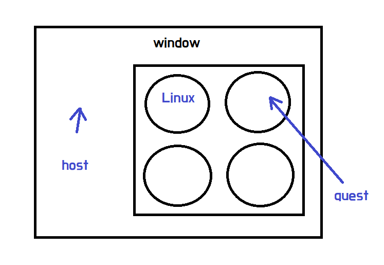

* 기존 pc에 설치되어 있는 windows를 **호스트 운영체제**
* 그 외 가상머신에 설치한 운영체제를 **게스트 운영체제** 라고 부른다.

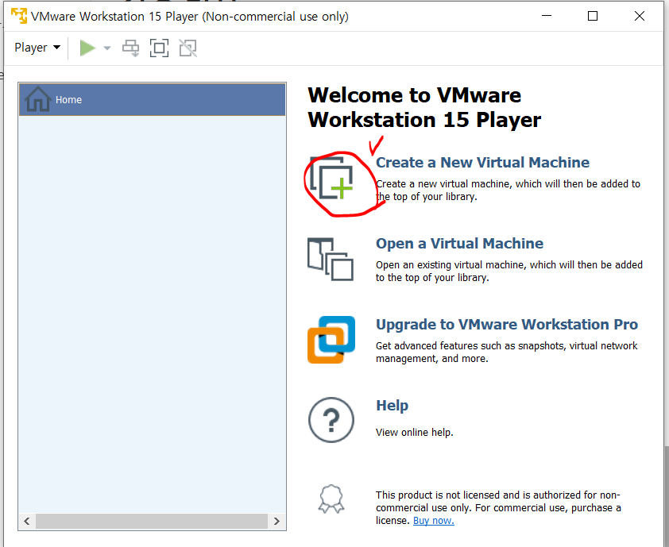

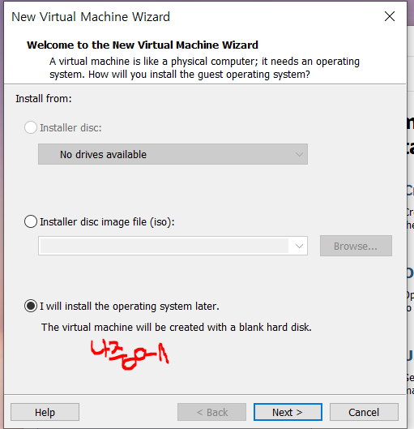

* 리눅스를 사용할 것
* 현재 다운 받은 것이 **centOS 7** 버전

​			

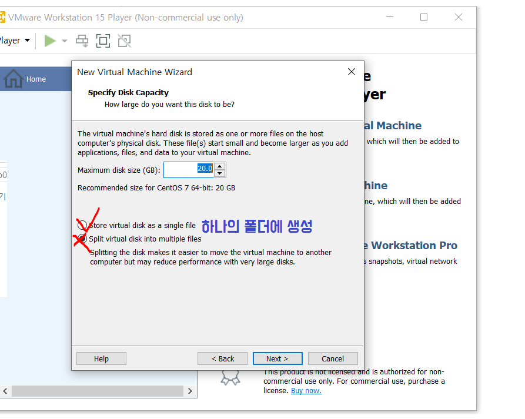

 Hadoop은 [master/slave] 구조이다.     
    따라서, master 역할을 하는 pc를 hadoop01로 잡는다.

# 리눅스 특징

1. **유닉스 기반**

   - 리눅스 커널 자체가 유닉스의 미닉스(Minix)를 참고하여 개발

     

2. **다중 사용자와 멀티 태스킹을 지원**

   - 리눅스는 다중 사용자 (하나의 컴퓨터에 여러 사용자가 로그인 및 사용 가능) 와 멀티 태스킹(한번에 여러 프로세스 실행 가능)을 지원

     

3. **자유 소프트웨어**

   - 리눅스 자유 소프트웨어 라이센스
- 누구나 소스 코드 활용 및 수정, 재배포 가능
   - 리눅스 커널 및 관련 다양한 소프트웨어를 패키지로 묶어서 배포하는 것을 리눅스 배포판이라고 함(예: ubuntu)

### GNU( Gnu is not Unix)

*  모두가 공유할 수 있는 sw 공유 프로그램

* 유닉스(UNIX) 운영체제를 여러 회사에서 각자 개발하며, 소스를 공유하지 않는 문화에 반발 ->
* GNU 프로젝트를 지원하기 위해 자유 소프트웨어 재단(FSF) 설립과 GNU 공개 라이선스(GPL)라는 규약 제공

**커널** : 리눅스의 핵심 부분

**CentOS** : 서버 구축에 적합한 사양

내부에서 관리하는 모든 서버에 **접근 권한**을 줄 수 있다. -> 보안을 유지하기 쉽게 설계되어 있다.

이를 통해 mail, web 등의 네트워크 서버도 저가로 구성이 가능해진다.

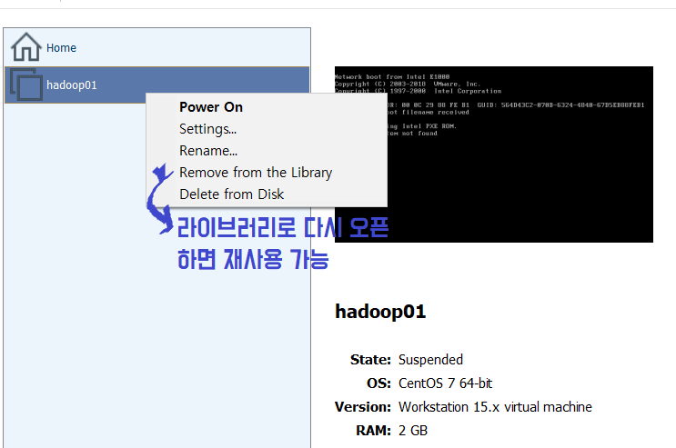

따라서, master 역할을 하는 pc를 hadoop01로 잡는다. 

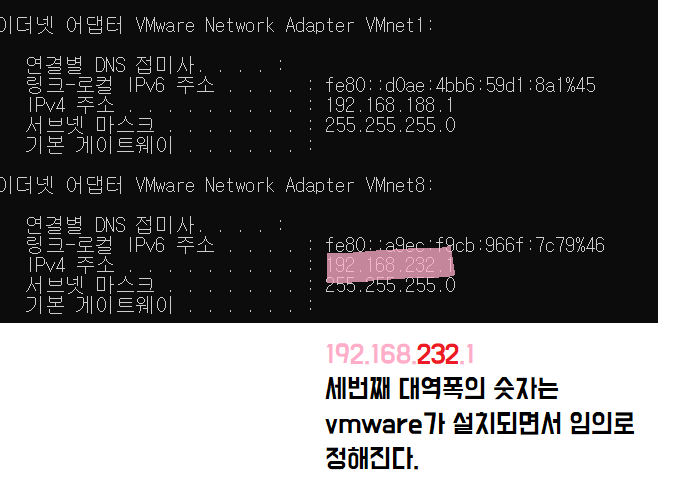

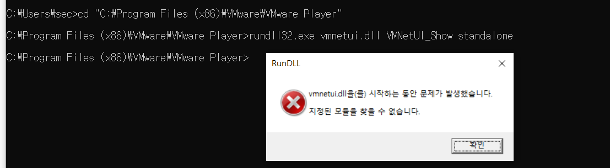

* 무료판이기 때문에 모듈이 존재하지 않는다 ㅜㅠ
  * **vmnetcfg.exe** 을 다운받아 `C:Program Files - VMware - VMware Player` 에 넣어준다.

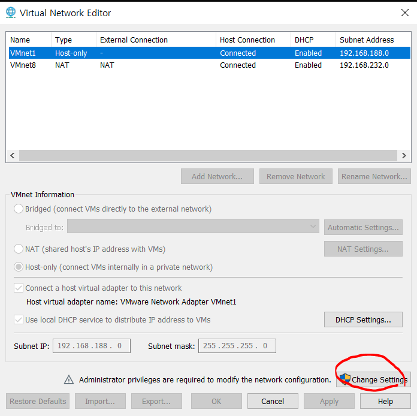

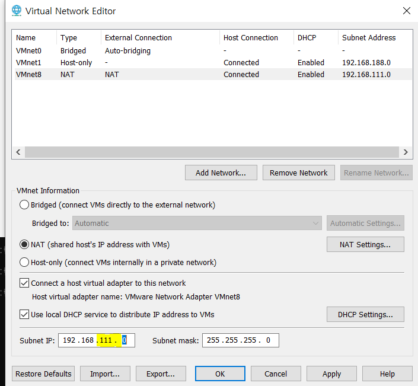

* VMware Player의 VMnet8의 IP주소를 동일하게 설정해줘야한다
* 이처럼 IP를 조정해서 일치시켜줄 수 있다.

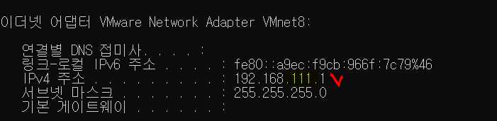

* CD/DVD 설치

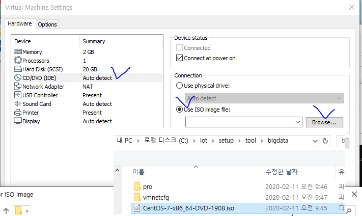

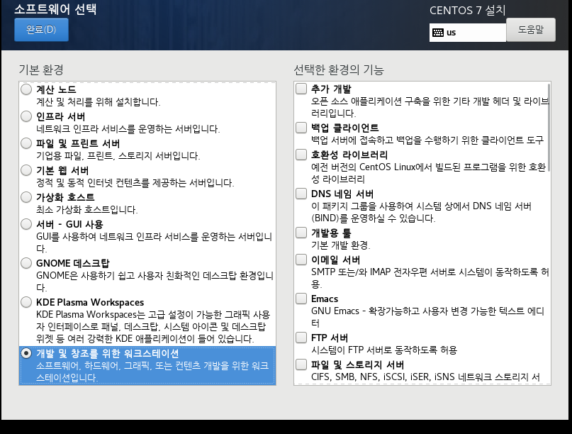

다 설치가 됐으면 VMWare 실행해준다.

### 빅데이터의 메인 시스템 ( 하둡 )

* 테스트 할 계정을 만든다.

ex ) 비밀번호 > **Root(관리자 계정)**  - bigdata

**계정 (테스트 계정) :** 암호, 비밀번호를 hadoop 으로 설정해준다.

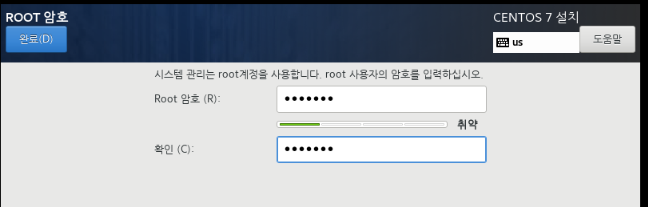

