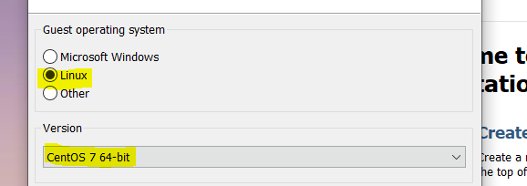
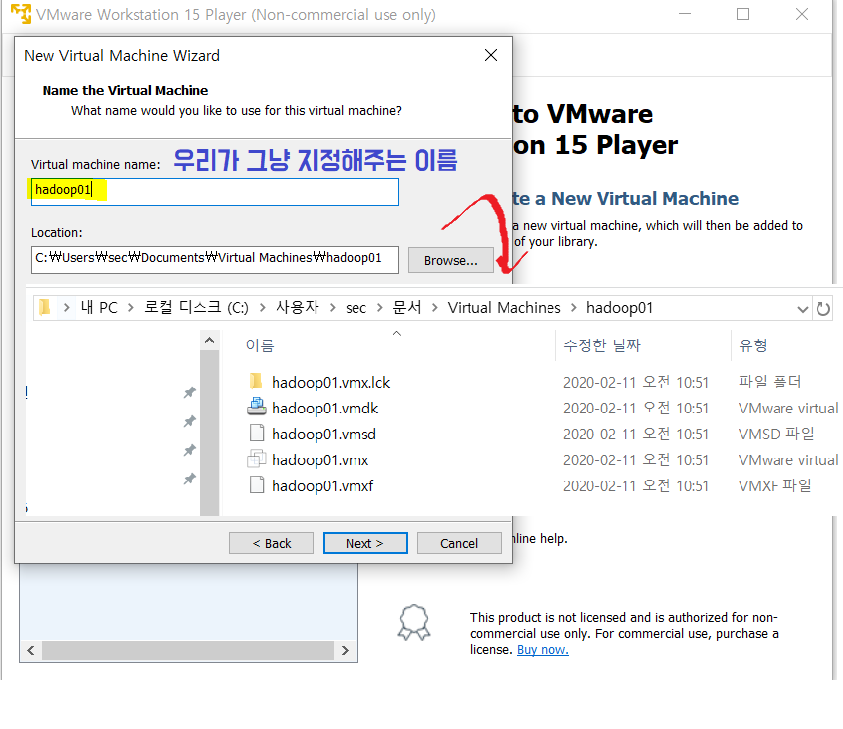

## 리눅스  다운로드

> 이미 window가 깔려있기 때문에 4대의 가상 머신을 만들어 클러스터링 할 것이다.
>
> 빅데이터 플랫폼 구축을 위해 꼭 필요

### 1.CentOS

### 2. vmware (가상 머신)

1) Windows용 Workstation 15.5 Player

2) **securable**

: 빅데이터 구축하기 위한 사양이 되는 지 확인

## 가상 머신 ?

*vc재배포 : visual c++ 다시 설치하라는 문구*

**컴퓨터에 설치된 운영체제(호스트OS) 안에 가상의 컴퓨터를 만들고, 그 안에 또 다른 운영체제를 설치/운영할 수 있도록 제작된 sw**

* 기존 pc에 설치되어 있는 windows를 **호스트 운영체제**
* 그 외 가상머신에 설치한 운영체제를 **게스트 운영체제** 라고 부른다.

* 리눅스를 사용할 것
* 현재 다운 받은 것이 **centOS 7** 버전

​			

Hadoop은 **master/slave** 구조이다. 

따라서, master 역할을 하는 pc를 hadoop01로 잡는다.

## 리눅스

**GNU** : 모두가 공유할 수 있는 sw 공유 프로그램

**커널** : 리눅스의 핵심 부분

**CentOS** : 서버 구축에 적합한 사양

내부에서 관리하는 모든 서버에 **접근 권한**을 줄 수 있다. -> 보안을 유지하기 쉽게 설계되어 있다.

mail, web 등의 네트워크 서버도 저가로 구성이 가능해진다.

### 빅데이터의 메인 시스템 ( 하둡 )

Root암호(관리자 계정) bigdata

계정 (테스트 계정): hadoop

