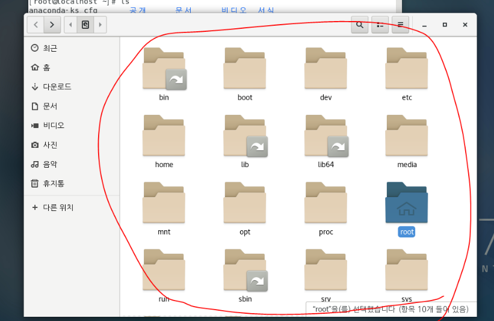
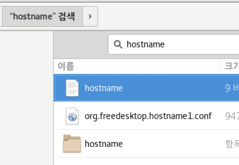
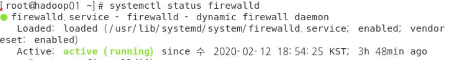
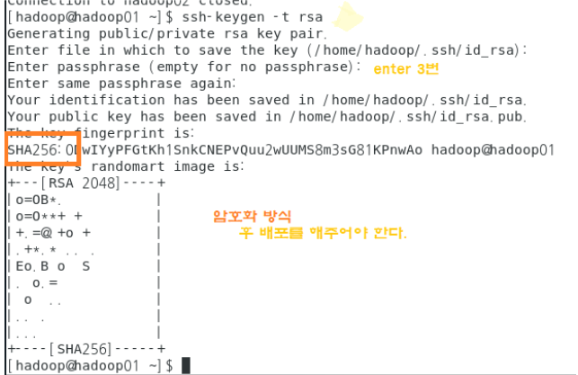
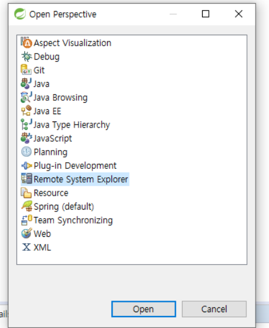

# # 리눅스 명령어

### 1] 기초 명령어 및 개념

#### 1. 계정 변경하기

> root => 프롬프트 #
>
> 일반 계정 => 프롬프트 $
>
> **[계정 @ 호스트명 ~ ]**

* 관리자 계정

<pre>[root@hadoop01 ~]# su root
</pre>

* 하둡 계정 ( 일반 계정)

<pre> [root@localhost~] # su - hadoop
 [hadoop@localhost ~] $     
</pre>

* 홈 디렉토리

<pre>[hadoop@localhost ~]$ su -
암호:
마지막 로그인: 화  2월 11 23:18:56 KST 2020 일시 :0
</pre>

home[홈디렉토리]

* 특정 계정으로 로그인 했을 때 자동으로 위치하는 폴더
* 모든 계정은 `홈디렉토리`를 갖고있다.
* root의 홈 디렉토리 명 `root 폴더`
* 기본 설정은 홈디렉토리 명이 계정명과 동일

#### 2. 디렉토리

<pre>[root@localhost ~]# ls
anaconda-ks.cfg       공개      문서      비디오  서식
initial-setup-ks.cfg  다운로드  바탕화면  사진    음악

* root계정에서 cd / -> ls 하면 아래 사진에서 다른위치에 있는 폴더들을 확인할 수 있음.

* etc폴더
  * 리눅스 입장에서 아주 중요한 파일들, 시스템 관리를 위해 각종 **설정파일을 보관**하는 폴더.

<pre>[root@localhost ~]# cd /
[root@localhost /]# ls
bin   dev  home  lib64  mnt  proc  run   srv  tmp  var
boot  etc  lib   media  opt  root  sbin  sys  usr
[root@localhost /]# cd ~
[root@localhost ~]# ls
anaconda-ks.cfg       공개      문서      비디오  서식
initial-setup-ks.cfg  다운로드  바탕화면  사진    음악
</pre>

*  일반 디렉토리는 **/home/** 안에 만들어진다.	

*  **directory 만들기**

<pre>[hadoop@localhost ~]$ mkdir test
[hadoop@localhost ~]$ ls
test
</pre>

* **한 단계 빠져나가기**

<pre>[hadoop@localhost ~]$ cd test
[hadoop@localhost test]$ cd ..
</pre>

* `/` 는 최상위를 의미

<pre>[hadoop@localhost ~]$ cd /
[hadoop@localhost /]$ cd ~
</pre>

#### 3. 유선네트워크 확인

#### 4. ip 

<pre>[root@localhost ~]# ifconfig
</pre>

* 추가된 가상머신에 접속
  - i moved it => 원래 PC의  IP를 가져간다.
  - i copied it => IP를 새로받는다. 

나의 테스트 컴퓨터 ip 

>hadoop01 : inet 192.168.111.128 
>
>hadoop02 : inet 192.168.111.131
>
>hadoop03 : inet 192.168.111.132 
>
>hadoop04 : inet 192.168.111.129

* ip 호스트 접속 

<pre>[root@localhost ~]# ssh 192.168.111.131
</pre>

#### 5. 호스트

* 호스트 네임 변경

<pre>[root@localhost ~]# hostnamectl set-hostname hadoop01
</pre>

* 호스트 네임 확인

<pre>[root@hadoop01 ~]# hostname
</pre>

* 설정 파일을 모아 놓는 곳인 etc 파일에 hostname > 우클릭 > 텍스트편집기 > 내가 **설정을 변경한 내용**을 볼 수 있음

* 호스트 네임 원격 접속

<pre>[root@hadoop01 ~]# ssh 192.168.111.131
root@192.168.111.131&apos;s password: 
Last login: Wed Feb 12 20:15:27 2020 from 192.168.111.128
[root@hadoop02 ~]# 
</pre>

#### 6. 설정

* 서비스 목록 보기
  * 현재 방화벽이 올라와 있는지, 어떤 서비스가 실행 중인지 확인
  * **systemctl** : 서비스 관리
    - 서비스 상태 보기, disable시키기, 서비스 start시키기 등

<pre>[root@hadoop01 ~]# systemctl list-units --type=service

* **특정** 서비스의 status 보기

<pre>[root@hadoop01 ~]# systemctl status firewalld
</pre>

-> active 되어있으니 이제 서비스를 중지해보자

* 서비스 중지

<pre>[root@hadoop01 ~]# systemctl stop firewalld
</pre>

* 후에 방화벽이 중지되어있는지 **reboot**를 통해서 확인해야 한다.
  * `disable` 상태로 변경

<pre>[root@hadoop01 ~]# systemctl disable firewalld
</pre>

* 이제 ip가 아닌, 도메인으로 접속이 가능해진다.

<pre>[root@hadoop01 ~]#  /etc/init.d/network restart
Restarting network (via systemctl):                        [  OK  ]</pre>

<pre>[root@hadoop01 ~]# ssh hadoop02
The authenticity of host &apos;hadoop02 
[root@hadoop02 ~]# 
</pre>

#### 7. 원격 서버로 file copy

<pre>[root@hadoop01 ~]# scp /etc/hosts root@hadoop02:/etc/hosts
root@hadoop02&apos;s password: 
hosts                                         100%  100    49.5KB/s   00:00 </pre>

#### 8. ssh 통신

* **ssh** ? (secure shell)

  * 보안 통신이 가능해진다.
  * 암호화된 통신을 위해서 공개키 생성 후 배포

  

  <pre>[hadoop@hadoop01 ~]$ cd . ssh
  [hadoop@hadoop01 ~]$ cd .ssh
  [hadoop@hadoop01 .ssh]$ ls
  id_rsa  id_rsa.pub  known_hosts
  [hadoop@hadoop01 .ssh]$ ssh-copy-id id_rsa.pub hadoop@hadoop02
  </pre>

  *위의 **id_rsa  id_rsa.pub  known_hosts** 는 모두 공개키*		

  * 슬레이브 패스워드 묻는 것 없애기 위해 하는 작업

  <pre>[hadoop@hadoop01 .ssh]$ ssh-copy-id -i id_rsa.pub hadoop@hadoop04
  </pre>

  * ROOT권한으로 작업하면 `소유권`때문에 불가능.
  * 관리를 위한 작업은 모두 **ROOT**, 빅데이터 처리, 변환 등은 전부 **hadoop계정으로** 진행한다. 

* sts 연결

설정해놓은 빅 데이터를 sts에서 활용할 것이다.

먼저, hadoop01 머신을 연결할 것이다.

* ssh ONLY

<pre>[root@hadoop01 ~]# su hadoop 
[hadoop@hadoop01 root]$ cd ~
[hadoop@hadoop01 ~]$ ssh hadoop02
....
[hadoop@hadoop02 ~]$ exit
logout
</pre>

