## [빅데이터 플랫폼 구축을 위한 순서]

**실제 여러 대의 서버가 클러스터링 설정이 되어 있어야 하나 우리는 그냥 가상머신을 설치하여 작업한다.**

**플렛폼을 구축하기 위한 준비과정은 다음과 같다.**

  **1. vmware 설치**

  **2. vmware 가상머신 설치하기 - CentOS 7버전을 설치한다.**

  **3. 가상머신 복제하기**

​     **- 가상머신이 네 대 있다 가정하고 네 개의 가상머신을 만들어준다.**

​     **: ip확인**

  **4. 하둡 서버를 구축하기 위한 클러스터링 설정하기** ( 머신 4대 클러스터링)

* **방화벽해제**

* **네트워크 설정**

* **DNS설정** (도메인)

  * hosts 파일 등록

  * 네트워크 프로세스를 restart

  * 설정 확인 - 설정을 성공 완료했는지 확인

  * 4대에 모두 적용되도록 hadoop01머신에서 hadoop02,03,04에 직접 접속

    * [원격 서버로 copy]
    * scp copy할 파일 (위치까지 명시) copy받을 서버의 위치
    * scp /etc/hosts root@hadoop02 :/etc/hosts               -계정으로 접근, 반드시 대상까지 명시

    ```linux
    scp 		/etc/hosts 			root@hadoop02 :/etc/hosts
    ---			----------		   	------------------------
    명령어		   copy할 파일			 target서버의 위치와 파일명
    ```

    * [원격 서버에 실행 명령]

    ```linux
    ssh 서버 "실행할 명령문"
    	---
    	ip 도메인
    ```

    

  **5. 각종 프로그램 설치**

​     **- SSH 프로토콜 설정**

​     **- hadoop을 테스트하기 위해서는 자바가 반드시 필요하므로**

​     **- java, hadoop을 설치하고 설정을 한 후 테스트한다.**

  **6. hadoop의 EchoSystem을 살펴보고 EchoSystem을 설치하여 테스트한다.**

---

### # 클러스터링 ?

*  **컴퓨터 컬러스터**는 여러 대의 컴퓨터들이 연결되어 하나의 시스템처럼 동작하는 컴퓨터들의 집합을 말한다.

웹서버 클러스터는 각기 다른 종류의 요구들을 각기 다른 노드에서 처리하도록 할당함으로써 전반적인 응답시간을 최소화 할 수 있다.

즉, **여러 대를 묶어서 처리**하는 것을 말한다.

우리는 가상머신 4대를 하나의 하둡 서버인것 처럼 사용할 것이다.

- 4대가 서로 통신해야하니까 방화벽을 해제해야 한다.
- 각 4대가 고유의 IP를 갖고 있어야 할 것이다.

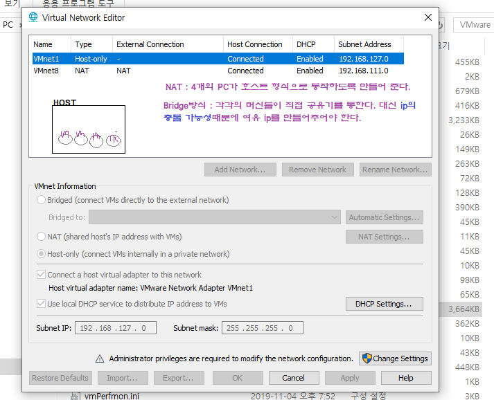

* **Host-only** : 가상머신끼리 통신 가능
  * guestPC들끼리 통신하게 만든다.
  * HOST는 공유기를 통해 인터넷에 접근
* **NAT**
  * guest랑 HOST 모두 공유기를 통해 인터넷에 접근
  * GUEST를 HOST인것 처럼 사용
  
---

## 하둡 설치

빅데이터 프로그램 : **하둡** , 하이브, h베이스 등등 ...

경로 : firefox - java.sun.com/j2se -  java se -  java archive - java SE 8(8u211 and later)


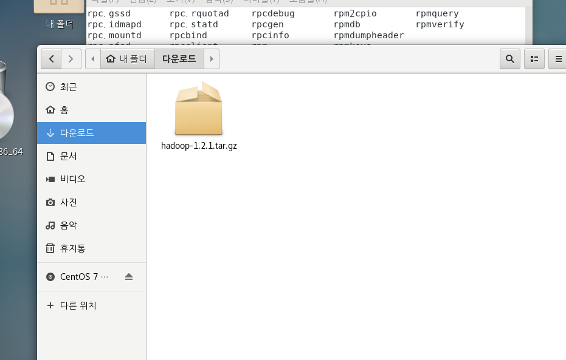


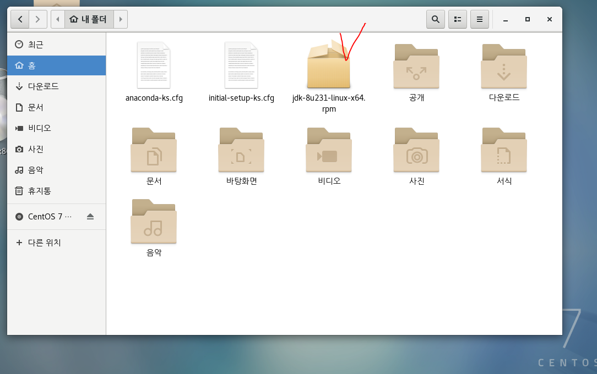

## rpm?

* **다운로드 받고 프로그램 설치할 때 쓰는 명령어**
  * rpm은 의존 모듈이 없으면 다운을 받지 못한다.
  * 의존 모듈을 같이 다운로드 받지 않기 때문에 rpm으로 다운 받으면 실행이 되지 않는다.
  * 즉, rpm은 window의 **setup** 명령어


<pre>[root@hadoop01 ~]# ls
anaconda-ks.cfg       <font color="#EF2929">jdk-8u231-linux-x64.rpm</font>  <font color="#005FFF">다운로드</font>  <font color="#005FFF">바탕화면</font>  <font color="#005FFF">사진</font>  <font color="#005FFF">음악</font>
initial-setup-ks.cfg  <font color="#005FFF">공개</font>                     <font color="#005FFF">문서</font>      <font color="#005FFF">비디오</font>    <font color="#005FFF">서식</font>
</pre>

* rpm 다운로드

>rpm -Uv**h** : 프로그레스 바를 의미한다.
>
>​		   	**v**:화면에 보여주겠다는 의미

### 1. 필요 파일 다운 및 설치

<pre>[root@hadoop01 ~]# rpm -Uvh jdk-8u231-linux-x64.rpm 
경고: jdk-8u231-linux-x64.rpm: Header V3 RSA/SHA256 Signature, key ID ec551f03: NOKEY
준비 중...                         ################################# [100%]
Updating / installing...
   1:jdk1.8-2000:1.8.0_231-fcs        ################################# [100%]
Unpacking JAR files...
	tools.jar...
	plugin.jar...
	javaws.jar...
	deploy.jar...
	rt.jar...
	jsse.jar...
	charsets.jar...
	localedata.jar...
</pre>

* 설치 됐는지 확인해보자

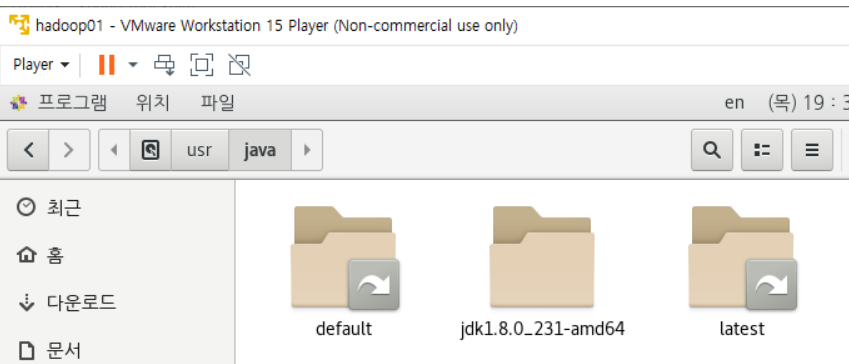

* hadoop02에서 C 드라이브 안의 root에 jdk 파일 설치

<pre>[root@hadoop01 ~]# scp /root/jdk-8u231-linux-x64.rpm root@hadoop02:/root/</pre>
* hadoop02에 설치한 jdk 파일을 실행 **[ 원격 설치 ]**

<pre>[root@hadoop01 ~]# ssh hadoop02 "rpm - Uvh jdk-8u231-linux-x64.rpm"</pre>
* 파일을 모두 다른 hadoop에도 복사해준다.

<pre>[hadoop@hadoop01 ~]$ scp /home/hadoop/hadoop-1.2.1/conf/* hadoop@hadoop04:/home/hadoop/hadoop-1.2.1/conf
</pre>

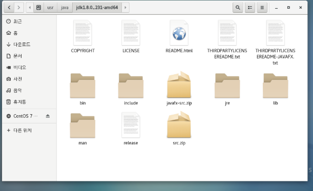

* ROOT 권한이 계속 남아있는 것을 방지해 주어야 한다.

  * 터미널에서 파일을 COPY해서 hadoop권한으로 바꿔줘야 한다.
  * usr폴더 = window 에서 program files

  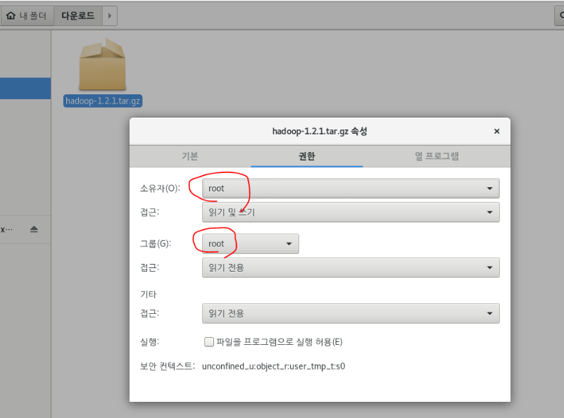

* home으로 이동해준다. 

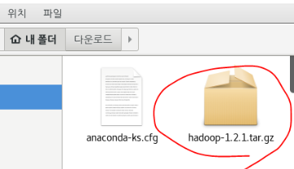

* HOME으로 COPY

<pre>[root@hadoop01 ~]# scp hadoop-1.2.1.tar.gz  hadoop@hadoop01:/home/hadoop/
...
hadoop-1.2.1.tar.gz                           100%   61MB  48.3MB/s   00:01    
</pre>

* Hadoop으로 들어가서 카피가 되었는지 확인해 준다.

<pre>[root@hadoop01 ~]# su hadoop
[hadoop@hadoop01 root]$ cd ~ 
[hadoop@hadoop01 ~]$ ls
<font color="#EF2929">hadoop-1.2.1.tar.gz</font>  <font color="#005FFF">test</font>
</pre>

* 명령어를 통해서 복사한 것이기 때문에 소유자가 hadoop 계정이 된다.

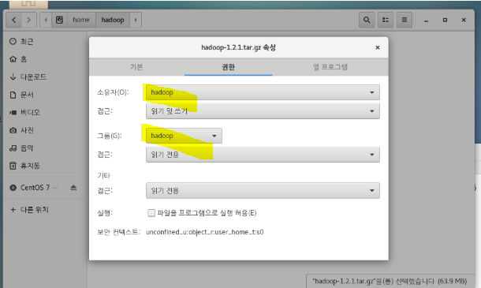

* 하둡 설치와 작업은 hadoop에서 작업하기로 결정했었기 때문에 hadoop계정으로 이동한다.
  * 그 후에 파일 압축 풀기

<pre>[hadoop@hadoop01 ~]$ tar -zxvf hadoop-1.2.1.tar.gz 
</pre>

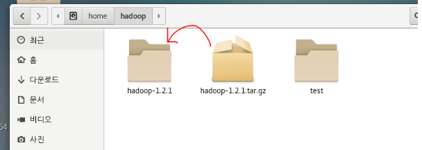

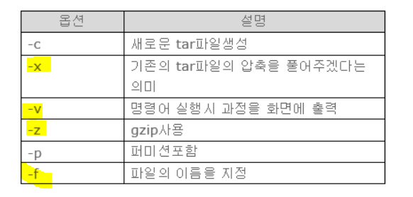

*  다른 hadoop 머신에 복사

<pre>[hadoop@hadoop01 ~]$ scp /home/hadoop/hadoop-1.2.1.tar.gz  hadoop@hadoop02:/home/hadoop/
</pre>

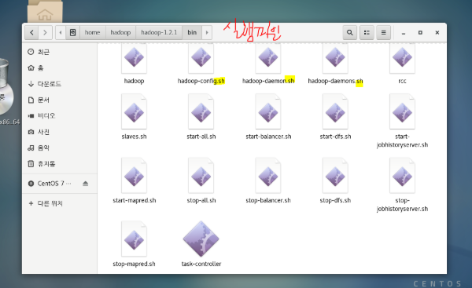

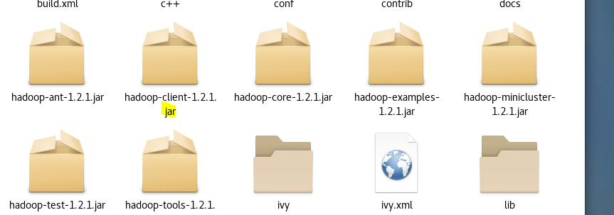

* **jar** 폴더는 hadoop의 라이브러리

* **conf** 는 설정 파일
* **bin** 폴더는 실행 파일이 모여있다.


### 2. Hadoop 설정 파일 등록

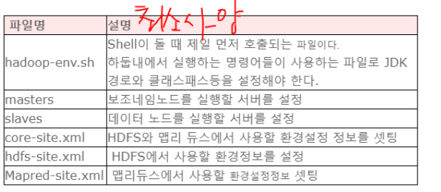

* hadoop-env.sh 수정

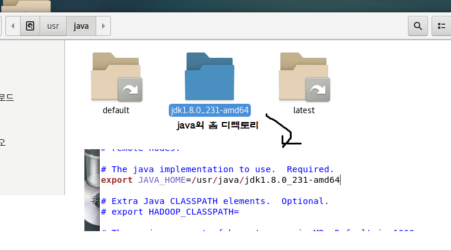

* export 행 수정
  * 하둡이 자바를 쓰기 위한 경로(*즉, 실제 jdk가 설치된 경로*)를 알려 준다.
* master 
  * 보조네임노드를 실행할 서버
  * localhost 를 지워주고 secondary namenode로 이름 설정.
* slaves
  * 데이터 노드를 실행할 서버
  * datanode와 task tracker

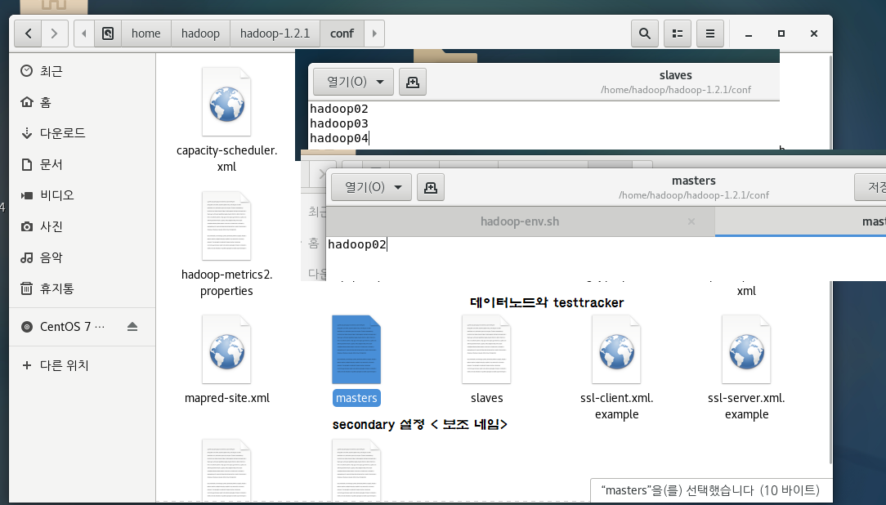

### 3. 임시 디렉토리 만들기

* hadoop의 권한으로 임시 디렉토리를 만들어 준다.
* HDFS에 저장하는 파일 내용이 hadoop-data에 저장

<pre> [hadoop@hadoop01 ~]$ mkdir hadoop-data
</pre>

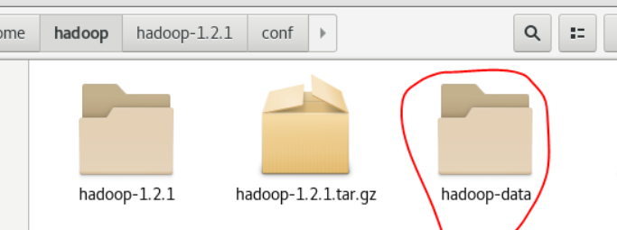

### 4. xml

**hadoop - hadoop-1.2.1 - conf** 안에 존재한다

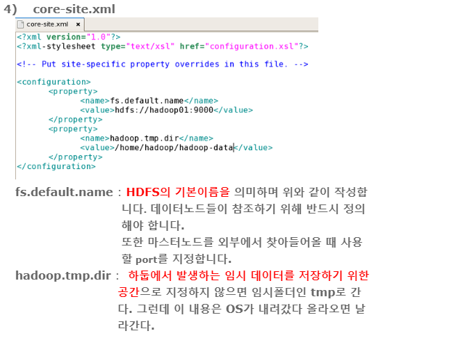

* 완전 분산 모드이기 때문에 복제본 개수 3으로 설정
  * HDFS에 데이터를 저장하면 3개의 복제본이 생성된다.

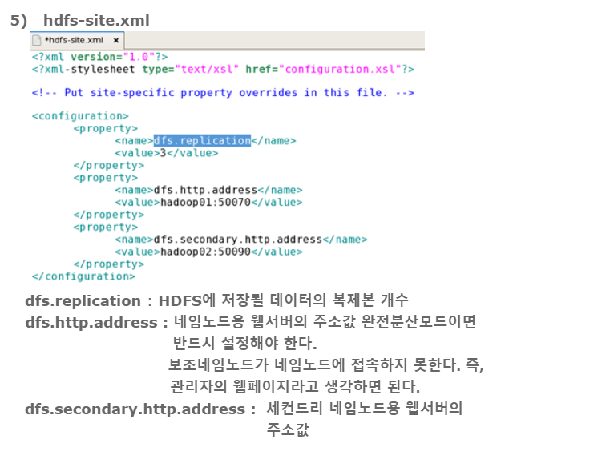


* pc끼리 서로 통신해야 하기 때문에 namenode 와 secondary 노드의 정보를 나타내 준다. 

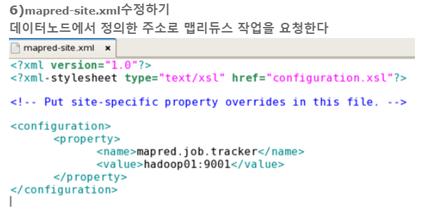

* 네임노드에서 모든 수정 작업이 완료되면 `SCP` 명령어를 통해 **모든 서버에 복사**해주기 


<pre>[hadoop@hadoop01 ~]$ scp /home/hadoop/hadoop-1.2.1/conf/* hadoop@hadoop04:/home/hadoop/hadoop-1.2.1/conf
</pre>

## Hadoop 실행

* HDFS 라는 데이터 장소를 포맷해준다.
* 네임노드 초기화
  * 하둡 명령어는 하둡 홈 디렉토리에 있는 `bin`디렉토리에 저장돼 있다.

<pre>[hadoop@hadoop01 ~]$ /home/hadoop/hadoop-1.2.1/bin/hadoop namenode -format
</pre>

* 하둡을 실행해준다.
  * 실행 :  **start-all.sh**
  * 종료 :  **stop-all.sh** ( 컴퓨터 끌 때 서버 꺼준다.)


<pre>[hadoop@hadoop01 ~]$ /home/hadoop/hadoop-1.2.1/bin/start-all.sh
</pre>

<pre>[hadoop@hadoop01 ~]$ /home/hadoop/hadoop-1.2.1/bin/stop-all.sh</pre>
* **JPS** 
  * 자바 프로세스를 확인

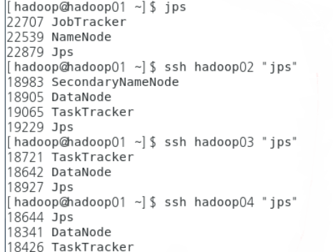

