## 빅데이터

**3V** (Volume,Velocity,Variety) - > **5V** (Volume,Velocity,Variety,Value,Veracity)

* 정형 데이터
* 반정형 데이터
* 비정형 데이터

빅데이터의 사례 :

ex ] 추천 시스템, 신용카드 

**데이터수집**

 IOT, log(flume), RDBMS(sqoop),웹페이지, 크롤링,SNS(R)

## 하둡 개발 준비

* ROOT 계정으로 접속 한 뒤 Hadoop계정으로 

* 인코딩 확인

<pre>[root@hadoop01 ~]# echo $LANG
ko_KR.UTF-8
</pre>

* SSH 설정

* 디렉토리 몇 개 있는지 확인 

<pre>[hadoop@hadoop01 hadoop-1.2.1]$ /home/hadoop/hadoop-1.2.1/bin/hadoop fs -ls /input
</pre>

* NOTICE.txt 생성

<pre>[hadoop@hadoop01 hadoop-1.2.1]$ /home/hadoop/hadoop-1.2.1/bin/hadoop fs -copyFromLocal NOTICE.txt /myinput
</pre>

* /wordcount_output

<pre>[hadoop@hadoop01 hadoop-1.2.1]$ ./bin/hadoop jar hadoop-examples-1.2.1.jar wordcount /myinput/NOTICE.txt /wordcount_output
</pre>

* spring - java project 로 작성

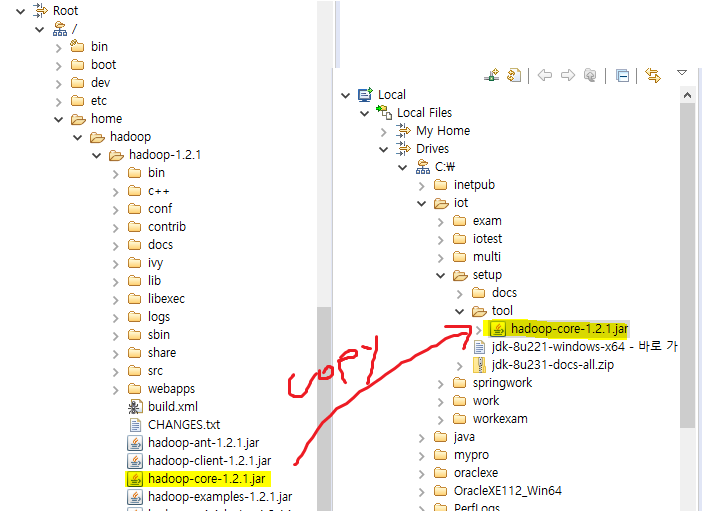

* add external library로 lib 추가

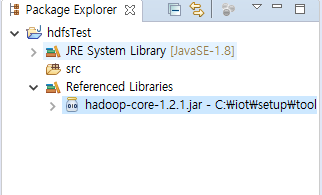

* ant

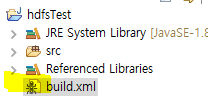

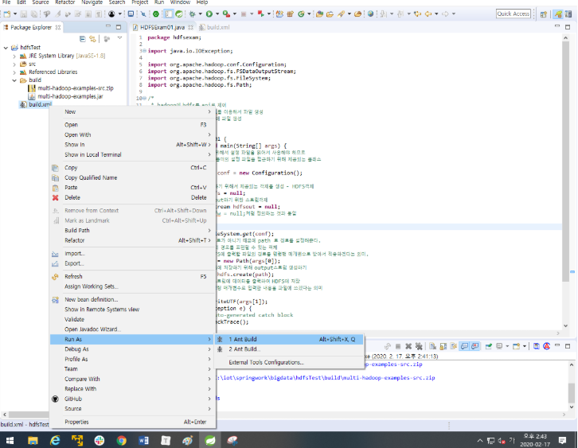

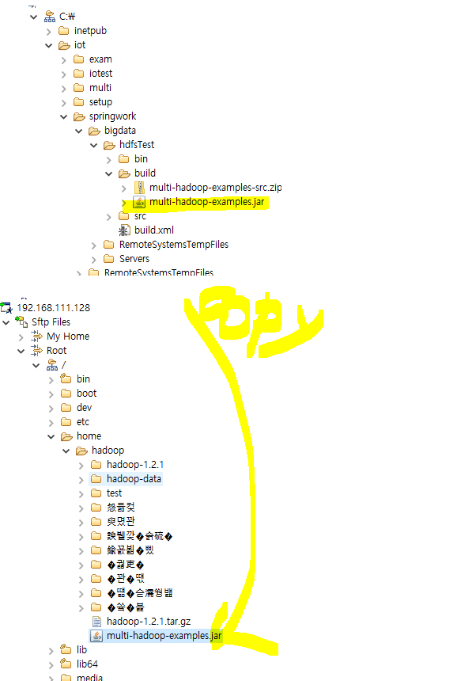

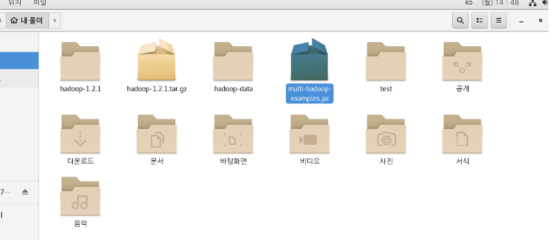

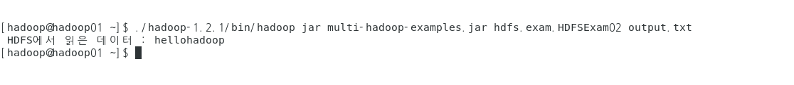

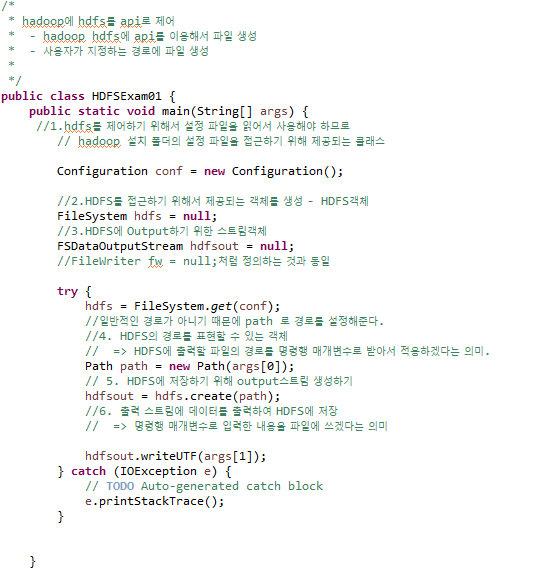

<pre>[hadoop@hadoop01 ~]$ ./hadoop-1.2.1/bin/hadoop jar multi-hadoop-examples.jar hdfs.exam.HDFSExam01 output.txt hellohadoop
</pre>

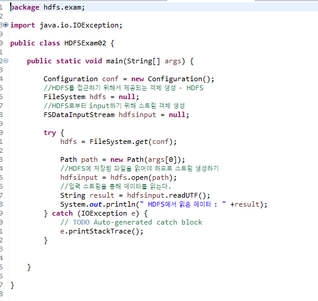

<pre>[hadoop@hadoop01 ~]$ ./hadoop-1.2.1/bin/hadoop jar multi-hadoop-examples.jar hdfs.exam.HDFSExam02 output.txt
 HDFS에서 읽은 데이터 : hellohadoop
</pre>

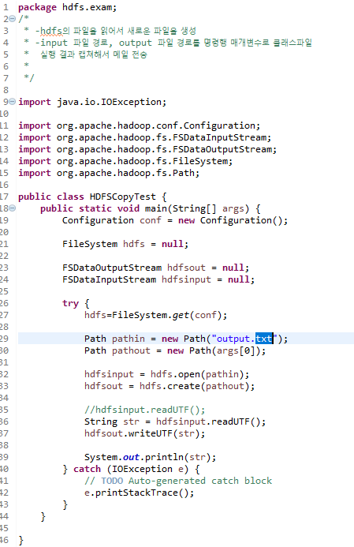

<pre>[hadoop@hadoop01 ~]$ ./hadoop-1.2.1/bin/hadoop jar multi-hadoop-examples.jar hdfs.exam.HDFSCopyTest secondfile.txt
hellohadoop
</pre>

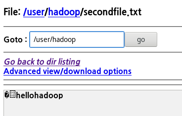