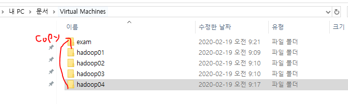
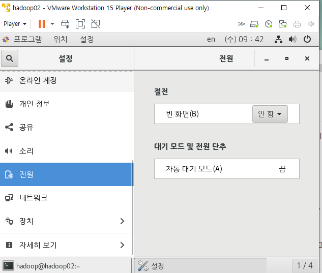
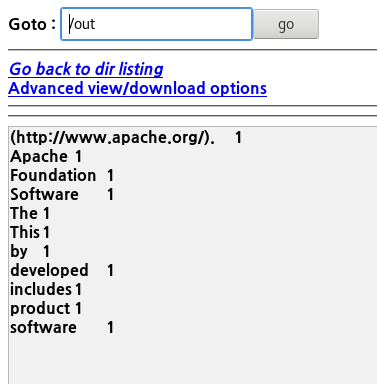
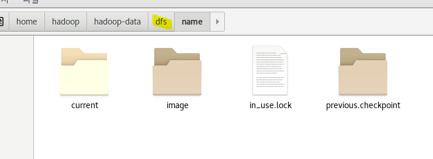
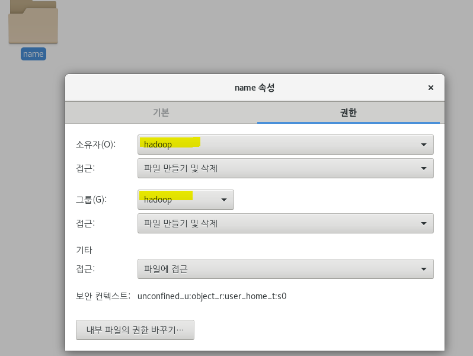
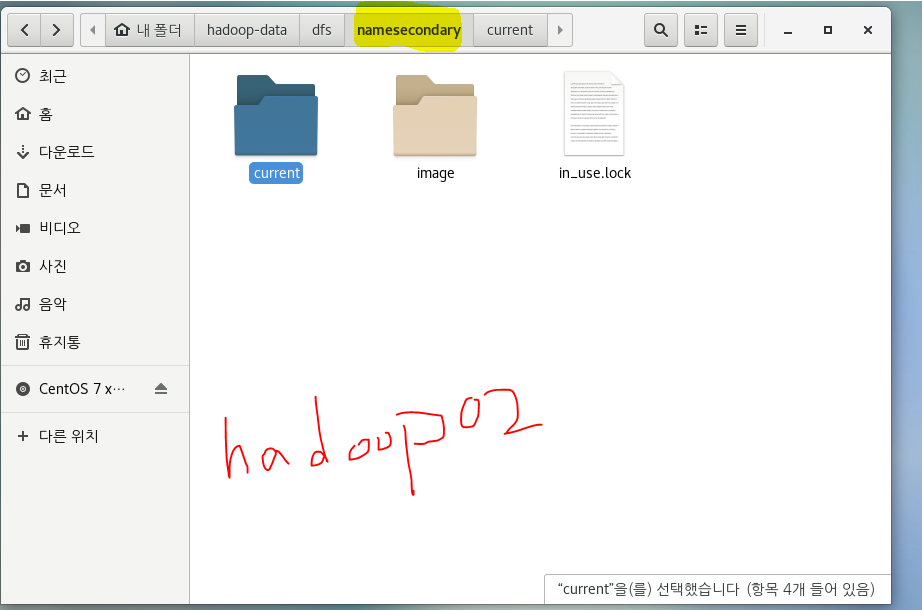
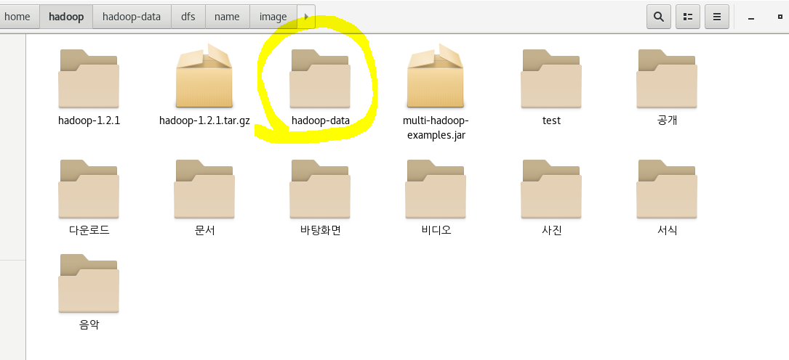
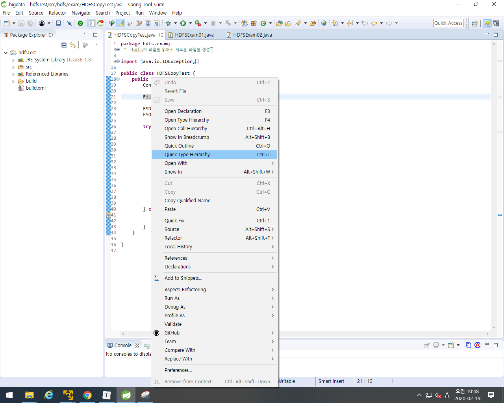

테스트용 계정을 만들 것이다. 

Hadoop04를 복사해서 테스트 계정을 만들어준다. 

단, 복사를 할 경우 사전에 무조건 서버를 **stop-all.sh**을 해주고 power-off 처리를 해주어야 한다.



# HDFS = 하둡의 분산 작업 시스템

하둡은 **HDFS**(Hadoop Distributed File System) 에 데이터를 저장하고, **맵리듀스**를 이용해 데이터를 처리한다.

하둡은 여러 대의 서버에 데이터를 저장하고, 저장된 각 서버에서 동시에 데이터를 처리하는 방식으로, **배치성**으로 데이터를 저장하고 처리하는데 적합한 시스템이다.


64Mbyte를 블럭단위로 잡는다........... 블럭이 커질 수록 메타 데이터가 작아지기 때문이다.

**HDFS**는 `네임노드(마스터)`와 `데이터노드(슬레이브)`로 구현되어 있다.

 ### 네임노드(NameNode) (master server )

- 메타데이터관리 : 파일 시스템을 유지하기 위한 메타데이타를 관리
- 데이터노드 모니터링 : 데이터노드는 네임노드에게 3초마다 **하트비트(heartbeat)**를 전송한다. 네임노드를 이를 이용하여 데이터노드의 실행상태와 용량을 체크한다. 하트비트를 전송하지 않는 데이터노드는 장애서버로 판단한다.
- 블록관리 : 장애가 발생한 데이터노드의 블록을 새로운 데이터노드에 복제한다. 용량이 부족하다면 여유가 있는 데이터노드에 블록을 옮긴다.
- 클라이언트 요청접수: 클라이언트가 HDFS에 접근하려면 반드시 네임노드에 먼저 접속해야 한다. HDFS에 파일을 저장할 경우 기존 파일의 저장여부와 권한 확인 절차를 거쳐 저장을 승인한다.

### 데이터노드

`데이터노드(DataNode)`는 클라이언트가 HDFS에 저장하는 파일을 로컬 디스크에 유지하다. 이때 파일은 두가지로 저장되는데 하나는 실제 저장되는 로우데이터이고 다른 하나는 체크섬이나 파일생성일자 같은 메타데이터가 저장된 파일이다. (업무를 분담하고 관리하는 **tasktracker**와 함께 존재)

**일괄 처리 (batch처리)** :컴퓨터 프로그램 흐름에 따라 순차적으로 자료를 처리

(cf. spark는 실시간 처리)


* 홈 디렉토리로 이동

<pre>
[hadoop@hadoop01 root]$ cd ~ 
[hadoop@hadoop01 ~]$
</pre>

~는 굉장히 private 한 폴더

* root 디렉토리로 이동

<pre>
[hadoop@hadoop01 ~]$ cd / 
[hadoop@hadoop01 /]$
</pre>

* 현재 작업중인 폴더 보기 (print working directory)

<pre>[hadoop@hadoop01 /]$ pwd
/ </pre>

* `.` 는 현재 , `..`는 상위 디렉토리를 의미한다.

<pre>[hadoop@hadoop01 ~]$ cd..
[hadoop@hadoop01 home] $ </pre>

* HDFS의 (특정) 폴더 지우기

<pre>[hadoop@hadoop01 hadoop-1.2.1]$ ./bin/hadoop fs  -rmr  /input</pre>
* 파일 실행시키기
  * hdfs.exam.HDFSCopyTest 는 실행시키고 싶은 클래스명 위치

<pre>[hadoop@hadoop01 hadoop-1.2.1]$ ./bin/hadoop jar ../multi-hadoop-examples.jar hdfs.exam.HDFSCopyTest /user/hadoop/output.txt /copytest</pre>


#### 머신 절전 모드

**프로그램** - **시스템 도구** - **설정** - **전원** - **절전** (안함)



* shell 스크립트 ?

현재 path를 걸어놓지 않은 상태이기 때문에 실행하고 싶은 파일의 전체 경로를 다 적어주어야 한다.

<pre>
[hadoop@hadoop01 ~]$ /home/hadoop/hadoop-1.2.1/bin/start-all.sh
</pre>

<pre>
[hadoop@hadoop01 ~]$ /home/hadoop/hadoop-1.2.1/bin/hadoop fs -ls
</pre>

- 현재 home디렉토리 (~)에 위치하기 때문에 경로를 full로 다 주어야 한다.

  따라서, `$ cd hadoop-1.2.1`를 통해 경로를 상대경로로 편하게 접근 할 수도 있다.

<pre>
[hadoop@hadoop01 hadoop-1.2.1]$ ./bin/hadoop jar hadoop-examples-1.2.1.jar wordcount /myinput/NOTICE.txt /out
</pre>

[결과]



* HDFS의 시스템 관련 파일이 있는 곳



* 가끔 READONLY 라는 오류가 뜰 경우, 권한 확인하기



* Hadoop02는 namenode를 통해 checkpoint 를 확인하기 때문에 다른 파일 구성을 가진다.



* **hadoop-data**는 실제 데이터를 관리하고 저장하는 폴더




* class의 계층 구조 확인할 수 있다.
  * FileSystem 이 FSInputStream과  FSoutputStream을 만드는데, 모든 정보를 다 갖고 있기 때문에 new 를 이용하는 것이 아닌 open, create해서 만든다. 



직렬화? 네트워크로 object를 보낼  수 있느냐 없느냐

## 리눅스 기본 명령어

### ls

* list의 약자로 `dir`역할
* 현재 디렉토리의 파일 목록 보기

<pre>[root@exam ~]# ls
</pre>

* /etc/sysconfig/ 디렉토리 목록

<pre>[root@exam ~]# ls /etc/sysconfig/
</pre>

* `-a` or `.` 숨긴 파일까지 모두 볼 수 있다.

<pre>[root@exam ~]# ls -a
<font color="#005FFF">.</font>              .bash_profile  <font color="#005FFF">.dbus</font>      anaconda-ks.cfg          <font color="#005FFF">문서</font>      <font color="#005FFF">음악</font>
<font color="#005FFF">..</font>             .bashrc        .esd_auth  initial-setup-ks.cfg     <font color="#005FFF">바탕화면</font>
.ICEauthority  <font color="#005FFF">.cache</font>         <font color="#005FFF">.local</font>     <font color="#EF2929">jdk-8u231-linux-x64.rpm</font>  <font color="#005FFF">비디오</font>
.bash_history  <font color="#005FFF">.config</font>        <font color="#005FFF">.ssh</font>       <font color="#005FFF">공개</font>                     <font color="#005FFF">사진</font>
.bash_logout   .cshrc         .tcshrc    <font color="#005FFF">다운로드</font>                 <font color="#005FFF">서식</font>
</pre>

* `-l` 현재 디렉토리의 자세한 목록을 볼 수 있다.

<pre>[root@exam ~]# ls -l
합계 174412
-rw-------. 1 root root      2002  2월 11 23:51 anaconda-ks.cfg
...
drwxr-xr-x. 2 root root         6  2월 11 23:53 <font color="#005FFF">음악</font>
</pre>

`d` : directory

`-` : 파일을 의미

- `.conf` 모든 파일 조회

<pre>[root@exam ~]# cd /etc/
[root@exam etc]# ls *.conf
</pre>

* 숨긴 파일과 자세한 내용을 모두 볼 수 있다.

<pre>[root@exam etc]# ls -al
합계 1508
</pre>

## mkdir

* make Directory, 새로운 디렉토리 생성

<pre>[root@exam ~]# cd mytest
[root@exam mytest]# touch myfile1
[root@exam mytest]# ls
myfile1
</pre>

## rmdir

디렉토리 삭제

<pre>[root@exam mytest]# mkdir myfolder
[root@exam mytest]# ls
myfile3  myfileTest1  <font color="#005FFF">myfolder</font>  <font color="#005FFF">test</font>  test_ana
[root@exam mytest]# rmdir myfolder/
[root@exam mytest]# ls
myfile3  myfileTest1  <font color="#005FFF">test</font>  test_ana
</pre>

## cp

* copy의 약자로, 파일이나 디렉토리를 새로 복사한다.

<pre>myfile1  myfile2  myfile3
[root@exam mytest]# cp myfile1 myfileTest1
[root@exam mytest]# ls
myfile1  myfile2  myfile3  myfileTest1
</pre>

* 디렉토리 복사

<pre>[root@exam mytest]# cp -r /etc/sysconfig/ test
[root@exam mytest]# ls
myfile3  myfileTest1  <font color="#005FFF">test</font>
</pre>

* 꼭 복사가 제대로 됐는지 확인.

<pre>[root@exam mytest]# ls ./test
anaconda         httpd             nfs              rsyncd
atd              init              ntpd             rsyslog
....
</pre>

## rm

* remove의 약자로 파일이나 디렉토리를 삭제한다.

<pre>[root@exam mytest]# rm myfile1
rm: remove 일반 빈 파일 `myfile1&apos;? y
[root@exam mytest]# ls
myfile2  myfile3  myfileTest1
</pre>


* 지울건지 물어보지 않는 제거 방법

<pre>[root@exam mytest]# rm -f myfile2
[root@exam mytest]# ls
myfile3  myfileTest1
</pre>

## mv

move의 약자로 파일이나 디렉터리의 **이름을 변경**하거나 **다른 디렉토리로 옮길 때** 사용

ex] ./test/anaconda 를 현재 폴더로 이동시킨다

<pre>[root@exam mytest]# mv ./test/anaconda ./
[root@exam mytest]# ls
anaconda  myfile3  myfileTest1  <font color="#005FFF">test</font>
</pre>

ex] anaconda를 test_ana로 이름 변경

<pre>[root@exam mytest]# ls
myfile3  myfileTest1  <font color="#005FFF">test</font>  test_ana
</pre>

예제 ] **계층형 디렉토리** 

```text
mytest1
 +
 |____mytest2
 		+
 		|____mytest3
```

<pre>[root@exam mytest]# mkdir mytest1/mytest2/mytest3
mkdir: `mytest1/mytest2/mytest3&apos; 디렉토리를 만들 수 없습니다: 그런 파일이나 디렉터리가 없습니다
</pre>

<pre>[root@exam mytest]# rm  mytest1
rm: cannot remove `mytest1&apos;: 디렉터리입니다
</pre>

* 생성

<pre>[root@exam mytest]# mkdir -p mytest1/mytest2/mytest3
</pre>

* 삭제

<pre>[root@exam mytest]# rm -r mytest1
rm: descend into directory `mytest1&apos;? y
rm: descend into directory `mytest1/mytest2&apos;? y
rm: remove 디렉토리 `mytest1/mytest2/mytest3&apos;? y
rm: remove 디렉토리 `mytest1/mytest2&apos;? y
rm: remove 디렉토리 `mytest1&apos;? y
</pre>

* 삭제 시 물어보는 여부가 싫을 경우

<pre>[root@exam mytest]# rm -rf test
</pre>

---

<pre>[root@exam ~]# ls /
<font color="#00FFFF">bin</font>   <font color="#005FFF">dev</font>  <font color="#005FFF">home</font>  <font color="#00FFFF">lib64</font>  <font color="#005FFF">mnt</font>  <font color="#005FFF">proc</font>  <font color="#005FFF">run</font>   <font color="#005FFF">srv</font>  <span style="background-color:#8AE234"><font color="#000000">tmp</font></span>  <font color="#005FFF">var</font>
<font color="#005FFF">boot</font>  <font color="#005FFF">etc</font>  <font color="#00FFFF">lib</font>   <font color="#005FFF">media</font>  <font color="#005FFF">opt</font>  <font color="#005FFF">root</font>  <font color="#00FFFF">sbin</font>  <font color="#005FFF">sys</font>  <font color="#005FFF">usr</font>
</pre>

* boot
  * 부팅 될 때 필요한 파일


```text
root 홈 디렉토리에 hadooptest 폴더 생성
-/etc/sysconfig폴더 copy
-/root/의 anaconda-ks.cfg 파일 복사하기
-복사한 후 my-conda.cfg로 rename
-아래의 구조를 갖고있는 서브 디렉토리 생성하기
mytest1
 +
 |____/etc/hosts파일 복사
 |____mytest2
 		+
 		|____mytest3
```

