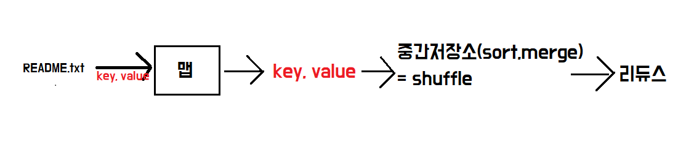
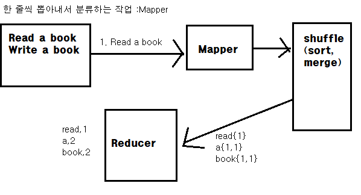
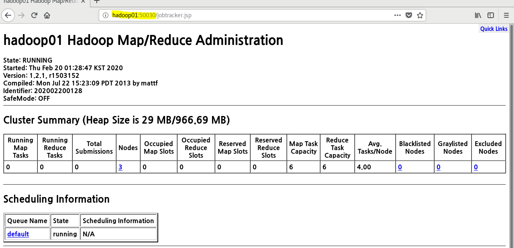
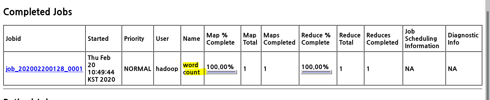
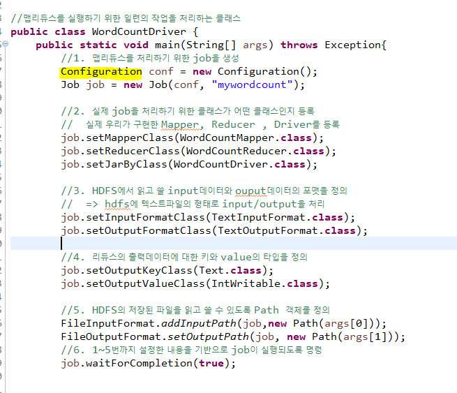
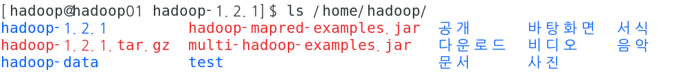
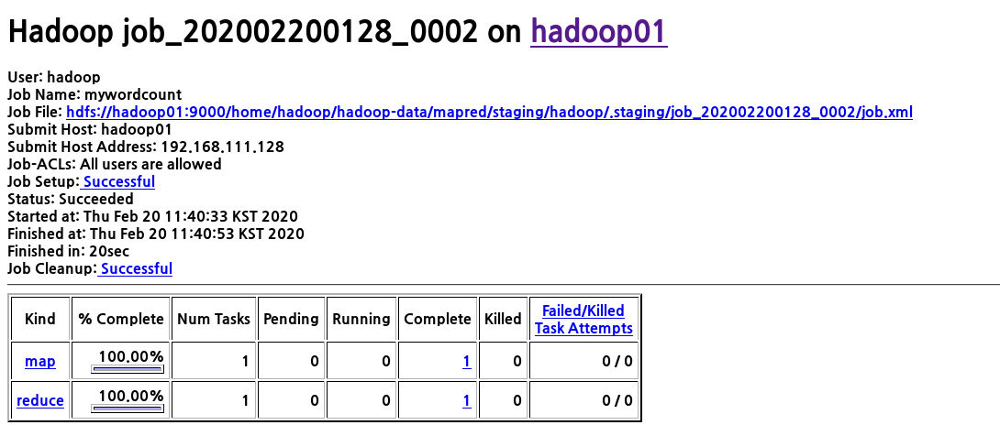
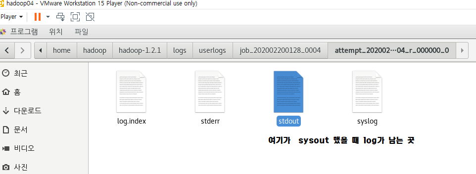

:jack_o_lantern:**ROOT**계정으로 접속 - 실행은 꼭 **hadoop**

## 클러스터 웹 인터페이스

* 하둡은 HDFS의 기본적인 상태를 모니터링하고 HDFS 내에 저장된 파일을 조회할 수 있게 웹 인터페이스를 제공해준다. 
* http://namenode:50070 으로 이동하면 웹 인터페이스에 접근 가능

### - HDFS 입출력

* 하둡은 HDFS 파일을 자바 애플리케이션에서 제어할 수 있게 자바 API를 제공해준다.

```JAVA
import org.apache.hadoop.fs.*;
//로컬이나 hdfs 파일을 제어할 수 있다.
```

* HDFS 제어
  * `Configuration` : 하둡 환경설정 파일에 접근하기 위한 클래스
    * `core-default.xml` 과 `core-site.xml` 등에 정의된 값을 조회, 변경 가능
  * `FileSystem` : 하둡에서 제공하는 파일 시스템을 추상화한 클래스
    * 로컬파일 시스템이나 HDFS 제어 가능

```JAVA
Configuration conf = new Configuration();
FileSystem hdfs = FileSystem.get(conf);
//get메서드를 호출하여 파라미터로 설정한 Configuration 객체가 사용하는 HDFS 반환
```

* 경로 객체 생성 후, 해당경로가 HDFS에 이미 존재할 경우 삭제.

```JAVA
Path path = new Path(args[0]);
if(hdfs.exists(path)){
    hdfs.delete(path,true);
}
```

* **FSDataOutputStream**
  * 버퍼에 데이터를 출력, 데이터 검증을 위한 체크섬 파일 생성

```java
FSDataOutputStream outStream = hdfs.create(path);
outStream.writeUTF(args[1]);//사용자가 입력한 내용 출력
outStream.close();
```

* **FSDataInputStream**
  * 파일을 조회하고, `readUTF`메서드를 호출해  파일의 내용을 문자열 변수에 저장한다.

```java
FSDataInputStream inputStream =hdfs.open(path);
String inputString = inputStream.readUTF();
inputStream.close();
```


## :star:맵리듀스

* 하둡은 **HDFS**와 **맵리듀스**로 구성된다.

* **맵리듀스**는 HDFS에 저장된 파일을 **분산 배치 분석**을 할 수 있게 도와주는 프레임워크
* 데이터 분류 - 같은 것 끼리 모아서 취합해 집계 (중간저장소)

* `mapper` + `reducer` + `driver` 로 구성된다



* **Map**은 입력 파일을 한 줄씩 읽어서 데이터를 **변형**
* **리듀스**는 맵의 결과 데이터를 **집계**(aggregation)한다.

```text
맵 : (k1,v1) -> list(k2,v2)  
리듀스 : (k2,list(v2)) -> (k3,list(v3))   
```


### 1. Mapper

1. Mapper 클래스를 상속한다

2. map메소드를 오버라이딩해서 map작업을 수행하면서 처리할 내용을 구현

> map 메소드의 매개변수 - 입력데이터 키, 입력 값 , context
>
> 맵리듀스 작업을 수행하여 맵메소드의 실행결과 즉, 출력데이터를 기록하고 **shuffle**(short,merge)하고 리듀서로 내보내는 작업을 수행하는 객체.

**context**  : 프레임워크 내부에서 기본작업을 처리하는 핵심적인 객체.

내부에서 머신들끼리 통신할 때 필요한 여러가지 정보를 갖고있다. 

output데이터를 Mapper의 실행결과로 내보낼 수 있도록 **key와 value**를 저장하는 변수


```java
public class WordCountMapper extends Mapper<LongWritable, Text, Text, IntWritable> {
    static final IntWritable outputVal = new IntWritable(1);
    Text outputkey = new Text();
    
    protected void map(LongWritable key, Text value, Mapper<LongWritable, Text, Text, IntWritable>.Context context)throws IOException, InterruptedException {
    
        StringTokenizer st = new StringTokenizer(value.toString());
     //key는 linenumber, value는 입력데이터의 한 라인에 해당하는 문장.
    while(st.hasMoreTokens()) { //잘라내는 token이 존재하는 동안 실행
			String token = st.nextToken();
			outputkey.set(token); //output데이터의 키를 셋팅
			//Context객체의 write메소드를 통해서 output으로 내보낼 데이터의 key와 value를 정의
			context.write(outputkey, outputVal);
		}
	}
	
}
```

### 2. Reduce

**Reducer**  데이터를 집계하는 역할

1. Reducer클래스를 상속
2. reduce 메소드를 오버라이딩

* **key** : 입력 데이터의 키타입
* **values** : 입력 데이터의 값에대한 타입
  * 입력 값들이 Iterable 형태로 전달
  * (1,1,1,1,1......) 값은 IntWritable이지만, 여러 개가 전달되므로 반복작업을 수행해야 한다.
* **context** :  맵리듀스 프레임워크 안에서 기본작업을 할 수 있도록 도와주는 역할

```java
@Override
	protected void reduce(Text key, Iterable<IntWritable> values, //Iterable : 반복해서 작업할 때 사용하는 interface
			Reducer<Text, IntWritable, Text, IntWritable>.Context context) throws IOException, InterruptedException {
		int sum = 0;
		for (IntWritable value:values) { 
			sum = sum+value.get();  
		}
		resultVal.set(sum);
        //reduce의 결과 전달.  계산될 결과를 IntWritable에 셋팅
		context.write(key, resultVal);
		//reduce의 실행 결과를 context에 write
		
	}
```




* 맵 관리하는 HDFS



<pre>[hadoop@hadoop01 hadoop-1.2.1]$ ./bin/hadoop jar hadoop-examples-1.2.1.jar wordcount /input/README.txt /wordcount
</pre>




### 3. Driver

**맵리듀스를 실행하기 위한 일련의 작업을 처리하는 클래스**






<pre>[hadoop@hadoop01 hadoop-1.2.1]$ ./bin/hadoop jar /home/hadoop/hadoop-mapred-examples.jar mapred.basic.WordCountDriver /input/README.txt /mywork/mywordcount
</pre>

[결과]



예제]5글자 이상인 문자열만 빈도수 구하기

```java
protected void map(LongWritable key, Text value, Mapper<LongWritable, Text, Text, IntWritable>.Context context)
			throws IOException, InterruptedException {
		
		StringTokenizer st = new StringTokenizer(value.toString());
		while(st.hasMoreTokens()) {
			String token = st.nextToken();
			System.out.println(key+":"+value);
			if(token.length()>=5) {
				outputkey.set(token);
				context.write(outputkey, outputVal);
			}
		}
```



