# <u>사용자</u> 정의 옵션

맵리듀스 잡을 실행하면 잡 객체는 사용자가 설정한 `Configuration` 객체를 이용해 `JobConf` 객체를 생성.

**JobConf** 객체는 하둡의 환경설정 파일과 하둡 명령어에서 입력한 파라미터를 참조해 모든 태스크에 이 정보를 제공.

사용자가 -D 옵션을 이용해서 입력한 옵션 값을 프로그램 안에서 사용하기 위해서 Mapper가 사용할 수 있도록 전달

1. **Configured**와 **Tool**을 상속해야 한다.

   > Configured는 환경설정 정보를 활용
   >
   >  Tool은 사용자정의 옵션을 사용하기 위함
   >
2. **run**메소드를 오버라이딩

   >  run메소드안에 Driver에서 구현했던 모든 코드를 구현

3. run메소드를 main메소드에서 실행되도록 호출해야 한다.
   
    >  run메소드를 직접 호출할 수 없고  `ToolRunner`라는 헬퍼클래스를 이용해서 호출

## OptionMapper

하둡을 실행할 때 사용자가 입력하는 옵션을 **Mapper내부에서 사용할 수 있도록** 옵션이 어떤 값으로 입력되었냐에 다라 다른 작업을 할 수 있도록 처리

-D 옵션과 함께 사용자가 입력하는 jobType이라는 옵션에 지정한 값을 추출해서 Mapper에 선언된 변수에 저장.

### MultipleOutputs

* **한 개의 입력데이터**를 이용해서 여러 개의 output을 만들고 싶은 경우 사용
* **Mapper** : `GenericOptionParser` 작업할 때와 동일하게 map메소드를 구성하며 보통 구분할 수 있도록 key에 각 상황별로 문자열만 추가해준다.
* **Reducer** : Mapper에서 넘겨준 데이터에서 구분자를 기준으로 분리해서 합산.
  * 개별 output 이 생성될 수 있도록 처리
  * **setup** : `Reducer` 객체가 처음 실행될 때 한번 호출되는 메소드
    * `MultipleOutputs`객체를 생성
  * **reduce** : 각각의 상황별로  write가 호출될 수 있도록 처리
    * ( `up`,` equal`, `down` )
  * **cleanUp** : Reducer의 작업이 종료될 때 한 번 호출되는 메소드
    * `MultipleOutputs`객체를 해제 ( 반드시 처리 )
* **Driver** :  `MultipleOutputs`으로 출력될 경로를 Path에 설정
  * prefix로 구분문자열을 정의
  * 

<pre>[hadoop@hadoop01 ~]$ /home/hadoop/hadoop-1.2.1/bin/hadoop fs -put /home/hadoop/hadoop-1.2.1/*.csv /input
[hadoop@hadoop01 ~]$ /home/hadoop/hadoop-1.2.1/bin/hadoop fs -lsr /input
-rw-r--r--   3 hadoop supergroup  127162942 2020-02-24 18:53 /input/1987.csv
....
</pre>

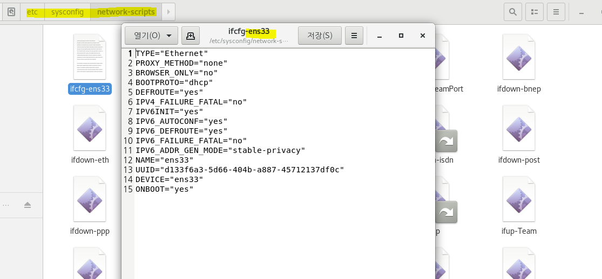

* 고정 IP설정 작업
  * 현재는 # 주석처리 된 상태.

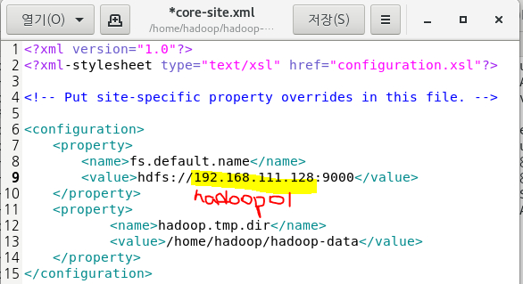

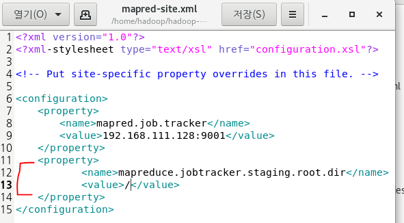

* 위의 설정파일 설정 과정 모두 다른 머신으로 복사

<pre>[hadoop@hadoop01 ~]$ scp /home/hadoop/hadoop-1.2.1/conf/* hadoop@hadoop02:/home/hadoop/hadoop-1.2.1/conf/
</pre>

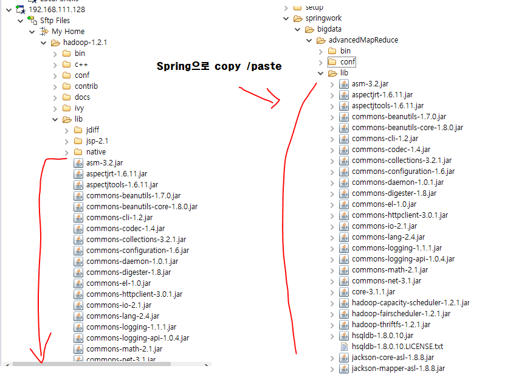

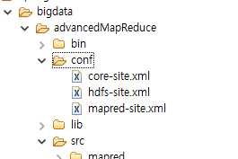

* 실제 Spring에서 인식할 수 있도록 변경
  * conf 클래스 추가

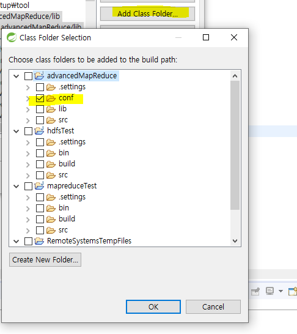

* library 추가 (JARs)

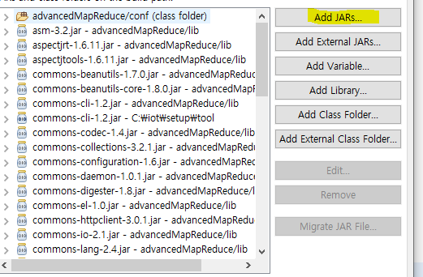

* Driver에서 명령행 매개변수 받게 설정해놨었다.

  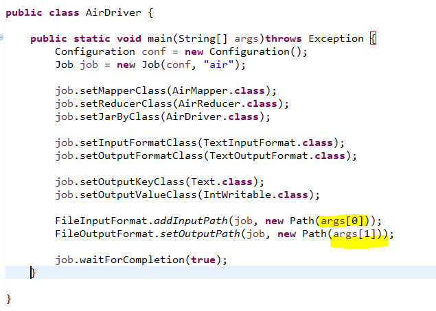

  아래와 같이  String_prompt 설정.

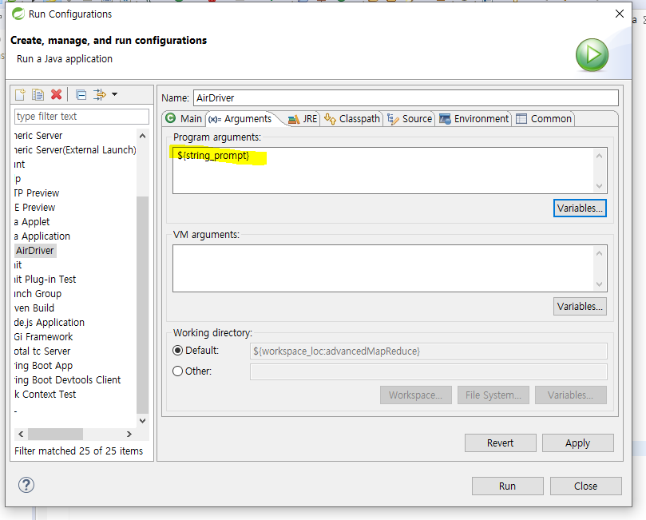

* 상대경로 실행

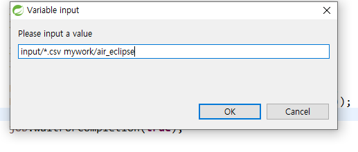

   * 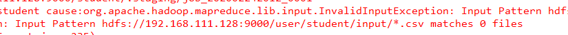
   * 이와 같은 경로 관련 문제 발생

* Spring에서 권한 관련 오류 발생시 아래와 같이 설정해준다.

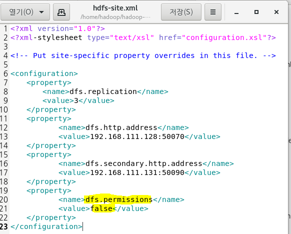

* Jar파일 경로 설정 (수동)

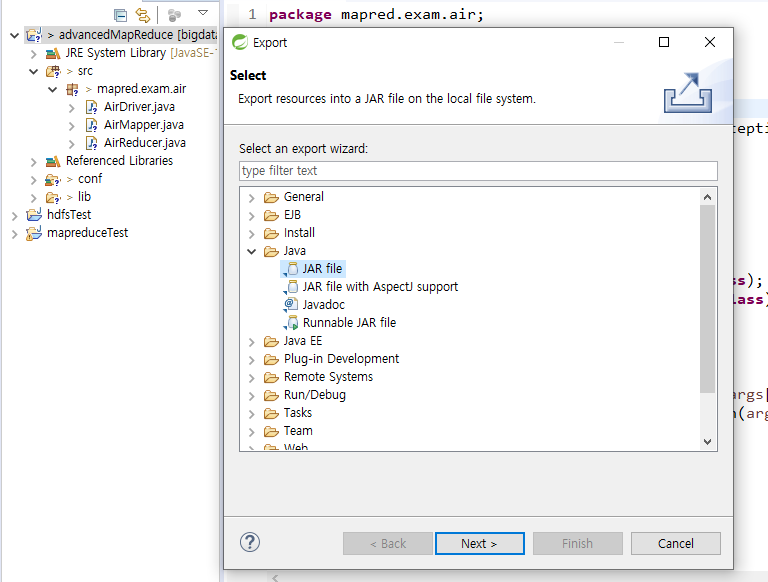

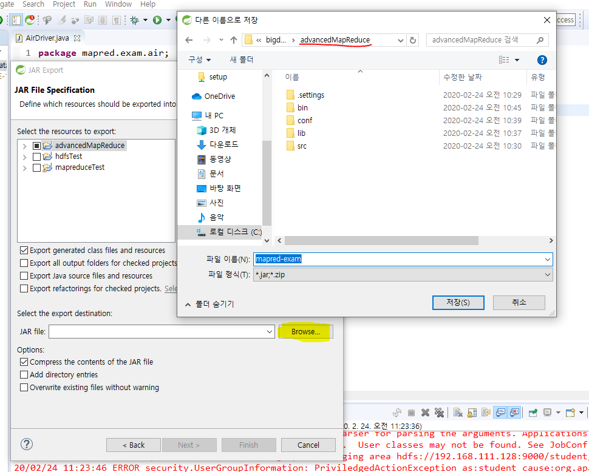

* 새로 생긴 mapred-exam.jar 에 add to build path 를 눌러준다.
  * (절대경로 설정 )

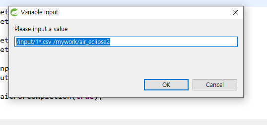

1로 시작하는 1987,1988.csv가 전부 실행된다.

실행할 때마다 mapred_exam.jar를 업데이트 해주어야 한다.

[결과]

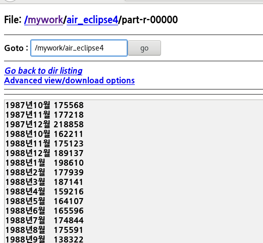

