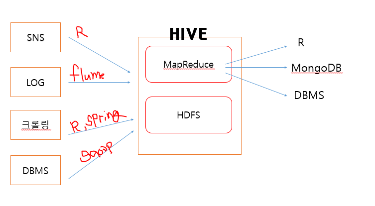
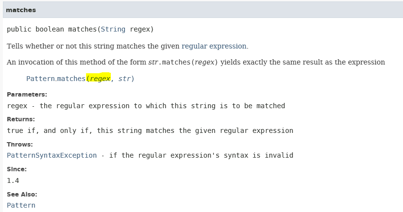

## 빅데이터

* 


* MapReduce : 분산 처리 프로그래밍
* HDFS : Hadoop Distributed File System


### 정규 표현식

텍스트안에서 특정 형식의 문자열을 추출하거나 검색할 때 사용하는 특수문자로 만들어진 패턴

### 1. 자바 API

1) String 클래스의 **matches**메소드 : 매개변수로 전달한 정규표현식에 일치하는 문자열이 있는지를  `boolean` 으로 리턴.



2) **java.util.regex** 패키지의 클래스들을 활용

* `Pattern` 클래스 : 패턴을 정의할 때 사용

  * **CASE_INSENSITIVE** : 대소문자 적용을 하지 않는다는 의미.

* `Matcher`클래스 : 패턴과 일치하는 문자열을 관리하는 클래스
* `find()` : 패턴에 만족하는 문자열이 있는지 찾기 : *true or false 리턴*
  * `start()` : 매칭되는 패턴과 일치하는 문자열의 start index
* `end()` : 패턴과 일치하는 문자열의  end index +1
  * `group()` : 패턴과 일치하는 문자열을 리턴 ( 일치하는 문자 추출 )

### 2. Pattern 기호

1) 기본 기호

`^` , `.`, `$` , `|` , `[]`,

`()`: 그룹으로 묶을 경우 사용

2) 수량 관련 기호

* `*` : `*`앞에 패턴문자가 0이거나 1이거나 여러 개 있거나
* `+` : `+`앞에 패턴문자가 1이거나 여러 개 있거나
* `?` : `?`앞의  패턴문자가 없거나 1이거나 
* `.{n}` : `.`은 임의의 한 문자를 의미, `n`은 글자 수를 의미
  * 어떤 문자이거나 n개의 문자
  * `xxxx{1,3}` : 1 이상 3 이하 (x는 패턴을 의미)
  * `xxxx{3, }`: 3이상

* IP 정규 표현식

```JAVA
String ipreg="^(([0-9]|[1-9][0-9]|1[0-9]{2}|2[0-4][0-9]|25[0-5])\\.){3}([0-9]|[1-9][0-9]|1[0-9]{2}|2[0-4][0-9]|25[0-5])$";
```


