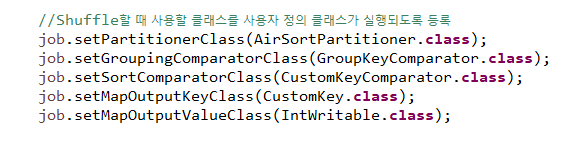

## 정렬

### 1. 보조정렬

**1) 정렬하려고 하는 기준을 정의한 사용자 키 클래스를 작성**  : 복합키 

**2) Mapper클래스의 map메소드에서 사용자 키가 outputkey로 출력될 수 있도록 정의** 

**3) Reduce 테스크에 분배할 수 있는 Partitioner를 정의**

* 같은 키를 갖고 있는 Mapper의 출력데이터를 같은 리듀스테스크로 보내기 위해서 **해시코드**를 이용해서 계산

**4)  Reduce테스크로 보내기전에 같은 그룹으로 그룹핑을 할 수 있도록 객체를 정의**

* 그룹키 비교기

  ex ] air 데이터에서 같은 년도별로 데이터를 분류

**5) 4번에서 같은 그룹으로 정의한 데이터 내부에서 두 번째 기준을 적용해서 비교할 수 있도록 객체를 정의.**

* 1번에서 정의한 복합키의 기준으로 데이터를 정렬하기 위한 객체
* 복합키비교기


### Airsort 예제 실습

* AirsortReducer


* AirSortDriver

* AirSortPartitioner

  * **Partitioner**클래스에는 Mapper의 key와 value타입을 `generic`으로 명시
  * year를 기준으로 해시코드를 구해서 같은 year를 갖고있는 데이터를 같은 리듀서에서 작업할 수 있도록 분배하는 작업 실습
  * 같은 것끼리 메모리 버퍼에 쌓았다가 한꺼번에 전송.

  ```java
  public class AirSortPartitioner extends Partitioner<CustomKey, IntWritable>{
  	//numPartitions는 파티션의 갯수 = 리듀스테스크의 갯수
  	
  	@Override
  	public int getPartition(CustomKey key, IntWritable value, int numPartitions) {
  		//year를 기준으로 평가
  		
  		return key.getYear().hashCode() % numPartitions;
  	}
  
  }
  ```

* **CustomKey**

  * **복합키**를 정의 - **사용자 정의 키** (정렬할 `기준`을 `컬럼`으로 갖고있는 객체)
  * 맵리듀스 프레임워크 내부에서 키와 value는 네트워크에서 주고 받는 값이므로 **네트워크 전송**을 하기 위해 제공되는 `Writable`타입이어야 한다.
  * `WritatbleComparable`을 상속받아 작성한다.

  

  * 데이터를 쓰고 읽는 작업을 처리
    * 데이터를 쓰기 - **직렬화**
    * 데이터를 읽기 - **역직렬화**
    * 하둡의 맵리듀스 내부에서 이런 작업을 처리할 수 있도록 메소드를 호출해서 처리한다.

  

* CustomKeyComparator

  

* GroupKeyComparator

  


* year, month로 찍어줄 toString 추가


[결과]


* 검색 기록 보기


* sysout 기록
  * 다른 데이터가 넘어옴을 확인할 수 있다.


key가 계속 바뀜을 볼 수 있다.


같은 year끼리 묶었기 때문에 reduce그룹이 2개로 나온다.


전부 같은 hashcode, 다른 mapkey

리듀스 안에서 출력하고 싶은 형태로 조절할 수 있다.

### Inner 클래스

클래스 안에 사용되는 클래스 

```java
class Mapper{
    ...
    class Context{
        ...
    }
}
```

