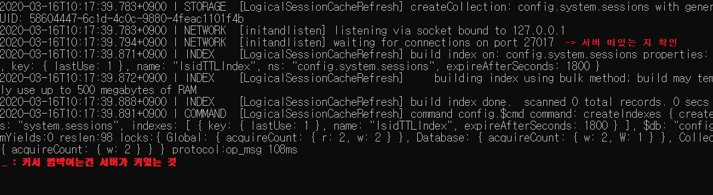
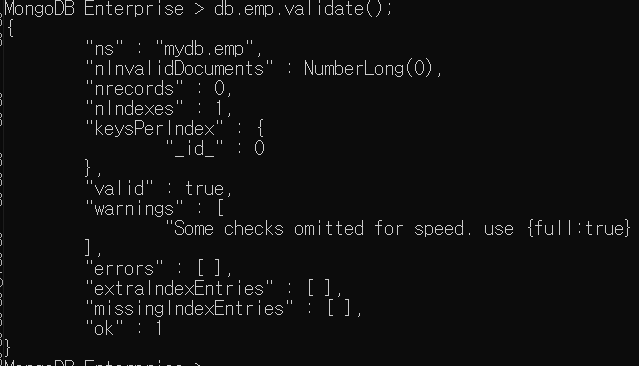

## [MongoDB](https://www.mongodb.com/)

* NoSQL 
  * schema가 없다.
    * `schema(스키마)` : 데이터베이스를 구성하는 레코드의 크기, 키(key)의 정의, 레코드와 레코드의 관계, 검색 방법 등을 정의한 것
    * 즉 , 비정형 데이터를 저장하고 있다

* JSON형태*(어떠한 데이터 형태도 수용 가능)*로 내부에서 데이터를 처리한다.
* `문서지향`이기 때문에 Join이 불가능하다.
* [Document](https://docs.mongodb.com/v3.6/introduction/#)

### MEAN Stack 

 **Mongo DB, Express JS, Agular, Node JS 로 구성**되어 있으며, 웹사이트 개발을 위한 개발 환경 구성

 **JavaScript(자바스크립트)를 기반**

입출력이 빈번하게 발생할 때 구축이 용이하다. 

cross domain이라는 문제가 발생.

node.js -> 라즈베리 파이 연동이 용이하다.

### MongoDB 설치


* 환경변수 - 시스템 변수 - path 저장


* DOS에 mongod 입력

  * 데이터가 저장될 폴더 만들기

  * 

  * 

  * 

  * 다른 dos 창에서 mongo 실행

    * ```sql
    C:\Users\student>mongo
      ```


  

  * `mongodb shell`에서 실행 됐는 지 확인

    * ```sql
      MongoDB Enterprise > show dbs;
      ```

  

  * 서버에서 접속이 된 것 확인할 수 있다.

  

  * 분산환경 접속 가능하기 때문에 여러 mongo 접속할 수 있다.

  

  * MongoDB를 사용할 때는 꼭 mongd가 올라와있어야 한다.

  * 상태 확인

    * ```sql
      MongoDB Enterprise > db.stats()
      ```

   

   * 현재 아무것도 저장되어있지 않음을 알 수 있다.

        * 접속에서 나가기

      ```sql
      MongoDB Enterprise > db.logout()
      ```

  ### MongoDB 용어

* `collection` : 테이블

* `document` : 레코드

* `filed` : 컬럼

* `_id` : 기본키

  * 값을 지정해주지 않으면 자동 생성

### collection(RDBMS에서의 테이블)

> 관계형 데이터베이스처럼 스키마를 정의하지 않는다.

* 테이블 만들기 


* 어떤 테이블이 있는지 조회
  * `select * from tab; `과 동일

```sql
MongoDB Enterprise > show collections;
```


#### 1. 종류

* **capped** collection  
  * 고정 사이즈 주고 생성하는 컬렉션
  * 미리 지정한 저장 공간이 모두 사용되면 맨 처음에 저장된 데이터가 삭제되고 공간으로 활용된다.
* document 사이즈를 벗어난 데이터가 입력될 시, `수정/삭제`가 되지 않으므로, 일반적으로 `non capped`를 사용한다.
  
* **non capped** collection
  * 일반적인 collection 
* capped collections인지 확인

```sql
MongoDB Enterprise > db.emp.isCapped();
true   --> capped
false  --> non capped
```

#### 2. Collection 관리

* 생성
* 일반 컬렉션

````sql
MongoDB Enterprise > db.createCollection("컬렉션명")
````

* 옵션을 설정한 작업 ( JSON)

```sql
MongoDB Enterprise > db.createCollection("컬렉션명", {옵션list})
```

ex )

```sql
MongoDB Enterprise > db.createCollection("emp",
...                                     {capped:true,size:100000000})
```

```sql
MongoDB Enterprise > db.createCollection("emp2",
                                         {capeed:false,size:100000000})
```




* 삭제 

```javascript
MongoDB Enterprise > db.collection명.drop()
```

* 컬렉션명 변경

```javascript
MongoDB Enterprise >db.컬렉션명.renameCollection("변경할컬렉션명");
```

---

[실습]

-mini 데이터베이스 생성

-emp(size:10000,capped컬렉션)

-shop(일반 컬렉션)

```javascript
MongoDB Enterprise > use mini
switched to db mini
MongoDB Enterprise > db.createCollection("emp",{capped:true,size:10000})
{ "ok" : 1 }
MongoDB Enterprise > db.createCollection("shop")
{ "ok" : 1 }
```

데이터베이스 목록, 컬렉션목록 

```javascript
MongoDB Enterprise > show dbs;
admin   0.000GB
config  0.000GB
local   0.000GB
mini    0.000GB
mydb    0.000GB
MongoDB Enterprise > show collections
emp
shop
```

---

### 1. MongoDB - insert

배열 : `[]`  	/ 	객체 : `{}`

#### [구문]

[`db.collection.insert(데이터...)`](https://docs.mongodb.com/v3.6/reference/method/db.collection.insert/#db.collection.insert)

[`db.collection.insertOne()`](https://docs.mongodb.com/v3.6/reference/method/db.collection.insertOne/#db.collection.insertOne)  

[`db.collection.insertMany()`](https://docs.mongodb.com/v3.6/reference/method/db.collection.insertMany/#db.collection.insertMany)

- document(관계형 db에서 레코드개념)에 대한 정보는 json의 형태로 삽입
  -  `ObjectId("5e6ee8127cbeee9bbc4d3d6a")` : primary key

```javascript
MongoDB Enterprise > db.emp.insert({id:"jang",pass:"1234"})
WriteResult({ "nInserted" : 1 })
MongoDB Enterprise > db.emp.find();
{ "_id" : ObjectId("5e6ee7cf7cbeee9bbc4d3d69"), "id" : "jang", "pass" : "1234" }
```

``` javascript
MongoDB Enterprise > db.emp.insert({id:"lee",pass:"1234",info:"jjang"});
WriteResult({ "nInserted" : 1 })
MongoDB Enterprise > db.emp.find();
{ "_id" : ObjectId("5e6ee7cf7cbeee9bbc4d3d69"), "id" : "jang", "pass" : "1234" }
{ "_id" : ObjectId("5e6ee8127cbeee9bbc4d3d6a"), "id" : "lee", "pass" : "1234", "info" : "jjang" }
-->스키마가 없음.(비정형 데이터)
```

* MongoDB에서 document를 삽입하면 자동으로`_id`가 생성 

  * 기본키 역할

  ```javascript
  "_id" : ObjectId("5e6ee7cf7cbeee9bbc4d3d69")
  				----------------------------
  				현재 timestamp + machine id + mongodb 프로세스 id + 순차번호
  															 	 --------
  															 	 추가될 때 마다 증가
  ```
  
  * 데이터 삽입

  ```javascript
  MongoDB Enterprise > mydata ={id:"kim",pass:"1234",val:1000,val2:2000}
  MongoDB Enterprise > db.emp.save(mydata)
  ```


* for문 이용한 insert

  ```javascript
  MongoDB Enterprise > for(var i=1100;i<=1120;i++){                    				                                          db.emp.save({id:i,msg:"test"});};
  WriteResult({ "nInserted" : 1 })
MongoDB Enterprise > db.emp.find();
  ....
  ```
  
* 배열 삽입

  * 배열은 `[]`로 관리된다

  ```javascript
  MongoDB Enterprise > db.emp.insert({id:"lee1245",pass:"1234",info:"jjang",
  ...                                                   subject:["java","jdbc","hadoop","sqoop"]});
  ```

  * 여러개 삽입

  ```javascript
  MongoDB Enterprise > db.emp.insert([{_id:11111,id:"test11",val1:2000,val2:3000}, 										{id:"kang",val1:2000,val2:3000,name:"홍길동"},
                 									 {id:"hong",val1:2000,val2:3000}])
  ```


* 이미 있는 데이터에 insert 하기

```javascript
MongoDB Enterprise > db.emp.insert({_id:11111,pass:"1234",info:"jjang"});
WriteResult({                       0}])
        "nInserted" : 0,
        "writeError" : {
                "code" : 11000, 
                "errmsg" : "E11000 duplicate key error collection: mydb.emp index: _id_ dup key: { : 11111.0 }"
        }
})
```

예제 ] 

```javascript
MongoDB Enterprise > db.customer.insert({id:"kang",pass:"1234",name:"강감찬",                                       info:{                                                  city:["서울","인천","부산"],
						toeicjumsu:[700,800,600,870,890]}
                                        });;
```

### 2. MongDB에 update

* document 수정
* 조건을 적용해서 수정하기 위한 코드도 JSON으로 구현
  * JSON의 형태로 문자열로 삽입되기 때문에 `$`로 결합한다.
* update를 위한 명령어
* **`$set`**: 해당 필드의 값을 변경 (업데이트를 하기 위한 핵심 명령어)
  * `none capped collection`인 경우, 업데이트 할 필드가 없는 경우 추가한다.
* **`$inc`** : 해당 필드에 저장된 숫자의 값을 증가
* **`$unset`** : 원하는 필드를 삭제할 수 있다.
* **업데이트 옵션** : 
  * `multi` : `true`를 추가하지 않으면 조건에 만족하는 document 중 첫 번째  document만 update

```javascript
MongoDB Enterprise > db.emp.update({id:"kang"},{$set:{val1:3000}},{multi:true});
```


#### [구문]

* ```javascript
  MongoDB Enterprise > db.컬렉션명.update({조건필드 : 값}, //sql의 update문 where절
                                     	{$set:{수정할 필드 : 수정 값}},//set절
                                     {update와 관련된 옵션 : 옵션 값})
  ```

  [예제]
  
* ```javascript
  MongoDB Enterprise > db.emp.update({id:"jang"},{$set:{pass:"abcd"}});
  ```

* ```javascript
  MongoDB Enterprise > db.emp.update({id:"kim"},{$set:{val1:3000}});
  ```


  * ```javascript
    MongoDB Enterprise > db.emp.update({id:"kang"},{$inc:{val1:2000}},{multi:true});
    //val1: 3000 의 값에서 2000을 더한 val1: 5000이 출력된다.
    ```


* 데이터 추가 
  
  ```javascript
  MongoDB Enterprise > db.score.update({id:"hong"},{$set:{msg:"test"}})
  ...
  
  
  
  
  MongoDB Enterprise > db.score.find();
{ "_id" : ObjectId("5e6f12966d70f05ba38f6657"), "id" : "hong", "name" : "홍길동", "dept" : "인사", "addr" : "서울", "java" : 100, "servlet" : 88, "bonus" : 2000, "msg" : "test" }
  ```
  
* 데이터 삭제

  ```javascript
  MongoDB Enterprise > db.score.update({id:"hong"},{$unset:{msg:"test"}});
  ```

---

[실습]

1. id가 kang사람의 dept를 "총무"로 변경
2. dept가 "전산"인 모든 addr을 "안양"으로 변경
3. id가 jang인 document의 bonus를 1000추가
4. dept가 "인사"인 모든 document의 bonus에 2000추가

```javascript
MongoDB Enterprise > db.score.update({id:"kang"},{$set:{dept:총무"}});

MongoDB Enterprise > db.score.update({dept:"전산"},{$set:{addr:"안양"}},{multi:true});

MongoDB Enterprise > db.score.update({id:"jang"},{$inc:{bonus:1000}});

MongoDB Enterprise > db.score.update({dept:"인사"},{$inc:{bonus:2000}},{multi:true});

```

----

### 3. MongoDB에서 배열 관리

#### [구문]

```javascript
MongoDB Enterprise > db.score.update({id:"jang"}, {$set:{  info:   {city:["서울","안양"], movie:["겨울왕국2","극한직업","쉬리"]  }  } }  );;
```

* 배열에서 사용할 수 있는 명령어

* **$addToSet**

  * 배열의 요소를 추가 

  * 없는 경우에만 값을 추가시킨다. *[중복을 체크하는 명령어]*

    ```sql
    MongoDB Enterprise > db.score.update({id:"jang"},{$addToSet:{"info.city":"인천"}})
    ```

* **$push**

  * 배열의 요소를 추가 

  * 중복을 허용하는 명령어

    ```javascript
    MongoDB Enterprise > db.score.update({id:"jang"},{$push:{"info.city":"천안"}});
    ```

* **$pop**

  * 배열에서 요소를 제거할 때 사용 *(오른 쪽 끝에서부터 지운다.)*
  * `1`이면 마지막 요소를 제거,
  * `-1`이면 첫 번째 요소를 제거

  ```javascript
  MongoDB Enterprise > db.score.update({id:"jang"},{$pop:{"info.city":1}})
  MongoDB Enterprise > db.score.update({id:"jang"},{$pop:{"info.city":-1}})
  ```


* **$each** : addToSet이나 push에서 사용할 수 있다.

  * 여러 개를 배열에 추가할 때 사용

  ```javascript
  MongoDB Enterprise > db.score.update({id:"jang"},{$push:{"info.city":{$each:["천안","가평","군산"]}}})
  ```

* **$sort** : 정렬 (1:오름차순,-1:내림차순)

* **$pull** : 배열에서 조건에 만족하는 요소를 모두 지운다. (조건 한 개)

  * **$pullAll** : 배열에서 조건에 만족하는 요소를 제거 (조건을 여러 개)

```javascript
MongoDB Enterprise > db.score.update({id:"jang"},{$pull:{"info.city":"천안"}})
```

```javascript
MongoDB Enterprise > db.score.update({id:"jang"},{$pull:{"info.city":["가평","군산"]}})
-->     WriteResult({ "nMatched" : 1, "nUpserted" : 0, "nModified" : 0 })
```

```javascript
MongoDB Enterprise > db.score.update({id:"jang"},{$pullAll:{"info.city":["가평","군산"]}})
```

[실습]


```javascript
1.
db.score.update({id:"song"},{$push:{"info.history":{$each:["영업1팀","총무","기획실"]}}});

db.score.update({id:"jang"},{$push:{"info.history":{$each:["전략팀","총무","전산"]}}});

db.score.update({id:"hong"},{$push:{"info.history":{$each:["영업1팀","기획실","전산"]}}});

2.
db.score.update({id:"song"},{$push:{"info.history":"자금부"}});
3.
db.score.update({id:"jang"},{$pop:{"info.history":1}});
4.
db.score.update({servlet:100},{$inc:{bonus:3000}});
5.
db.score.update({id:"song"},{$push:{"lang.ms":{$each:["visual basic","asp",".net"]}}});
```

[실습]


```javascript
MongoDB Enterprise > db.board.insert({no:1,id:"soyoun",title:"댓글달기",count:1,writedate:"20/03/16"});
```

```javascript
MongoDB Enterprise > db.board.update({id:"yooni"},{$push:{comment:{"content":"댓글1","count1":"1","count2":"2"}}});;
```

```javascript
MongoDB Enterprise > db.board.update({id:"yooni"},{$pop:{"comment":-1}});
```


