# MongoDB

>  aggregation (집계 기능) / mapreduce 제공

* 펼쳐진 데이터를 볼 수 있다.

```javascript
MongoDB Enterprise > db.board.find().pretty();
```

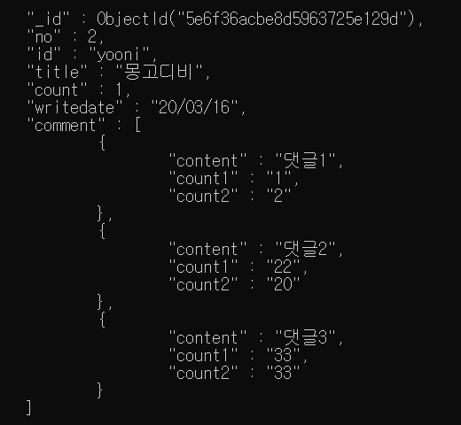

* 화면 클리어

```javascript
MongoDB Enterprise > cls
```

* 현재 시간 insert
  * `new Date()` 이용

```javascript
MongoDB Enterprise > db.board.update({no:2},{$push:{comment: {content:"댓글 내용",count1:5,count2:2,writedate:new Date()}}});
```

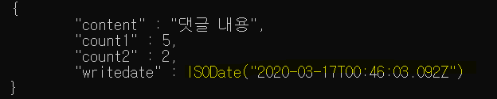

## MongoDB에 저장된 데이터 조회하기

```javascript
MongoDB Enterprise > var x = db.score.findOne();
MongoDB Enterprise > x
```

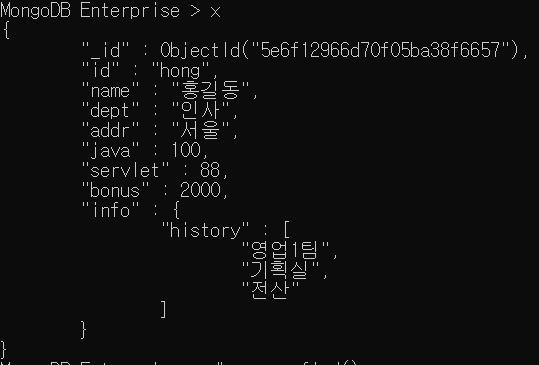

```javascript
MongoDB Enterprise > x.num=120
```

* 데이터 삽입

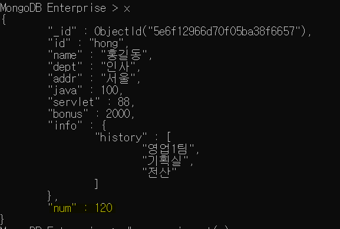

* 기존에 데이터가 있는 경우 insert 는 수행할 수 없지만, save 는 값을 수정해서 넣을 수 있다.

  * ```javascript
    MongoDB Enterprise > db.score.insert(x)
    //최초 삽입
    ```

  * ```javascript
    MongoDB Enterprise > db.score.save(x)
    ```

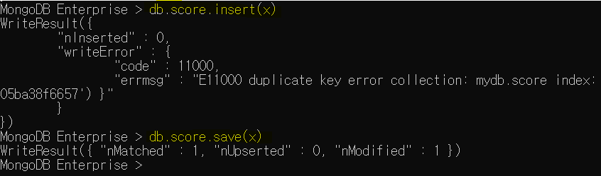

* 데이터 갯수 리턴
  * javascipt 형태이기 때문에 데이터 체이닝이 가능하다.

```javascript
MongoDB Enterprise > db.score.find().count();
11
```

[실습]

score의모든 document에 num필드(1000)이 추가되도록 작업.

여러 데이터를 collection으로 받을 수 있도록 처리.

```javascript
MongoDB Enterprise > var y = db.score.find()
MongoDB Enterprise > while(y.hasNext()){
...                     var one = y.next();
...                      one.num =1000;
...                      db.score.save(1000);
...                   }
```

### 1) find

* `db.컬렉션명.find({})`와 동일 :` {}` 안에 아무것도 없으면 전체 데이터 조회

  * 조건, 조회할 필드에 대한 명시 모두 json 형태로 

* 조회할 필드의 정보 명시

  * 형식 : **{필드명 : 1...}** : 화면에 표시하고 싶은 필드

    ​           **{필드명 : 0...}** : 명시한 필드가 조회되지 않도록 처리 

```javascript
MongoDB Enterprise >db.컬렉션명.find(조건,조회할 필드에 대한 명시)
```

* [조건]
  * `$lt`  : <
  * `$gt` : >
  * `$lte` : <=
  * `$gte` : >=
  * `$or` : 여러 필드를 이용해서 같이 비교 가능
  * `$and`:  and 연산
  * `$in` : 하나의 필드에서만 비교 가능
  * `$nin` :  `not in`의 개념으로,`$in`으로 정의한 조건을 제외한 document를 조회
* 실습

*ex ] addr 이 인천인 데이터: id , name , dept, addr*

```javascript
MongoDB Enterprise >db.score.find({addr:"인천"},{id:1,name:1,dept:1,addr:1})
```

*ex ]id를 조회하지 않을 떄*

```javascript
MongoDB Enterprise >db.score.find({addr:"인천"},{id:1,name:1,dept:1,addr:1,_id:0})
```

*ex ]score컬렉션에서 java가 90점 이상인 document 조회 (id,name,dept,java만 출력)*

```javascript
db.score.find({java:{$gte:90}},{id:1,name:1,dept:1,java:1,_id:0})
```

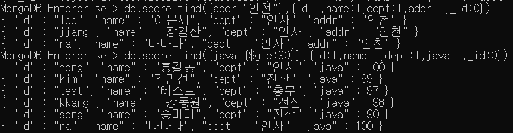

 *ex ] dept가 인사이거나 addr이 인천인 데이터 조회*

```javascript
MongoDB Enterprise > db.score.find({$or:[{dept:"인사"},{addr:"인천"}]})
```

*ex ] id가 song,kang,hong인 데이터 조회*

```javascript
MongoDB Enterprise > db.score.find({$or:[{id:"song"},{id:"hong"},{id:"kang"}]})
//다른 필드 가능
```

```javascript
MongoDB Enterprise > db.score.find({id:{$in:["song","hong","kang"]}})
//같은 필드
```

*ex ] id가 song,kang,hong이 아닌 데이터 조회*

```javascript
MongoDB Enterprise > db.score.find({id:{$nin:["song","hong","kang"]}})
```

### 2) 조회 메소드

* **findOne()** : 첫 번째 document만 리턴

* **find**() : 모든 document리턴

* **count**() : 행의 갯수를 리턴

* **sort**({필드명 : sort 옵션}) : 정렬

  * 1 : 오름차순
  * -1 : 내림차순

  ```javascript
  MongoDB Enterprise > db.score.find().sort({java:-1})
  ```

* **limit**(숫자) : 숫자만큼의 document만 조회

  ```javascript
  MongoDB Enterprise > db.score.find().limit(5);
  //위에서부터 5개만 조회
  ```

* **skip**(숫자) : 숫자만큼의 document를 skip하고 조회

  ```javascript
  MongoDB Enterprise > db.score.find().skip(5);
  //6번째부터 조회
  ```

### 3) 정규표현식을 적용

> db.컬렉션 명.find({조건 필드명:/정규표현식/옵션})

* 기호
  * `|` : or
  * `^` : ^뒤의 문자로 시작하는 체크조건
  * `[]` : 영문자 하나는 한 글자를 의미하고 `[]`로 묶으면 **여러 글자**를 표현
    * **[a-i]** : a에서 i 까지의 모든 영문자
* 옵션
  * `i` : 대소문자 구분없이 조회 가능

*ex ] id가 kim과 park인 document조회*

```javascript
MongoDB Enterprise > db.score.find({id:/kim|park/})
// 대소문자를 구분하지 않음
```

````javascript
MongoDB Enterprise > db.score.find({id:/kim|park/i})
````

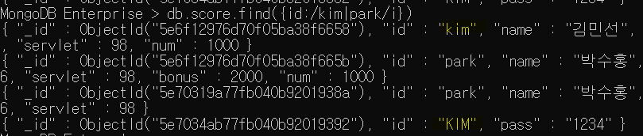

*ex ] id 가 k로 시작하는 document 조회*

```javascript
MongoDB Enterprise > db.score.find({id:/^k/})  //대소문자 구분 O
MongoDB Enterprise > db.score.find({id:/^k/i}) // 대소문자 구분 X
```

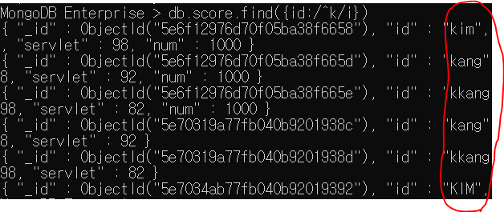

*ex ] [ a-i ]까지 영문이 있는 id를 조회*

```javascript
MongoDB Enterprise > db.score.find({id:/[a-i]/})
//a-i가 들어있는 모든 id 데이터 조회
```

*ex ] id가 k-p로 시작하는 document조회*

```javascript
MongoDB Enterprise > db.score.find({id:/^[k-p]/})
//k,l,m,o,p 로 시작
```

*ex] id에 k와 p가 있는  document조회*

```javascript
MongoDB Enterprise > db.score.find({id:/[kp]/})
```

### 4) MongoDB에 저장된 데이터 삭제하기 - romove()

*  조건을 정의하는 방법은 `find()`나 `update()`와 동일

  >  MongoDB Enterprise > db.score.remove({삭제할 필드 조건});

  ```javascript
  MongoDB Enterprise > db.score.remove({servlet:{$lt:80}});
  //80보다 작은 값 제거
  ```


[실습]

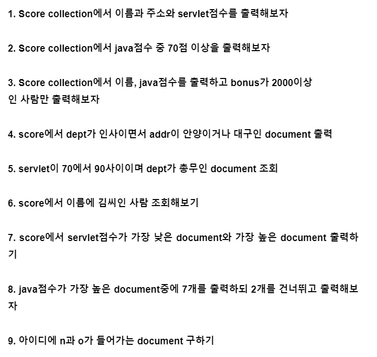

```javascript
1
MongoDB Enterprise > db.score.find({},{id:1,addr:1,servlet:1,_id:0});
2
MongoDB Enterprise > db.score.find({java:{$gte:70}});
3
MongoDB Enterprise > db.score.find({bonus:{$gte:2000}},{name:1,java:1});
4
MongoDB Enterprise > db.score.find({$or:[{dept:"인사"},{addr:"안양"},{addr:"대구"}]});
5
MongoDB Enterprise > db.score.find({$and:[{servlet:{$lte:70},servlet:{$gte:90}},{dept:"총무"}]});

db.score.find({$and:{$or[java:{$lte:70},{$gte:90}]},{dept:"총무"}});
6
MongoDB Enterprise > db.score.find({name:/^김/});
7
MongoDB Enterprise > db.score.find().sort({java:-1}).limit(1);
MongoDB Enterprise > db.score.find().sort({java:1}).limit(1);
8
MongoDB Enterprise > db.score.find().sort({java:-1}).skip(2).limit(7);
9
MongoDB Enterprise > db.score.find({id:/n/,id:/o/});
```

```javascript
MongoDB Enterprise >  db.score.find({servlet:{$not:{$exists:null}}}).sort({servlet:1}).limit(1);
```

* `null` 값 조회

```javascript
MongoDB Enterprise > db.score.find({servlet:{$exists:null}});
```

```javascript
MongoDB Enterprise > db.score.find({servlet:{$not:{$exists:null}}});
//null이 아닌 값 조회
```

* null값이 아닌 최소 데이터 구하기

```javascript
MongoDB Enterprise > db.score.find({servlet:{$not:{$exists:null}}}).sort({servlet:1).limit(1);
```

## [Aggregation](https://docs.mongodb.com/v3.6/core/aggregation-pipeline/) ( 집계 )

* `group by`  와 동일한 개념
* 간단한 집계를 구하는 경우, mapreduce를 적용하는 것 보다 간단하게 작업 가능
  * `Pipeline`을 내부에서 구현
  * **한 연산의 결과**가 또 다른 연산의 **input데이터로 활용**된다.
* match : where 절 / _id : primary key => filed를 만들어서 연산 후 쳐낸다.

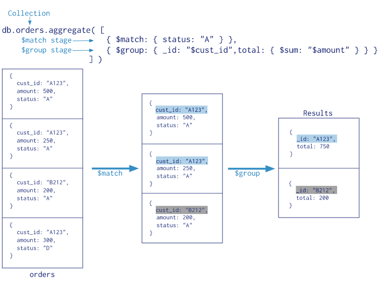

The aggregation pipeline is a framework for data aggregation modeled on the concept of data processing pipelines. Documents enter a multi-stage pipeline that transforms the documents into aggregated results.


### 1 ) 명령어 ( RDBMS와 비교)

* `$match` : where 절, having 절
* `$group` : group by
* `$sort` : order by
* `$avg` : avg 그룹 함수
* `$sum` : sum 그룹 함수
* `$max` : max 그룹함수

#### [형식]

> db.컬렉션명.aggregate(aggregate명령어 정의)
>
> ​										-------------------------------- : 여러가지 적용해야 하는 경우 (배열 )

* `$group`:{_id: 그룹으로 표시할 필드 명,

  ​				연산 결과를 저장할 필드명 : {연산 함수: **값**}}

  ​																					ㄴ 숫자나 필드 참조

  * `$`를 붙이지 않으면 단순 문자열이 되기 때문에, **참조형**임을 명시하기 위해 붙인다.

* `$match`:{필드명 :{연산자 : 조건값}}

  ​								----------------------- : 비교연산 or 조건이 여러 개

* addr별 인원 수 

```javascript
 MongoDB Enterprise > db.exam.aggregate([
     								{$group:{_id:"$addr",num:{$sum:1}}
                                    }//내부에서 하나씩 더하면서 집계한다.
 ]) 
```

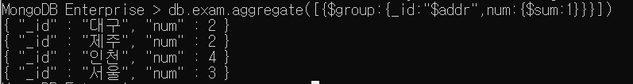

* dept별 인원수

```javascript
MongoDB Enterprise > db.exam.aggregate([{$group:{_id:"$dept",num:{$sum:1}}}]);
```

* dept별 java점수의 평균

```javascript
MongoDB Enterprise > db.exam.aggregate([{$group:{_id:"$dept",평균:{$avg:"$java"}}}]);
```

* addr별 servlet 합계

```javascript
MongoDB Enterprise > db.exam.aggregate([{$group:{_id:"$addr",서블릿합계:{$sum:"$servlet"}}}]);
```

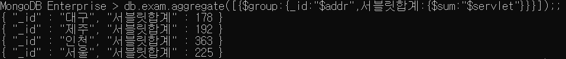

* dept별 java 점수의 평균 단, addr이 인천인 데이터만 작업
  * `$match`를 추가

```javascript
MongoDB Enterprise > db.exam.aggregate([{$match:{addr:"인천"}},
                                       {$group:{_id:"$dept",평균:{$avg:"$java"}}}]);
```

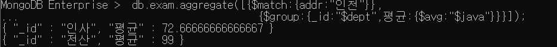

db.exam.aggregate([{$match:{dept:"인사"}},{_id:"$servlet"},서블릿 합계:{$sum:"$servlet"}])

[실습]

1. *dept가 인사인 document의 servlet평균 구하기*

```javascript
MongoDB Enterprise > db.exam.aggregate([{$match:{dept:"인사"}}, {$group:{_id:"$dept",평균:{$avg:"$servlet"}}}]);     
```

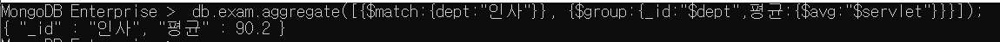

2.  *java가 80점이 넘는 사람들의 부서별로 몇 명인지 구하기*

```javascript
MongoDB Enterprise > db.exam.aggregate([{$match:{java:{$gt:80}}}, {$group:{_id:"$dept",인원수:{$sum:1}}}]);   
```

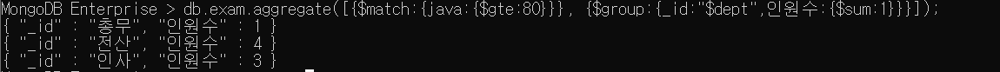

3. *2번 결과를 인원수데이터를 내림차순으로 정렬해 보세요.*

```javascript
MongoDB Enterprise > db.exam.aggregate([{$match:{java:{$gt:80}}},{$group:{_id:"$dept",num:{$sum:1}}},{$sort:{num:-1}}]);
//num reference 하지 않아도 된다.
```


