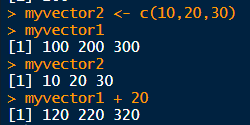

# R

## 1. 기초 문법

* `#` :주석

* `<-` :  선언  : `alt + -`

* ctrl + shift + 화살표 : 문장 선택 

* ctrl + " : `" "`적용

  

  

* `class `: 데이터 타입(구조) 확인

```r
>class(result1)
[1] "numeric"
>class(result2)
[1] "character"
```

* `as.character() `: 타입 변경
  * ex ) 숫자이지만 character 타입을 요구할 때.

```r
> test <- as.character(result1)
> test
[1] "100"
> class(test)
[1] "character"  
> test <- as.numeric(result1)
> test
[1] 100
> class(test)
[1] "numeric"
```

* `=`,`<-` 이 같은 것처럼 보여지만 <- 를 이용해서 변수에 데이터를 할당해주어야 한다.
  * `sqrt(x)` : square root of x, √{x}.


* 생성된 데이터를 보여주는 환경 창


* `c()` : 배열 , 변수 생성

  * ```r
    > mytext <- c("java","R","hadoop","android")
    ```

  

  * 변수로도 연산이 가능하다. 

  

  * 조인

  ```r
  > myvector1 + myvector2 #조인
  [1] 110 220 330
  ```

  * `,` 

    

* `:`  

  * 시작과 끝 숫자를 입력 시 1씩 증가하면서 연속된 변수로 만든다.

* 
  

  

  * 벡터 자동 생성

  
  
* `seq()` : 연속 값을 지닌 변수

  * `by` 파라미터 이용해서 간격 생성

  

* `names()` : 벡터의 이름 출력

```r
v1 <- c(70,80,90,100)
names(v1)     # names는 벡터의 이름을 출력
names(v1) <- c("국어","수학","영 어","자바")
```


* 기타


## 

| 데이터 구조     | 차원   | 특징                       |
| --------------- | ------ | -------------------------- |
| 벡터 Vector     | 1차원  | 한 가지 변수 타입으로 구성 |
| 데이터 프레임   | 2차원  | 다양한 변수 타입           |
| 매트릭스 Matrix | 2차원  | 한 가지 변수 타입으로 구성 |
| 어레이 Array    | 다차원 | 2차원 이상의 매트릭스      |
| 리스트 List     | 다차원 | 서루 다른 데이터 구조 포함 |

* **Vector**

  * 하나의 값 또는 여러 개의 값으로 구성된 데이터 구조

  ```r
  a <- 1
  a
  ## [1] 1
  ```

* **Data Frame**

  * 행과 열로 구성된 **2차원 데이터** 구조. 
  * 다양한 변수 타입으로 구성 가능

* **Matrix**

  * 2차원 데이터 구조이지만, 한 가지 변수 타입으로만 구성됨.

  * 기본값 존재

    ```r
    matrix(data = NA, nrow = 1, ncol = 1, byrow = FALSE,
           dimnames = NULL
    ```

* **list** 

## 2. 데이터 프레임

* 데이터 프레임은 직접 입력해 만들 수도 있고, 외부의 데이터를 가져와 만들 수도 있다.


```r
> dataframeMat1[,1]
[1]  1  4  7 10 13
> mydataframe[,1]
[1]  1  4  7 10 13
```

* matrix로 정의된 데이터를 dataframe으로 변경하여 작업하는 경우가 많음

* matrix의 1열만 char타입으로 변경

  * `as.character()`

  

* `str()` 
  * dataframe내부의 데이터 형을 볼 수 있는 함수
  * 
  * 

## 3. Matrix 

* 3열로 작성


* 1부터 15가지의 값을 3개의 열로 표현, row 방향 값을 추가


* ```r
  mymat1[1,] #1행의 모든 값 출력
  mymat1[,1] #열의 모든 값 출력
  ```

* matrix에서 원하는 값을 추출하기


*ex ) 실습*


## 4. 조건문

### 1. if 문

* java랑 방식이 유사하다.


### 2. for 문


## 5. CSV 분석 

### 1. 파일 입출력

* csv는 기본 패키지로 사용 가능

```r
#csv를 읽기
mdf <- read.csv("csv_exam.csv")
```

```r
# 13보다 큰 데이터 출력
myresult <- d[d$X3>=13,]
myresult 

# 조건에 만족하는 데이터를 result.csv로 저장
write.csv(myresult,file="result.csv")
```


---

[실습]

*문제 : csv_exam.csv 읽어서 데이터 수정한 후 csv_exam_result.csv로 저장하기*

* *science가 80이상인 데이터를 추출*
* *추출된 데이터에 mytotal과 myavg 컬럼추가*
  
  * *mytotal : 모든 과목의 총점*
  
  * *myavg : 모든 과목의 평균*
  

*[과정]*

* *데이터 읽어오기*

```R
mydata <- read.csv("csv_exam.csv")
mydata
```

* *데이터 분리*

**

* *R특성 상 maxtrix로 만든 것을 데이터 프레임으로 변환하여 새로운 컬럼을 추가시킬 수 있다.*

  * `as.numeric()` : 숫자 데이터가 아닌 것을 숫자형으로 변환 가능하다.
  * 총 점 구하기
    
* 평균 구하기


* 출력하기

```r
write.csv(mydataResult, file="result2.csv")
```


* 최종 결과


