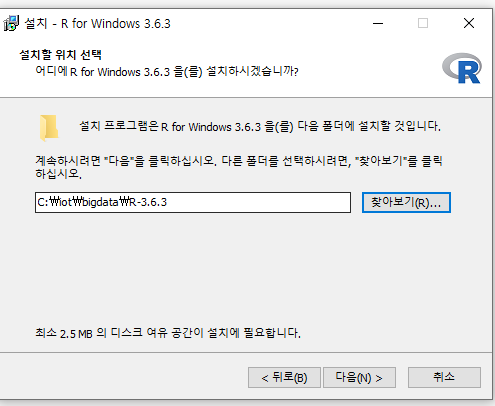

# R

* 데이터를 분석하는 데 사용되는 sw( =오픈 소스 통계 패키지)

 하둡 - 배치

 spark : 실시간 (real time)

* [R 설치](https://ftp.harukasan.org/CRAN/)

* 한국에 서버를 두고 있는 미러 사이트 이용하여 다운

* 경로에 띄어쓰기가 들어가면 안되기 때문에 경로 변경해준다.
  * 띄어쓰기, 한글 절대 불가.

* R 콘솔창

* [R studio 설치](https://rstudio.com/products/rstudio/download/#download)
  * R 활용 프로그램

* R과 같은 위치로 경로 설정

* R은 항상 관리자 모드로 실행되어야 한다.

