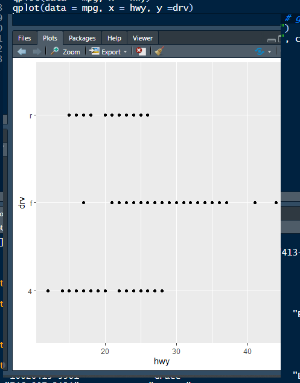
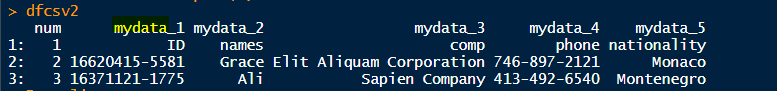

## 패키지

특정한 기능을 가지고 있는 함수들을 모아 놓은 것.


* [라이브러리](https://cran.r-project.org/) 참고
  * 필요한 라이브러리 다운 후 참고


* 라이브러리 저장 위치


* 설치

```r
install.packages("beepr")
library("beepr") # 라이브러리 import
```

* 라이브러리 위치 확인


* 예시 데이터 생성


* write
  * 나머지는 다 인코딩이 잘 되었으나, utf8만 오류 발생


* utf8은 깨진 것을 볼 수 있다.

* 한글이 깨지면 `read` 할 때 로딩을 하지못해 파일이 읽히지 않는다.


* readLines("encoding_test.csv_utf8.csv")은 한줄씩 읽어서 데이터가 보인다.


* 

* `fread()`  : `data.table` 에서 지원되는 read.table function


* 하나의 컬럼에 대해 변경할 수 있는 것을 확인할 수 있다.

  

* encoding  설정


## 그래프 그리기

```r
mydata <- c("java","spring","bigdata","android")
qplot(mydata)   # 빈도 막대 그래프 출력력
```


* 함수 기능 테스트 할 수 있는 예제 데이터 : **mpg**





# List 


* csv 파일이므로 ,로 구분이 되어있지만, 사용자가 원하는 구분자를 적용해서 작성한 문자열인 경우 


* 사이즈가 각기 다른 list 로 받아진 것을 볼 수 있다.


* 라이브러리 설치
  * **splitstackshape** : 데이터를 reshape 할 수 있음


* 테이블 split
  * **cSplit** : 하나의 컬럼 안에 구분자로 텍스트가 구성된 경우 분리시켜준다. 




* dfcsv 가 data.table이면서 data.frame 이된다.
  * 이런 경우 작업이 제대로 처리되지 않을 수도 있으니, 하나로 설정해주어야 한다.


### 타입 변경

* `as`의 함수들을 이용해서 변경

  * as는 ~~가 아닌 것을 ~~로 변경한다는 의미
  * ` data.table`과  `data.frame` 속성을 가지고 잇는 dfcsv2를 dataframe으로 변경
  * 통계데이터는 factor를 기본으로 되도록 작성되어있다. 

  ```r
  dfcsv2 <- as.data.frame(dfcsv2)
  ```

  

* R에서 제공해주는 `factor` :  순서와 명목형

  * 1,2,3,.....의 값이 어떤 숫자를 의미하는 경우 : 컬럼의 데이터가 순서형
  * 순서가 적용되도록 정의된 Factor타입을 char로 변경

  

  

### tsv 파일 읽기

* **tsv** : tab으로 구분된 파일(\t)
  * 


### XML 파일 읽기

* 라이브러리를 다운받아야 한다.


* `xmlTreeParse`  : Parses an XML or HTML file or string containing XML/HTML content, and generates an R structure representing the XML/HTML tree. Use htmlTreeParse when the content is known to be (potentially malformed) HTML. 


* `xmlRoot() `  : root element와 하위엘리먼트만 추출
  * 즉, `tag` 만 남길 수 있다. 


* `~apply` : 지정한 모든 데이터, 즉 dfxml에서 자료를 빼서 반복 작업
  * xxxApply함수는 for문 대신 사용할 수 있는 함수

### xlsx파일 읽기 

* 라이브러리 설치


* tibble => data.frame과 비슷한 다른 종류의 라이브러리


# 데이터 분석

1. 데이터 가젹오기

   * 외부 파일
   * 크롤링
   * DB (오라클 , MongoDB, Hadoop, ....)
     * R에서 사용할 수 있는 여러 형태의 데이터로 변환
     * 변환된 데이터를 액세스

2. 데이터의 정보를 확인

   * 컬럼 갯수, row갯수, 타입, 유형, 실제 저장된 데이터....

     

     

   * 실제 뷰어로 보기 : View()

   * 행의 갯수 : nrow()
* 컬럼의 갯수 : ncol()
   * 행과 열의 갯수를 확인 : dim()
* 구조 확인 : str()
   
  
   
   * 데이터에 대한 요약 정보 : `summary()`
   
     * 1st Qu. : 4분위수.///?


