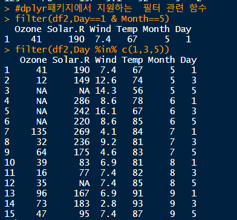
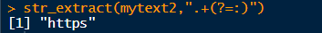

# R

```r
data(package="MASS") 
```

* **R data sets** 으로 MASS에서 어떤 데이터들이 제공되는 지 알 수 있다.


## apply_test 


* 일렬로 정렬 

 

* `head()`로 데이터 앞 부분 확인


* R은 반복 작업을 할 때 사용할 수 있도록 함수를 지원해준다.
* `margin = 1` : 행방향으로 계산
* `margin = 2` : 열방향으로 반복 작업 계산

*[예시]*

* 행방향


* 열방향
  * **round(, 소숫점자리)**


* apply의 margin속성을 2로 정의

## filter 

>  주어진 데이터에서 원하는 데이터만 추출

* `dplyr`은 문자열에 대한 작업에 특화된 기능이 많은 패키지
  * c++로 구현되어 있어 가장 빠르다
  * `dplyr`라이브러리는 실핼할 때 코드 전체를 범위지정해서 실행




### 1. Vector 연산

*[실습]*

*MASS의  airquality 데이터 사용*


- Day=1인 데이터 조회


- Day가 1이 아닌 데이터 조회


* 연산자 이용한 조회


### 2. 데이터 체이닝

```text
데이터 정제 / 이상 데이터 잘라내기
```

> **dplyr** 패키지는 `%>%`기호를 이용해 함수를 나열하는 방식으로 코드 작성
>
> `%>%`는 **파이프 연산자**라고 읽는다.
>
> `%>%`는 함수들을 연결하는 기능을 한다.
>
> `%>% ` : Ctrl + shift+m


* `%in%`기호 사용 시 코드를 좀 더 간편하게 작성 가능.

  * `%in%` 와 `C()`를 이용해서 조건 목록 입력한다.
  * 즉, `%in%`기호는 변수의 값이 지정한 조건 목록에 해당하는 지 확인하는 기능이다.

  

  * Day에 1과 1가 들어가는 경우 조회

  

  

### 3. select

>  select : 추출하고 싶은 변수를 정의


### 4. 정렬

* 기본 오름차순


### 5. mutate 

* 원본에 없는 컬럼 추가


* `n()` : 빈도수
* 집단 별 요약을 구한 값을 구할 때 `group_by()` 와 `summarise()`
* `group_by()`  : 항목 별 데이터 분리


## 데이터 합치기  =   조인

* 데이터 가로로 합치기
  * **dplyr** 패키지의 **left_join()** 이용
  * 기준으로 삼을 변수명에 `by` 이용
    * ​	`id`를 기준으로 합치기


* 세로로 합치기
  * **stringsAsFactors** : FACTOR타입으로 만들지 않도록 설정
  * 
  * **bind_rows()**
  * 

### 

## 패턴(정규 표현식)


* **str_extract** : 패턴 실행해주는 function 

  *  패턴과 일치하는 문자열도 리턴

  ```r
  mytext <- "test$uuuuu"
  mytext2 <- "https://cran.r-project.org/"
  ```


  * 패턴과 일치하는 문자를 찾아 일치문자 바로 전까지 리턴



  * 전방탐색**(?=)**
  * 후방탐색**(?<=)**


### paste

* 문자열 관련 function
* **paste** - 벡터를 연결해서 하나의 문자열로 생성
* **paste0** - 여러개를 연결해서 보여준다.


## crawl

- 웹 페이지에서 데이터를 추출 (csv 저장)

* 라이브러리 설치


```r
url <-'https://www.clien.net/service/board/cm_car'
```


* 정보 확인
  * class(url_data)
  * length(url_data)
  * head(url_data)
  * tail(url_data)

* readLines : url 접속 가능 

  * 사이트에 있는 데이터, csv 등 파일을 받아오는 것 가능

* 조건에 만족하는 데이터를 필터링

  ```r
  url_data[200]
  ```

  * `str_detect() `: 문자열에 패턴을 적용해서 일치여부를 TRUE 와 FALSE로 리턴
  * **str_detect(패턴을 검사할 문자열, 패턴)**을 이용해서 웹 페이지 전체에서 필요한 데이터만 먼저 추출

``` r
filter_data <- url_data[str_detect(url_data,"subject_fixed")]
title <- str_extract(filter_data,"(?<=\">).*(?=</span>)")
title
```


* 추출한 데이터 전체에서 내가 필요한 문자열만 추출
  * str_extract() -> 패턴에 일치하는 문자열을 리턴
  * 후방, 전방 탐색 정규 표현식

```r
hit_data <- url_data[str_detect(url_data,"<span class=\"hit\">")]    # 태그 추출
hit_data

hit <- str_extract(hit_data,"(?<=\">).*(?=</span>)")
hit
```

* url

```r
str_detect(url_data,"subject_fixed")
(which(str_detect(url_data,"subject_fixed"))-3)
myurl <- url_data[(which(str_detect(url_data,"subject_fixed"))-4)]    # 태그 추출
myurl

url_Val <- str_extract(myurl,"(?<=href=\").*(?=data-role)")
url_Val
```


* 필요없는 문자열 잘라내기 
  * end = 3 : 뒤에서  3개를 잘라내기

```r
url_Val <- str_sub(url_Val,end = -3)
url_Val <- paste0("http://www.clien.net",url_Val)
url_Val

```


* copySelector

#div_content > div.list_content > div:nth-child(6) > div.list_symph.view_symph.lSymph01

* copyXpath

//*[@id="div_content"]/div[10]/div[6]/div[1]