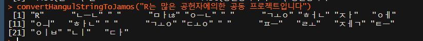
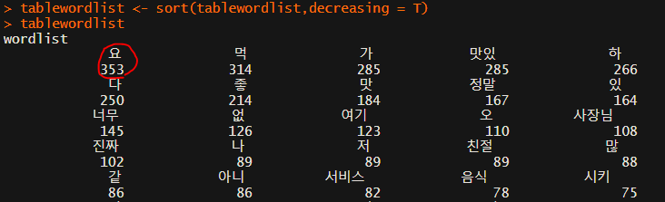
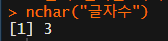
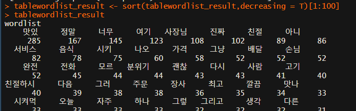
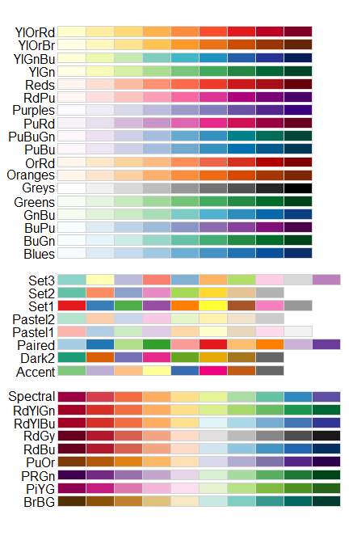
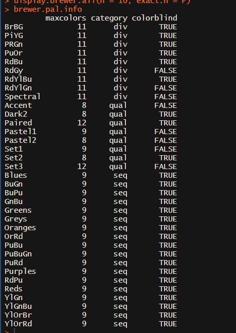
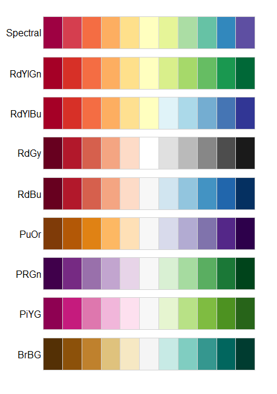
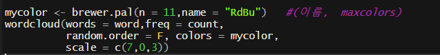
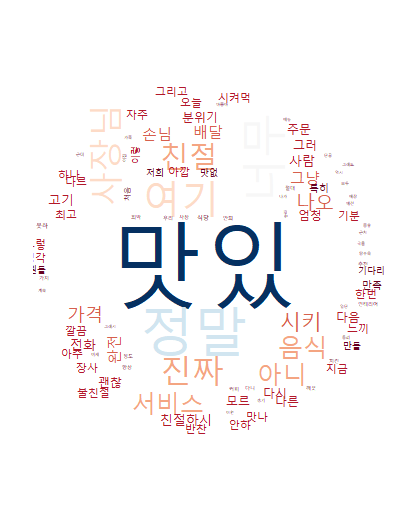

## R 데이터 분석

### content 내용 가져오기

저장된 craw_data.RData 에서의  1번째  url을 이용해서 content 크롤링

* 라이브러리 및 url 불러오기

```r
library(stringr)
load(file = "craw_data.RData")

final_data
url_list <- final_data[,3]
class(url_list)
```

* 웹 페이지 데이터 가져오기

```r
contentdata <- readLines(url_list[1],encoding = "UTF-8")
```

* 원하는 부분만 데이터 가져오기

```r
start = which(str_detect(contentdata,"post_content")) # 504번에 위치함을 알 수 있다.
end = which(str_detect(contentdata,"post_ccls"))
end #525번 위치

content_filter_data <- contentdata[start:end]
content_filter_data
```

* 데이터 정제하기

  * 1. 벡터로 리턴하므로 한 개로 합치기

  ```r
  content_filter_data <- paste(content_filter_data,collapse = "")
  content_filter_data 
  ```

  

[실습]

*모두의 광장의 1페이지 : 10페이지의 모든 게시글을 크롤링*

1. *모든 페이지의 title, hit,url,content까지 추출*

2. *crawl_result.csv , crawl_result , RData 저장*
3. *mongodb 저장 (300개 저장)*
4. *for문 if 를 적절하게 활용*

* 0번부터 9번 페이지까지 반복 작업


* url을 이용해서 content항목 추출


* mongodb에서 결과 확인


### 사이트 크롤링

#### 1. 일반 사이트 크롤링 

css의 선택자를 활용할 수 있는 방법 - rvest

```r
install.packages("rvest")
library(rvest)
```

* **html_nodes**(선택자) : 일치하는 모든 태그를 추출
* **html_node**(선택자) : 일치하는 태그 한개
* **html_text**() :텍스트를 추출
*  **html_name**() : attribute의 이름 추출
* **html_children**() : 하위 노드 추출
* **html_attr**() : attribute 추출

```r
# subject_fixed로 정의된 모든 태그 다 뽑아 온다/
readPage <- read_html(url)
readPage %>% 
  html_nodes("span.subject_fixed")   -> title_data
title_data
```

```r
readPage %>% 
  html_nodes("span.subject_fixed") %>% 
  html_text() -> title_result
title_result
```


#### 2. 네이버 크롤링 (N2H4)

* 기사 댓글 크롤링
*  체이닝 생성 -> 변수에 집어넣기 


### 텍스트 마이닝

* 형태소 분석  (명사/ 형용사 / ... )
* 한글 자연어 분석 패키지 는 한국어를 분석할 수 있는 27개의 함수가 내장되어 있으며, 이 중에서 형태소를 분석할 수 있는 함수를 제공합니다.

[**KoNLP라이브러리**](https://github.com/haven-jeon/KoNLP/blob/master/etcs/KoNLP-API.md)

* 라이브러리가 등록이 안될 때에는 따로 추가해주어야 한다.


* 패키지 라이브러리 설치
  *  KoNLP는 JAVA로 만들어진 패키지이기 때문에 JAVA와 R에서 자바 패키지를 불러올 수 있는 **rJava**패키지를 인스톨해야한다. 


```r
library(KoNLP)
library(stringr)
```

* extractNoun : 명사만 추출하는 함수


* SimplePos09 : 좀 더 디테일한 함수


* 사이즈가 전부 다르고 별도로 저장할 수 있는 list에 담을 수 있다.



* **table** 함수를 이용해서 **단어의 빈도수** 구하기
  * Table 함수는 벡터에 저장되어 있는 모든 단어들의 빈도수를 계산해서 변환해준다.
    * **names** : 단어를 이용해서 변수명으로 사용

```r
tablewordlist <- table(wordlist)
tablewordlist[1]
names(tablewordlist)  
```

* 분석한 데이터를 이용해서 sort - 상위 100개만 출력

  ```r
  tablewordlist <- sort(tablewordlist,decreasing = T)
  ```

  

* 분석 결과를 가지고 기준을 적용해서 정리  -- 한글자를 빼고 작업

  * 

  ```r
  tablewordlist_result <- tablewordlist[nchar(names(tablewordlist))>1]
  tablewordlist_result
  tablewordlist_result <- sort(tablewordlist_result,decreasing = T)[1:100]
  tablewordlist_result
  ```

* 한 글자 ( 조사 )삭제

  

### RColorBrewer

*  모든 색상의 팔레트를 보여준다.

```r
display.brewer.all(n = 10, exact.n = F)
```





```r
display.brewer.all(type="div")
```




* 분석한 결과가 저장되어 있는 tablewordlist_result의 값을

* 단어와 숫자로 각각 저장



