# 쇼핑몰 댓글 분석하기


**step1**

1. 오라클에 테이블 작성

create table pro_comment(

prd_no varchar2(20) ,

mem_id varchar2(20) ,

pro_comment varchar2(60),

writedate date)


2. 상품 보기 화면 추가하기

\- 상품을 클릭하면 상품 상세화면이 보일  수 있도록

\- 요청 url /product/read.do

\- tile화면명 : product/read

\- jsp 파일명 : /WEB-INF/product/product_read.jsp


3. product_read.jsp에 상품평을 추가할 수 있도록 구현


## 댓글 입력

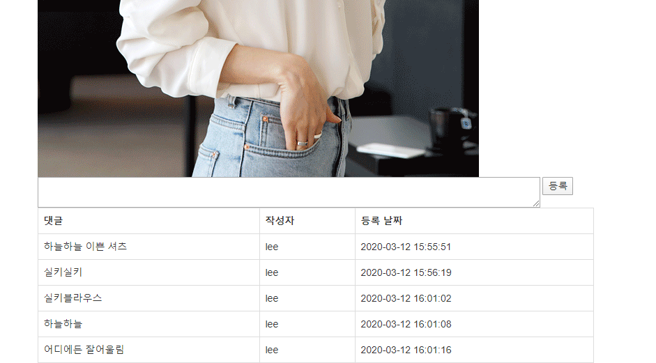

* Insert mapper 

```xml
<insert id="insert" parameterType="comment">
 		insert into pro_comment values(#{prd_no},#{mem_id},#{pro_comment},sysdate)
 </insert>
```

* select mapper
  * 해당 상품의 댓글을 출력할 수 있도록 mapper 작성

```xml
 	<select id="commentlist" resultType="comment" parameterType="String">
 		select * from pro_comment where prd_no=#{prd_no}
 	</select>
```


* Insert Controller

```java
@RequestMapping(value="/comment/write.do",method=RequestMethod.POST)
	public String Comment(ProductCommentDTO comment) {
		service.insert(comment);
		return "redirect:/product/read.do?prd_no="+comment.getPrd_no();
	}
```

* Select Controller
  * 상품 상세조회 페이지에 service 삽입하여 출력

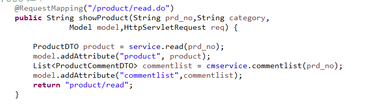


* jsp
  * 댓글이 있을 때만 출력하도록 `<c:if>` 사용

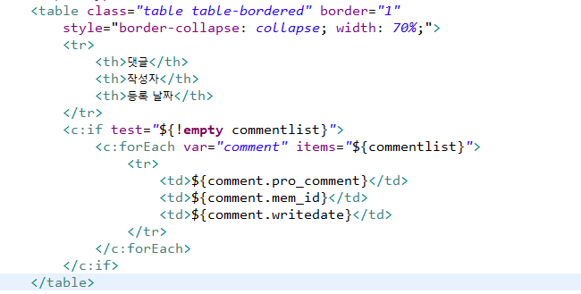

## hadoop 에서 댓글 단어 분석

**step2**

오라클에 저장된 pro_comment 테이블의 모든 데이터를 sqoop을 이용하여 하둡 HDFS의 /bigshop 아래 저장하세요. 

댓글 샘플을 10개 상품에 10개씩 상품평을 임의로 입력해 놓고 작업한다.


* import 해서 댓글 데이터 집어넣기

<pre>[hadoop@hadoop01 ~]$ sqoop import -connect jdbc:oracle:thin:@70.12.115.64:1521:xe -username shop -password shop \
&gt; -table word_result -target-dir /mywork/bigshop/ \
&gt; -as-textfile -columns &quot;comment&quot; -m 1
</pre>

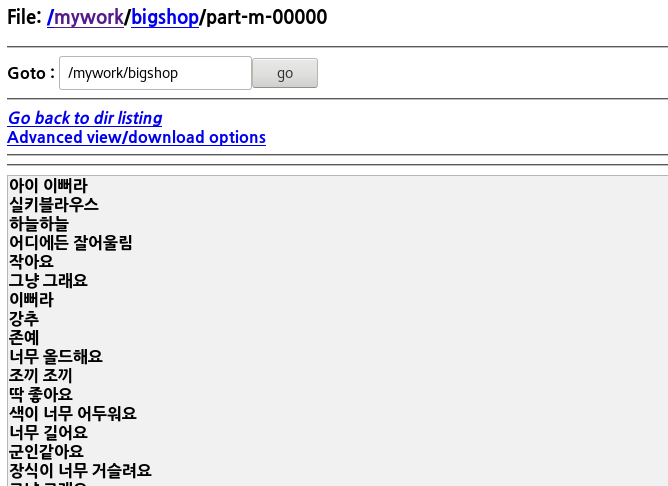

**step3**

Bigdata 프로젝트를 작성한 후 shop.bigdata.comment 패키지를 만들고 작업한다.

하둡 HDFS의 /bigshop 아래 저장된 데이터를 이용하여 이번 달 댓글 데이터의 키워드로 wordcount를 작성하기

```text
[조건]
 의,에,은,는,이,가 등의 조사를 빼고 wordcount를 적용해 보세요.
 ===========================
          조사를 빼고 작업하는 부분은 mapper에서  우선 패턴을 적용하여 대략적 조사만
            제외합니다.
```


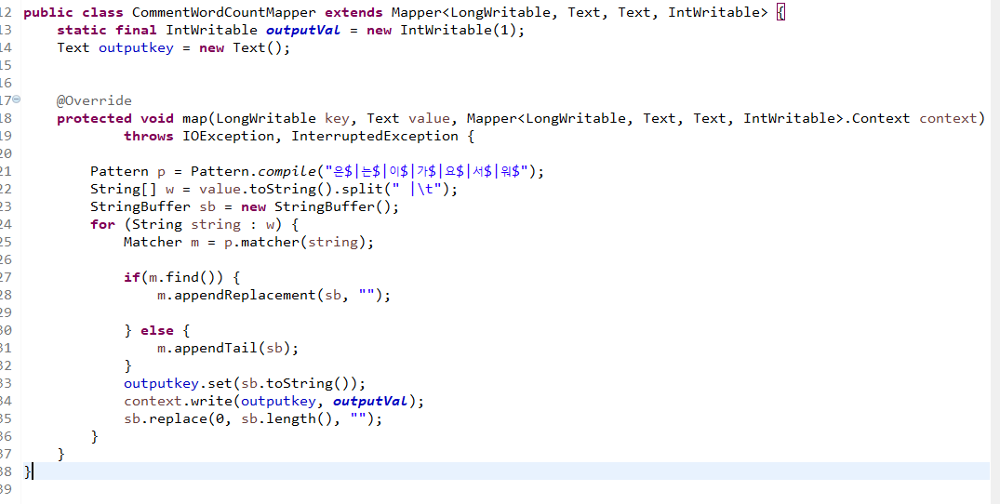

* 정규표현식을 이용해서 조사 없애기.

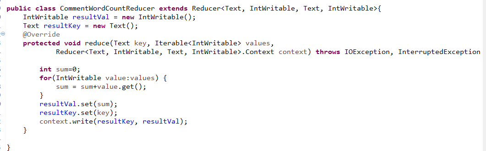

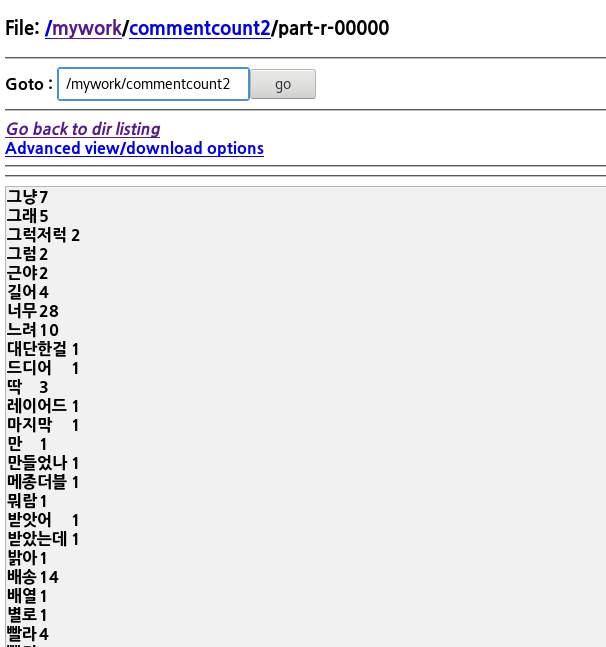

**step4**

step3에서 작성한 MapReduce의 결과를 오라클에 저장될 수 있도록 결과 테이블을 만들고 sqoop을 이용하여 저장하세요. 결과로 만들어지는 mapreduce는 하나의 칼럼이고 이를 오라클 테이블에 두 개의 칼럼으로 나누어서 저장을 하려면 sqoop에서 옵션을 더 지정해 주어야 한다. 찾아서 적용해보세요.

테이블명:comment_result

<pre>[hadoop@hadoop01 ~]$ sqoop export -connect jdbc:oracle:thin:@70.12.115.64:1521:xe -username shop -password shop -export-dir /mywork/cmdwordcount6/part-r-00000 -table comment_result -columns &quot;word, count&quot; --fields-terminated-by &quot;\\t&quot;
</pre>

* --fields-terminated-by <char>

   : <char>를 기준으로 잘라서 컬럼으로 구분시켜 준다.

   &quot;\\t" : sqoop 안에서 \를 사용하기 때문에 두번 `\\ ` 붙여주어야 한다.
   
* 테이블에 export 됐는 지 확인하기.

​	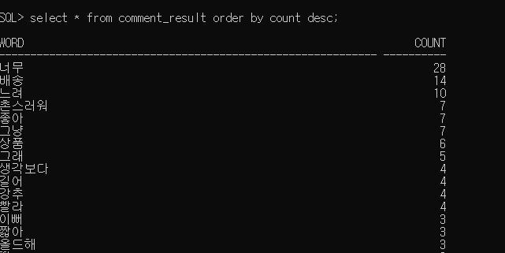

**step5**

관리자 화면에서 "상품 댓글 분석"을 클릭하면 분석 결과를 볼 수 있도록 메뉴를 추가하고 클릭하면 분석 결과가 top 메뉴의 하단에 표로 10개가 출력될 수 있도록 구현하세요.

ProductCommentController에 추가하기

comment~패키지에 동일하게 메소드를 추가하여 볼 수 있도록 구현합니다.

* mapper 

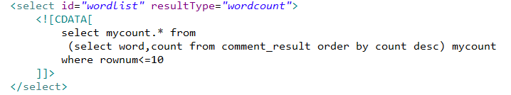

* DTO 만들기

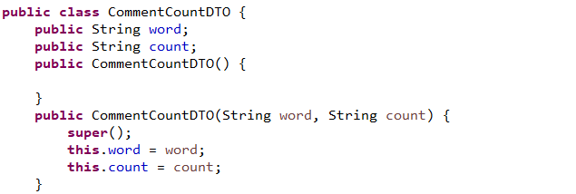


* Controller

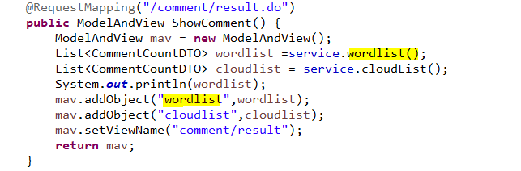


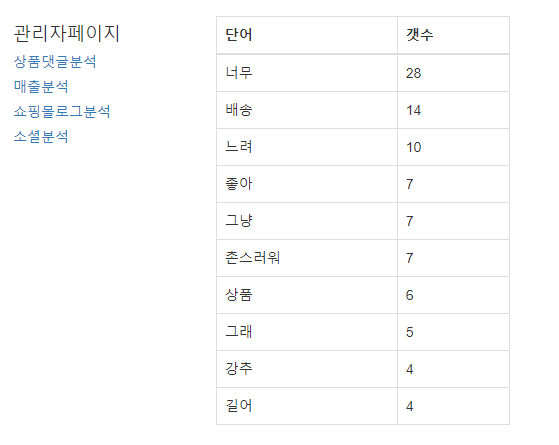


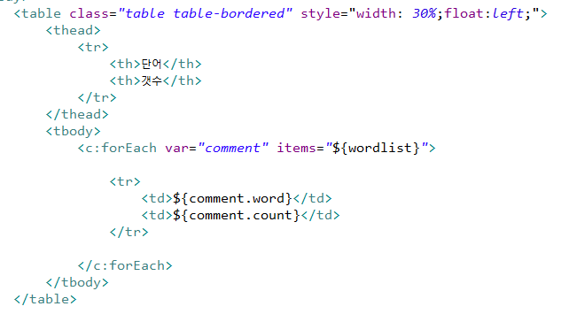

### jQcloud

[플러그인 사용](https://github.com/lucaong/jQCloud)

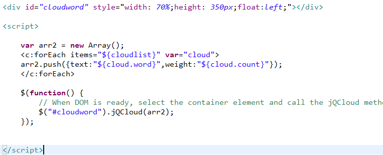

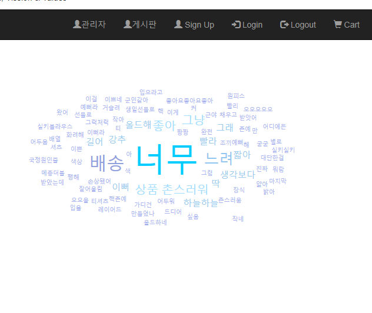

프로젝트에서 어떻게 구현했는지...

내가 구현했든 안했든 프로젝트 모든 부분 파악하기

