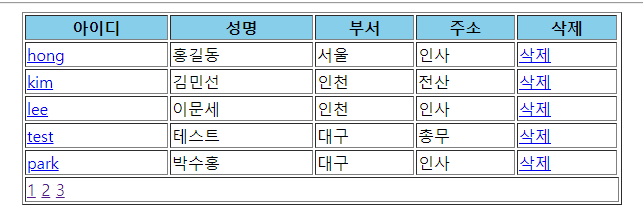

# Spring Data MongoDB

### [NoSQL](http://www.dbguide.net/db.db?cmd=view&boardUid=186825&boardConfigUid=9&categoryUid=216&boardIdx=155&boardStep=1)

HashMap처럼 키밸류(KeyValue) 형식의 데이터를 분산ㆍ저장함으로써 기존 관계형 데이터베이스에서는 처리하기 힘들었던 테라바이트에서 엑사바이트 단위의 데이터베이스 구축이 가능

키밸류 속성정보를 메타데이터 구조정보에 별도로 보관하기 때문에 데이터 용량이 방대해도 빠르게 조회할 수 있다.

 데이터를 다수의 서버에 분산ㆍ저장하기 때문에 동시 접속 클라이언트 수가 많더라도 디스크 및 네트워크 병목 현상 없이 우수한 성능의 서비스를 기대할 수 있다.

### MongoDB 언제?

* 많은 양의 데이터를 다룰 때
* 복잡한 구조때문에 스키마를 제대로 정의할 수 없을 때
* 중간저장소 , 단기간에 요청이 몰려 로그를 기록해서 작업해야하는 때 
* MapReduce를 사용하지 않아도, 집계(Aggregation) 연산을 가능하게 하는 집계 프레임워크 기능.


*cf. 빅데이터 처리는 `하둡`*

*mongoDB에서는 update 보다는 insert가 성능면에서 좋다.*

*data-format : json*


## Spring Data 설치

* Spring 버전 확인


* 라이브러리 확인


* 


### dos로 데이터 추출

* cmd 창


```cmd
C:\iot>mongoexport -d mydb -c score -o score.json
//-d : database /-c : collection /-o : output
```

* 이렇게 `score.json`데이터가 추출된다.


* 데이터 import 
  * 첫번째 줄은 headerline임을 명시 (skip하도록)


```cmd
C:\iot>mongoimport /d bigdata /c test /type csv /file test.csv /headerline
```

* import 결과


###  paging처리

>  페이징 처리를 편하게 하기위해 **CLRUD**를 위한 기본 기능도 제공 (SPRING-DATA의 COMMON 라이브러리에서 지원하는 기능)

* mongoDB Collection에서 하나의 document와 매핑될 클래스
* @Document 를 통해 어떤 컬렉션이랑 연동될 것인지 명시


* PagingAndSortingRepository에서 제공하는 findAll을 호출하면 Spring-data내부에서 페이징처리가 된 객체를 전달받을 수 있다.

* 페이징 처리를 내부에서 할 수 있도록 필요한 정보를 findAll메소드에서 `pageable`타입의 매개변수로 전달받는다.

  **[정보전달]**

* pageable을 구현하고 있는 pagerequest객체를 넘겨준다.

* 현재 페이지 번호(page),size(화면에 표시할 게시글 갯수)
  
**[리턴]**
  
* findAll이 처리되면 페이징된 객체를 page타입으로 리턴한다.

* pageRequest에 전달한 사이즈와 page번호를 기준으로 조회한 데이터를 매핑해서 넘겨준다.

```java
public List<ScoreDTO> findAll(int pageNo) {
		Page<ScoreDTO> pageList= scoreRepository.findAll(new PageRequest(pageNo, 5));
		List<ScoreDTO> mongolist = pageList.getContent();
		return mongolist;
	}
```

[결과]



* DAO
  * `ScoreRepository` : mongodb를 연동하기 위한 기능을 제공

```java
	@Autowired
	ScoreRepository scoreRepository;
	@Autowired
	MongoTemplate mongoTemplate;
```

### 검색기능

* Controller 


* 상세조회 DAO


* 상세조회 Service


[결과]


* 검색 DAO


* 검색 Service

