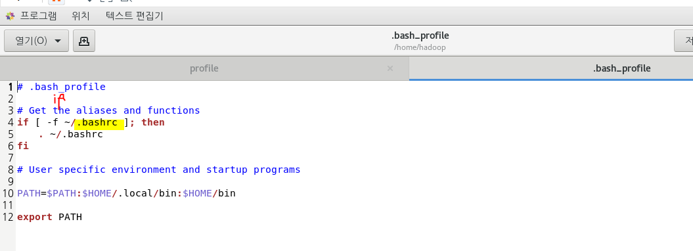
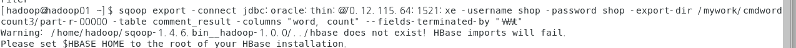

# Apache Sqoop

**SQL데이터를 하둡으로 가지고 올 때 사용하는 tool**

CLI(Command Line)기반 


* hadoop에서 sqoop 설치


<pre>[hadoop@hadoop01 ~]$ wget http://archive.apache.org/dist/sqoop/1.4.6/sqoop-1.4.6.bin__hadoop-1.0.0.tar.gz
</pre>

* 다운 확인

<pre>[hadoop@hadoop01 ~]$ ls
<font color="#005FFF">hadoop-1.2.1</font>         <font color="#005FFF">hadoop-data</font>                 <font color="#EF2929">multi-hadoop-examples.jar</font>             <font color="#005FFF">test</font>  <font color="#005FFF">다운로드</font>  <font color="#005FFF">바탕화면</font>  <font color="#005FFF">사진</font>  <font color="#005FFF">음악</font>
<font color="#EF2929">hadoop-1.2.1.tar.gz</font>  <font color="#EF2929">hadoop-mapred-examples.jar</font>  <font color="#EF2929">sqoop-1.4.6.bin__hadoop-1.0.0.tar.gz</font>  <font color="#005FFF">공개</font>  <font color="#005FFF">문서</font>      <font color="#005FFF">비디오</font>    <font color="#005FFF">서식</font>
</pre>

* 압축 풀기

<pre>[hadoop@hadoop01 ~]$ tar -zxvf sqoop-1.4.6.bin__hadoop-1.0.0.tar.gz 
</pre>


리눅스는 윈도우와 달리 다중 사용자가 접속할 수 있기 때문에 다루어 주어야 할 설정파일들이 있음.

* 리눅스의 관리자 계정으로 들어가면 `profile`이 먼저 작동한다
  *  모든 계정의 설정 파일




- 기본적인 설정 정보


* 설정 파일 실행 명령어

<pre>[hadoop@hadoop01 ~]$ source .bashrc
</pre>

* STS remote system

  * remote system을 통해 호스트와 게스트 사이의 양방향 통신이 가능하게 만든다.

  

  * ojdbc6.jar 붙여넣기 


* 데이터 집어넣기

<pre>[hadoop@hadoop01 ~]$ sqoop eval -connect jdbc:oracle:thin:@70.12.115.64:1521:xe -username shop -password shop -query &quot;select * from tb_product&quot;
</pre>

* 맵리듀스 실행 
  * `-target-dir` : 하둡의 HDFS
  * `-m` :  map task 수행 갯수 

<pre>[hadoop@hadoop01 ~]$ sqoop import -connect jdbc:oracle:thin:@70.12.115.64:1521:xe -username shop -password shop \
&gt; -table tb_product -target-dir /mywork/sqoop/ \
&gt; -as-textfile -columns &quot;prd_no,prd_nm&quot; -m 1
</pre>

[결과]


* map task 2개 사용시

  * -split-by 를 꼭 명시해 주어야 한다.

  <pre>[hadoop@hadoop01 ~]$ sqoop import -connect jdbc:oracle:thin:@70.12.115.64:1521:xe -username shop -password shop -table tb_product -target-dir /mywork/sqoop2/ -as-textfile -columns &quot;prd_no,prd_nm&quot; -split-by prd_no -m 2
  </pre>


이렇게 두개로 나뉘어서 작업된다.

[결과]


* export 

  * `-export-dir `: 어느 테이블을 복사 할 것인지

  <pre>[hadoop@hadoop01 ~]$ sqoop export -connect jdbc:oracle:thin:@70.12.115.64:1521:xe -username shop -password shop \
  &gt; -export-dir /mywork/sqoop/part-m-00000 \
  &gt; -table sqoop_result -columns &quot;prd_no,prd_nm&quot; 
  </pre>
  
  
  
* 조건절


---


#### SQL

* 계정 삭제

```sql
SQL> drop user shop cascade;
```

* 계정 생성

``` sql
SQL> create user shop identified by shop;
```


