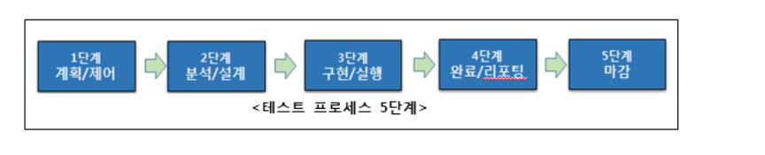
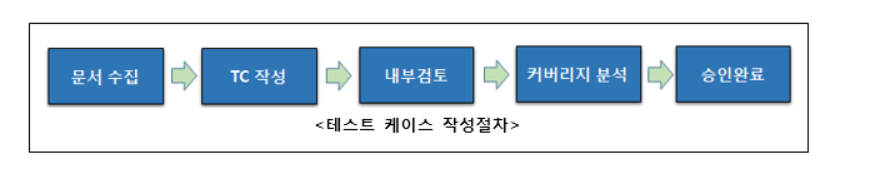
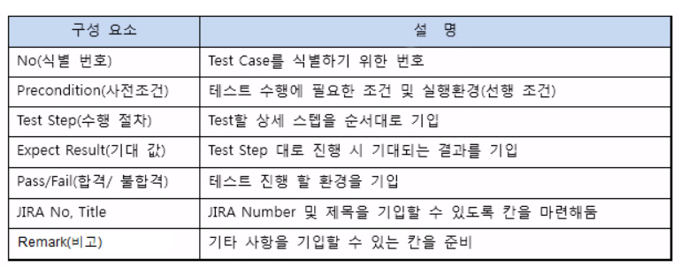

# 1. 테스트

> 테스트 프로세스 : 테스트 목적과 목표를 달성할 수 있도록 테스팅의 모든 구성 요소를 엮어준다.

* 요구사항, 사용자 스토리 등등 작업 산출물 평가
* 명시된 모든 요구사항이 충족됐는지 검증
* 결함 예방/ 결함 및 장애 발견

* 테스트를 실행하면 SW 결함으로 인한 장애 발견 가능
> 디버깅 :  장애의 원인을 찾고 수정하는 개발활동

* 결함 오류 장애
  * **오류(error) :** 부정확한 결과를 초래하는 인간의 활동, 인간의 실수*결함을 일으킨다.*

  * **결함(defect) :** 필요한 기능을 수행하지 못하도록 하는 컴포넌트나 시스템 상의 결점 

    *ex) 부정확한 구문이나 부정확한 데이터 정의*

  * **장애(failure) :** 컴포넌트나 시스템이 예상된 서비스 또는 예상 결과와 실제적인 편차를 보이는 것

* **인수 테스팅**

  * 전체 시스템 또는 제품의 동작이나 능력에 초점을 두고 진행하는 경우가 많다.
    * 전체 시스템의 품질에 대한 자신감 획득
    * 완성된 시스템이 기대한 대로 동작하는 지 확인
    * 시스템의 기능/비기능 동작이 명세대로 동작하는 지 검증

* **화이트박스 테스팅** :

  * 시스템 내부 구조나 구현을 기반으로 테스트를 도출* 

* 테스트 프로세스 : 

  * 계획/제어 - 분석/설계 - **구현/실행 - 완료/리포팅** 

  

## 테스트 케이스

* 테스트 케이스 작성 절차:

  

  * 내부 검토 : PM, 아키텍처, 디자이너, 기획자, 개발자와 테스트 담당자가 작성된 테스트케이스의 적정성을 검토한다. 

  * 요구사항 대비 커버리지 분석:

    테스트 케이스가 어느 정도 요구사항을 반영하였는가에 대한 분석

    기본적으로 테스트 가능한 요구사항은 모두 테스트케이스에 반영이 되었는지 확인한다.

* 테스트 케이스 구성요소 :

  