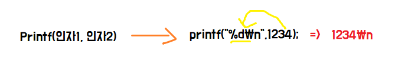
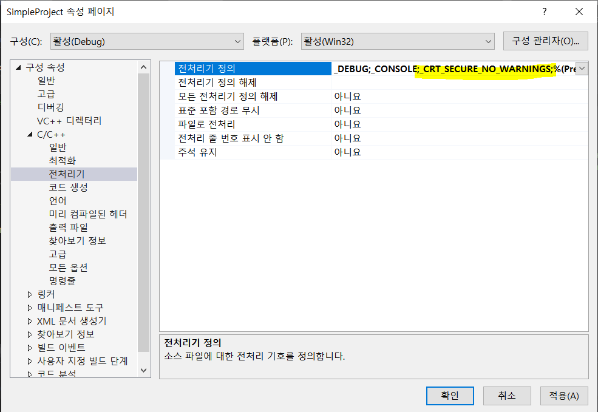
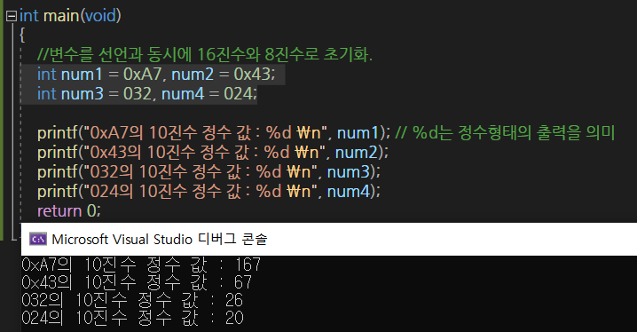
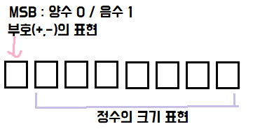

# C

1. **절차지향적 특성**
2. **이식성이 좋다.(CPU의 종류에 상관없이 실행이 가능)**
3. **C언어로 구현된 프로그램은 좋은 성능을 보인다.**

## 프로그램의 기본 구성

* 헤더파일 선언의 필요성
  * 헤더파일의 선언은 소스파일의 맨 앞 부분, main함수 정의 이전에 와야한다.

```c
#include<stdio.h>
//헤더파일 stdio.h에는 printf함수의 호출에 필요한 정보가 존재한다.
```

```markdown
int main (void)
출력 함수  입력형태
형태 이름 
# 출력의 형태가 int이고 입력의 형태가 void인 mian이라는 이름의 함수.
```

* 정해진 순서에 의해서 진행되는 함수의 호출이 바로 프로그램의 흐름이다. 

```c
int main(void) 
{ 
	printf("Hello World! \n");
	return 0;
} // 함수의 몸체
```

* `\n` : 문자열의 줄을 바꾸라는 의미.

* `return`은 **함수의 종료**와 **값의 전달(반환)**이라는 의미

```markdown
`return 0;` : 함수를 호출한 영역으로 값(0) 전달.
> 현재 실행중인 함수의 종료
> main 함수의 종료는 프로그램의 종료이기 때문에 프로그램이 종료된다.
보통 0은 정상적으로 프로그램의 종료상태를 알리는 용도로 사용된다.
```

## Printf

> 문자열을 출력하는 함수

* `printf` 함수는 첫 번째 인자로 전달된 문자열을 출력한다.
* `f`는 `formatted(서식이 지정된)`을 의미한다.
* `%d` : 서식문자
  * 10진수 정수형태의 출력 
  * 출력의 형태를 지정하는 용도로 사용.
* 함수호출 시 전달되는 인자는`,`로 구분한다.



* **서식 문자**

| 서식 문자 | 출력 대상(자료형)                      |
| --------- | -------------------------------------- |
| %d        | char , short , int                     |
| %f        | float, double                          |
| %u        | unsigned int(부호 없는 10진수 정수)    |
| %o        | unsigned int (부호 없는 8진수 정수)    |
| %c        | char, short, int  - 값에 대응하는 문자 |
| %s        | char* (문자열)                         |
| %p        | void* (포인터의 주소 값)               |


## 변수

> 변수 : 정해지지 않은, 임의의 값을 대입할 수 있는 문자를 가리켜 **변수**라고 한다.
>
> 즉, 값을 저장할 수 있는 메모리 공간에 붙은 이름, 혹은 메모리 공간 자체를 가리켜 **변수**라고 한다.

```markdown
int num;
`int` : 정수의 저장이 가능한 메모리 공간 할당
`num` : 메모리 공간의 이름
```


## 논리연산자

* `&&` : 모두 참이면 연산결과로 '참'을 반환
* `||` : 하나라도 참이면 연산 결과로 '참'을 반환
* `!` : `!A` ? A가 참이면 거짓, A가 거짓이면 참을 반환 
  * C언어는 0이 아닌 모든 값을 `참`으로 간주한다.

## ,연산자

> 콤마 연산자는 둘 이상의 변수를 동시에 선언하거나, 둘 이상의 문장을 한 행에 삽입하는 경우에 사용되는 연산자.
>
> 즉, 다른 연산자들과 달리, 연산의 결과가 아닌 **구분**을 목적으로 사용된다.

```c
int num1=10,num2=11;
num1++, num2++;
printf("%d", num1), printf("%d", num2),printf("\n");
```

## 비트 연산자

* `&`: AND연산
* `|` : OR연산
* `^` : XOR연산
* `~` : 단항 연산자로서, 피연산자의 모든 비트를 반전시킨다.
* `<<` : 피연산자의 비트 열을 왼쪽으로 이동시킨다.
  * `num<<2` : num은 변화 없음, 두 칸 왼쪽 이동 결과만 반환.
* `>>`: 피연산자의 비트 열을 오른쪽으로 이동시킨다.

## scanf

> 키보드로부터 다양한 형태의 데이터를 입력받을 수 있다.
>
> **scanf**함수는 공백을 기준으로 데이터를 구분한다.

```c
	int num;
	scanf("%d", &num); // 키보드로 입력된 정수를 변수 num에 저장해라. 
```

* `%d` : 10진 정수 형태의 입력
* 입력된 데이터를 저장할 변수의 앞에 `&`연산자를 붙인다.

> 비주얼 스튜디오 2013(VS 2013) 버전 이상부터 scanf 을 사용하면 컴파일 오류 발생



> _CRT_SECURE_NO_WARNINGS; 추가

### :a:데이터 표현 방식

> 컴퓨터는 **2진수**를 기반으로 데이터를 표현하고 연산도 진행한다.

* 비트(bit) : 컴퓨터가 표현하는 데이터의 최소단위
  * 2진수 값 하나를 저장할 수 있는 메모리의 크기를 뜻하는 단위.
  * 8비트 = 8바이트
* n개의 비트를 가지고 나타낼 수 있는 데이터 수 2^n 개.
* 초기화에 사용된 표현의 방식에만 차이가 있을 뿐 변수에 초기화되는 값은 모두 동일하다.

```c
// 8진수와 16진수를 이용한 데이터 표현
int num1 = 10; //특별한 선언이 없으면 10진수의 표현
int num2 = 0xA; //0x로 시작하면 16진수로 인식
int num3 = 012; //0으로 시작하면 8진수로 인식
```

```c
	int num1 = 0xA7, num2 = 0x43;
	int num3 = 032, num4 = 024;
```





* 음의 정수를 표현할 때는 **2의 보수**를 취해야 한다.