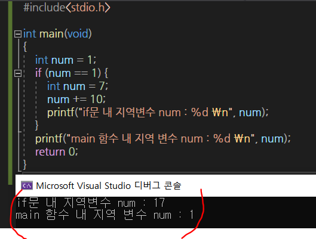

# 자료형

>  **unsigned** : 0과 양의 정수만 표현하는 자료형이 되어 표현할 수 있는 값의 범위가 양의 정수 방향으로 2배 넓어진다.
>
> > char형 변수의 경우, 표현할 수 있는 범위가 `-128이상 127이하` 이다. 그러나 앞에 unsigned를 붙여서 unsigned char가 되면 표현할 수 있는 값의 범위가 `0이상 +255이하`가 된다.
> >
> > 즉, unsigned를 붙이면 MSB 조차 값의 크기를 나타내는 비트로 사용하게 된다. 

* `signed`를 붙인다고 의미가 변하는 것은 아니다. 
  * `int`와 `signed int`는 같은 선언이며, `short`와 `signed short`도 같은 선언이다.

> **ASCII**코드 : 숫자를 이용해서 문자를 표현하도록 한 문자. 
>
> * 알파벳과 일부 특수문자를 포함하여 **총 128개의 문자**로 이뤄져 있다.
>   * A : 65
>   * B : 66
>   * ` : 96
>   * ~ : 126
> * 프로그램상에서 문자표현에는 작은 따옴표`' '`가 사용된다.

```c 
int main(void)
{
    char ch1 = 'A'; // 이렇듯 문자는 작은 따옴표로 감싸서 표현한다.
    char ch2 = 'C';
}
```


* `%c` : 문자의 형태로 데이터를 출력하라.

## const 상수

> 이름을 지니는 Symbolic 상수 : const
>
> * 초기화 되면 그 값을 변경시킬 수 없다. 선언과 초기화를 분리시킬 수가 없다.
> * 상수와 변수의 구분을 용이하게 하는데 목적이 있다.
> * 상수의 이름은 모두 대문자로 표시하고, 둘 이상의 단어로 연결할 때는 MY_AGE와 같이 언더바를 이용해서 두 단어 구분@!

```c
int main(void){
    const int MAX = 100;  //MAX는 상수 - 값의 변경 불가.
    const double PI = 3.1415; 
}
```

```c
int main(void){
 const int MAX; //쓰레기값으로 초기화
 MAX = 100; //값의 변경 불가 @ 컴파일 에러 발생
}
```

## 자료형의 변환

### 자동 형 변환(묵시적 형 변환)

```markdown
# 대입연산자의 왼편과 오른편에 존재하는 피연산자의 자료형이 일치하지 않으면, 왼편에 있는 피연산자를 대상으로 자동으로 형변환이 일어난다.
double num1 = 245;  // int형 정수 245를 double형으로 자동 형 변환
int num2 = 3.1415; // double형 실수 3.1415를 int형으로 자동 형 변환 
* 실수형 데이터를 정수형으로 변환하는 과정에서 `소수부의 손실` 발생
```

* 데이터의 표현범위가 보다 넓은 자료형으로의 형 변환은, 그 과정에서 데이터의 손실이 발생하지 않는다.
* 데이터의 표현범위가 좁은 자료형으로의 형 변환은 데이터 손실이 발생한다. 
* 형 변환의 우선 순위는 정수 자료형보다 실수 자료형이 무조건 앞서는 형태로 정의된다.

### 강제 형 변환(명시적 형 변환)

```c
	//명시적 형 변환
	int num1 = 3, num2 = 4;
	double divResult;
	divResult = num1 / num2;
	printf("나눗셈 결과: %f \n", divResult);
	// 나눗셈 결과: 0.000000
	//연산 결과의 자료형은 피연산자의 자료형과 일치하기 때문에, 나눗셈의 결과는 0이 되고. 이 값이  double 형으로 형변환된다.
```

* 원하는 결과 출력하려면

  ```c
  divResult = (double)num1 / num2;
  ```

  ```c
  divResult = 3.0 / num2;
  ```

---

# escape sequence

> escape sequence = 특수 문자 

```markdown
`"`는 문자열의 시작과 끝을 의미한다. 큰 따옴표 자체의 출력을 원하는 경우에는 큰 따옴표 앞에 `\`를 붙여준다.
```

| 특수 문자 |     의미하는 바     |
| :-------: | :-----------------: |
|    \a     |       경고음        |
|    \b     |     백스페이스      |
|    \f     | 폼피드(프린트 출력) |
|    \n     |   개 행(new line)   |
|    \r     |   carrage return    |
| `\'` `\"` |     따옴표 출력     |
|   `\?`    |     물음표 출력     |
|   `\\`    |  역슬래쉬 `\` 출력  |

:star:  **참고 -  printf**

* 정수의 출력을 위한 **서식 문자**
  * 음의 정수 출력은 반드시 `%d`
  * 실수의 출력을 위한 `%f` `%e` `%g`
    * `%g`는 소숫점 길이가 늘어나면 `%e`표기법으로 표기한다.
* `%s`을 이용한 문자열 출력
* 필드 폭을 지정하여 정돈된 출력 보이기
  * `%8d` : 필드 폭 8칸 확보하고, 오른쪽 정렬해서 출력 진행
  * `%-8d` : 필드 폭을 8칸 확보하고, 왼쪽 정렬해서 출력 진행

# 반복문

## While

* 반복의 대상이 하나의 문장이라면 중괄호는 생략 가능

  ```c
  while(num<5)
      printf("Hello world! %d \n", num++);
  ```

  ```c
  while(num<5)
      printf("Hello world! %d \n", num), num++;
  ```

* do~while

  * while문과 달리 반복 조건을 뒷부분에서 검사한다.
  * 반복 영역을 최소한 한번은 실행한다.

  ```c
  do{
      printf("Hello World!\n");
      num++;
  }while(num<3)
  ```

## for

```markdown
# 반복의 횟수가 정해지지 않고 사용자가 임의의 값을 입력하길 기다리는 상황? while
# 반복의 횟수가 정해진 경우라면 for문이 최선!!
for ( 초기식; 조건식; 증감식){
//반복의 대상이 되는 문장들
}
```


# 함수

* 함수는 호출되기 전에 미리 정의되어야 한다.

**1. 전달인자와 반환 값이 모두 있는 경우**

> 가장 일반적인 형태의 함수

```c
int Add(int num1, int num2){ //전달 인자는 int 형 정수 두개
    int result = num1 + num2;
    return result; //result에 저장된 값을 Add함수를 호출한 영역으로 전달.
}

//호출
result = Add(3, 4);
```

**2. 전달 인자나 반환 값이 존재하지 않는 경우**

```c
void ShowAddResult(int num){ //인자 전달 O, 반환 값 X
   printf("덧셈결과: %d \n", num);
}
```

```c
int ReadNum(void){ //인자 전달 X, 반환 값 O
    int num;
    scanf("%d", &num);
    return num;
}
```

```c
void HowToUseThisProg(void) {//인자 전달 X, 반환 값 X
    printf("두 개의 정수를 입력하시면 덧셈 출력 \n");
    printf(" 자! 그럼 두개의 정수를 입력하세요 !!! \n");
}
```

**3. return이 지니는 두 의미 중 한가지만 살리기**

```markdown
# 키워드 return은 값을 반환하면서 함수를 빠져나갈 때 사용된다. 즉, return 문에는 두가지 의미가 달려있다.
* 함수를 빠져나간다.
* 값을 반환한다.
```

* 값을 반환하지 않고 함수 빠져나갈 때

```c
void NoReturnType(int num){ //반환형이 void인 함수
    if(num<0)
        return; //값을 반환하지 않는 return 문
}
```

# 변수

> 변수는 선언되는 위치에 따라 크게 **전역변수**와 **지역변수**로 나뉜다.
>
> 다음 두 가지에 대해 차이점을 보인다.
>
> * 메모리에 존재하는 기간
> * 변수에 접근할 수 있는 범위

**1. 함수 내에만 존재 및 접근 가능한 지역변수(Local Variable)**

> 지역변수는 해당 선언문이 실행될 때 메모리 공간에 할당되었다가, 선언문이 존재하는 함수가 반환을 하면 메모리 공간에서 소멸된다.

* 중괄호 내에 선언되는 변수는 모두 지역변수다.
* 지역변수는 해당 지역을 벗어나면 자동으로 소멸된다.
* 함수가 호출될 때마다 변수가 새롭게 메모리 공간에 할당된다.

* 지역변수는 `stack`이라는 메모리 영역에 할당된다.



* 지역 변수 선언문 없앴을 때


``` markdown
if문 내에서 main함수의 num을 호출했다.
`매개변수`는 `지역변수`이다.
```

**2. 전역변수**

> 프로그램이 처음 실행되면 메모리 공간에 할당되어서 프로그램이 종료될 때까지 메모리 공간에 남아있는 변수.
>
> * 프로그램의 시작과 동시에 메모리 공간에 할당되어 종료 시까지 존재한다.
> * 별도의 값으로 초기화히지 않으면 0으로 초기화된다.
> * 프로그램 전체 영역 어디서든 접근이 가능하다.

* 전역변수와 동일한 이름의 지역변수가 있다면 : 해당 지역 내에서는 전역변수 X 지역변수로의 접근이 이뤄짐.
* 전역변수의 수가 증가하면 그만큼 프로그램은 복잡해지며, 좋은 구조의 프로그램과는 거리가 멀어진다. 따라서 전역변수의 선언은 그만큼 신중해야 한다.

**3. static변수**

* 함수 내에 선언된 지역변수에 static 선언이 붙게되면, 

  * 선언된 함수 내에서만 접근이 가능하다.
  * 딱 1회 초기화되고 프로그램 종료 시까지 메모리 공간에 존재한다.

  ```c
  void SimpleFunc(void){
      static int num1=0; // 초기화하지 않으면 0으로 초기화 - 사실은 존재 x
      int num2 = 0;
      num1++, num2++;
      printf("static: %d , local : %d \n", num1,num2);    
  }
  int main(void){
      int i;
      for(i=0;i<3;i++)
          SimpleFunc();
      return 0;
  }
  ```

  * static으로 선언된 지역변수는 전역변수와 동일한 시기에 할당되고 소멸된다. 단, 선언된 함수 내에서만 접근이 가능하다.

  * 그 변수에 접근하는 영역이 하나의 함수로 제한된다면, 우리는 static 지역변수의 선언을 고려해야 한다.

    

**4. register 변수**

* register는 CPU내에 존재하는 크기가 매우 작은 메모리.
* CPU내에 존재하기 때문에 메모리에 저장된 데이터를 대상으로 하는 연산은 매우 빠르다.
* 이러한 레지스터의 활용과 관련해서 컴파일러에게 힌트를 주는 선언이 register 선언

