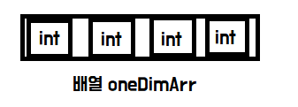
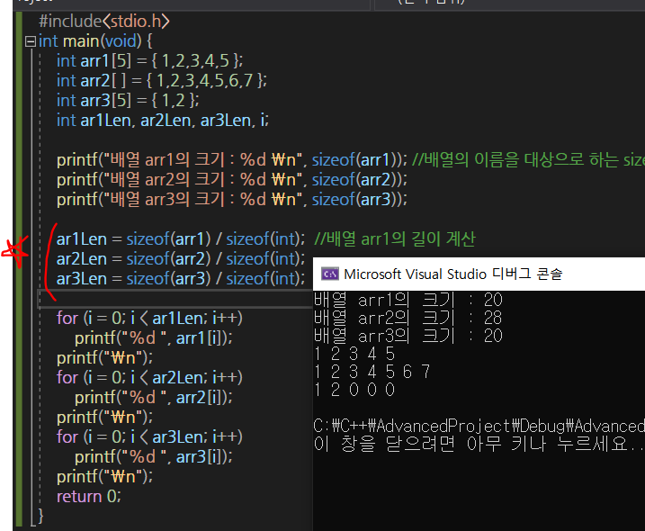
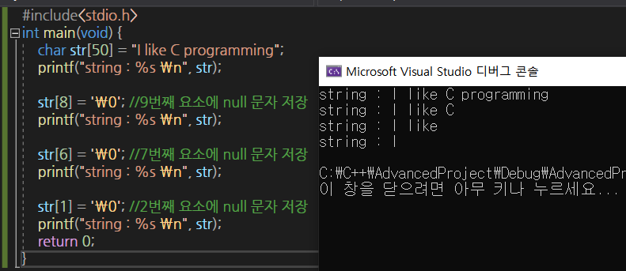
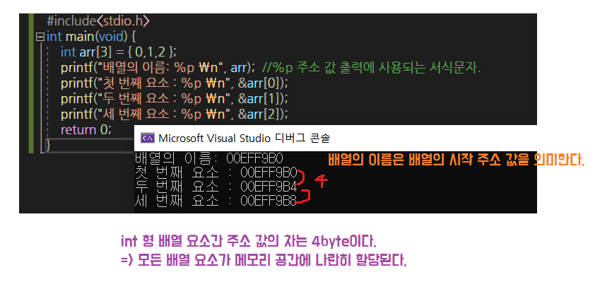

# :star: ​배열

> 둘 이상의 변수를 모아 놓은 것.

## 1차원 배열

> 필요한 것 : 배열 이름, 자료형, 길이 정보
>
> ```c
> int oneDimArr[4];
> ```
>
> * int  -- 배열을 이루는 요소의 자료형
> * oneDimArr -- 배열의 이름
> * [4] -- 배열의 길이
>
> 

* 배열 선언

  ```c
  int arr1[5] = {1,2,3,4,5};
  int arr2[] = {1,2,3,4,5,6,7}; //컴파일러에 의해서 자동으로 7 삽입
  int arr3[5] = {1,2};  //3,4,5번째 배열요소는 0으로 채워진다.
  ```

* 배열의 이름을 대상으로 하는 sizeof의 결과는 '**바이트 단위의 배열 크기**' 반환

  

* char형 배열의 문자열 저장

  * 문자열 끝에는 `\0`이 자동으로 삽입되어 문자열 길이 +!된다.
  * `\0` 는 **null**문자라고 한다. = *null문자의 아스키 코드값이 0이다. 이를 문자 혀앹로 출력할 경우 아무런 출력이 발생하지 않는다.*
  * 공백문자(` ' '`)의 아스키 코드값 = 32

  ```c
  char str[14] = "Good morning!";
  ```

  ```c
  char str[50];
  scanf("%s", str); //문자열을 입력받아서 배열 str에 저장
  ```

  * 문자열을 입력받을 때에 배열의 이름앞에 `&` 연산자 붙이지 않는다.

  * scanf함수 호출을 통해서 입력 받은 문자열의 끝에도 null문자가 삽입된다.

  * C언어에서 표현하는 **모든 문자열의 끝에는 null문자가 자동으로 삽입된다.**

    * 즉, null문자가 존재하면 문자열이고,null문자가 존재하지 않으면 문자열이 아니다.(문자 배열)

  * 문자열의 끝이 변경되었을 때 , 변경된 끝을 기준으로 문자열이 출력된다.

    > C언어는 `\0`를 만나면 문자열 끝이라고 판단!

  

# 포인터

> 포인터를 이용하면 **메모리에 직접 접근**이 가능하다.
>
> 주소 값의 저장을 목적으로 선언되는 **포인터 변수**.
>
> 모든 변수는 주소를 가진다.

```markdown
포인터는 **메모리 주소를 값으로 가지는 변수**이다. 포인터 변수는 다음과 같이 선언된다.

type-name * variable-name;

`*`는 variable-name이 포인터 변수임을 표시.

`type-name`은 포인터변수 variable-name에 저장될 주소에 저장될 데이터의 유형을 지정

`variable-name `: 선언된 포인터 변수의 이름

 int * ptr ;
```

* 변수의 주소 값 저장을 위한 포인터 변수 pnum을 선언

```c
int main(void){
    int num = 7;
    int * pnum; //포인터 변수 pnum 선언
    pnum = &num; //num의 주소 값을 포인터 변수 pnum에 저장
    // & 연산자는 오른쪽에 등장하는 피연산자의 주소 값을 반환하는 연산자.
}
```

* 포인터 변수 선언하기

  ```c
  int * pnum1;
  // int * 는 int 형 변수를 가리키는 pnum1의 선언
  ```

  ```c
  type * ptr;
  //type형 변수의 주소값을 저장하는 포인터 변수 ptr의 선언
  ```

## 포인터 연산자 : &, *

### 1. 변수의 주소 값을 반환하는 `& `연산자 

* `&` 연산자의 피연산자는 **변수**여야 하며, 상수는 피연산자가 될 수 없다.

```c
int main(void){
    int num = 5;
    int * pnum = &num; // num의 주소 값을 반환해서 포인터 변수 pnum을 초기화.
}
```

```c
int main(void){
    int num1 = 5;
    double * pnum1 = &num1; //일치하지 않음!
    
    double num2 = 5;
    int * pnum2 = & num2 ; //일치하지 않음!
}
```

### 2. 포인터가 가리키는 메모리를 참조하는 `*`연산자

* `*` 연산자는 포인터가 가리키는 메모리 공간에 접근할 때 사용하는 연산자.

```c
int main(void){
    int num=10;
    int * pnum = & num; //포인터 변수 pnum이 변수 num을 가리키게 하는 문장
    *pnum = 20; //pnum이 가리키는 메모리 공간인 변수 num에 정수 20저장.
    printf("%d", *pnum); // pnum이 가리키는 메모리 공간인 변수 num에 저장된 값 출력
```

> 포인터 변수 `pnum`이 가리키는 메모리 공간인 변수 num에 접근을 해서...~@ 라는 의미.

## 포인터와 배열의 관계

* 배열의 이름은 포인터이다. 단, 그 값을 바꿀 수 없는 `상수 형태의 포인터` 이다.
  * **배열의 이름** = **포인터 상수**
  * 가리키는 대상의 변경이 불가능한 상수.
  * 배열의 이름도 `포인터`이기 때문에 배열의 이름을 피연산자로 하는 `*`연산이 가능하다.



