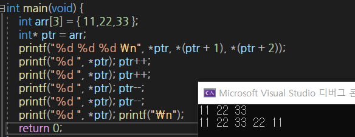
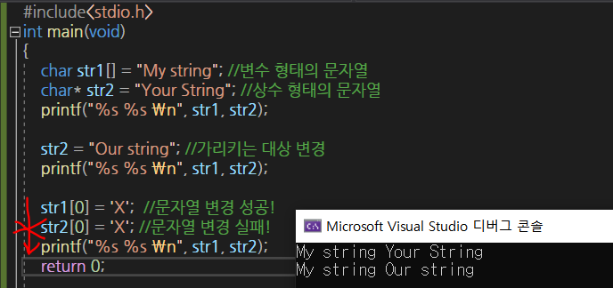
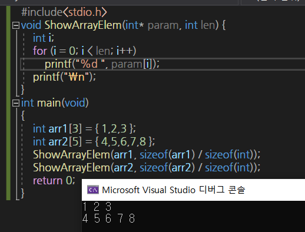

# 포인터

## 연산

* 증가 연산

  * `int `형 포인터를 대상으로 n증가 -> `n * sizeof(int)`크기만큼 증가
  * `double `형 포인터를 대상으로 n증가 -> `n * sizeof(double)`크기만큼 증가

  ```markdown
  int형 포인터를 대상으로 1을 증가시키면 4가 증가하고 double형 포인터를 대상으로 1을 증가시키면 8이 증가한다.
  ```

  

  * `*ptr, *(ptr + 1), *(ptr + 2)` 의 출력 결과는 `arr[0], arr[1], arr[2]`와 동일함을 알 수 있다.

  * 아래 모두 같은 의미.

    ```c
    	printf("%d %d %d \n", *ptr, *(ptr + 1), *(ptr + 2)); //ptr+0은 *ptr과 같다.
    	printf("%d %d %d \n", ptr[0], ptr[1], ptr[2]);
    	printf("%d %d %d \n", *(arr+0), *(arr + 1), *(arr + 2)); //*(arr+0)은 *arr과 같다.
    	printf("%d %d %d \n", arr[0], arr[1], arr[2]);
    ```

  * 따라서 `arr[i] == *(arr+i)`를 도출할 수 있다. ( `arr[i]`는 `*(arr+i)`와 같다.)

  * 

## 문자열 포인터

```markdown
# 일반적인 문자열 선언
char str1[] = "My string"; - 배열 기반의 `변수 형태의 문자열`
* 자체로 문자열 전체를 저장하는 배열
# 포인터 형태의 문자열 선언
## 상수 형태의 문자열 
char * str2 = "Your String"; - 포인터 변수
* str2가 가리키는 문자열은 그 내용의 변경이 불가능하다.
```



* 위와 같은 형태로 선언된 문자열은 상수로 간주하여 그 값을 변형시키지 않아야 한다.

* `char * str2 = "Your String";` 와 같은 문장이 실행되면 먼저 문자열이 메모리 공간에 저장된다. 그리고 그 메모리의 주소 값이 반환된다. 즉, 문자열이 0x1234 번지에 저장되었다고 가정하면, 위의 문장은 `char * str2 = 0x1234;` 형태가 된다.
  * 따라서 str에는 문자열의 주소 값이 저장되는 것이다. 

## 함수 인자로 배열 전달하기

> 배열을 통째로 넘겨받으려면 매개변수로 배열을 선언할 수 있어야 한다.
>
> 대신 함수 내에서 배열에 접근할 수 있도록 **배열의 주소 값**을 전달하는 것은 가능하다.



### Call- by- value

> 값을 호출할 때 **단순히 값을 전달**하는 형태의 함수 호출

```c
#include<stdio.h>
void Swap(int n1, int n2) {
	int temp = n1;
	n1 = n2;
	n2 = temp;
	printf("n1 n2 : %d %d \n", n1, n2);
}
int main(void)
{
	int num1 = 10;
	int num2 = 20;
	printf("num1 num2 : %d %d \n", num1, num2);

	Swap(num1, num2);
	printf("num1 num2 : %d %d \n", num1, num2);
	// num1과 num2는 n1, n2와 별개이다.
	return 0;
}
```


### Call- by- reference

> 메모리의 접근에 사용되는 **주소 값을 전달**하는 형태의 함수호출

```c
void Swap(int* ptr1, int* ptr2) {
	int temp = *ptr1;
	*ptr1 = *ptr2;
	*ptr2 = temp;
}
int main(void)
{
	int num1 = 10;
	int num2 = 20;
	printf("num1 num2 : %d %d \n ", num1, num2);
	Swap(&num1, &num2);
	printf("num1 num2 : %d %d \n ", num1, num2);
	//num1, num2에 저장된 값이 서로 바뀜을 알 수 있다.
	return 0;
}
```

* scanf 함수 호출 시 `&` 연산자 붙이는 이유

  ```markdown
  # 변수 num의 주소 값을 scanf 함수에 전달.
  scanf("%d", &num);  
  ```

* 변수를 상수화하는 목적의 `const` 선언 - >포인터 변수를 대상으로 선언이 가능하다.

  ```c
  int main(void){
      int num = 20;
      const int * ptr = & num;
      *ptr = 30; //컴파일 에러 !
      num = 40; //컴파일 성공!
      ...
   
  }
  ```

  *  **const** : 포인터 변수 ptr을 이용해서 **ptr이 가리키는 변수에 저장된 값을 변경하는 것을 허용하지 않는다.**

## 이중 포인터

> 포인터 변수를 가리키는 이중 포인터 변수(더블 포인터 변수)

```markdown
포인터 변수는 종류에 상관없이 무조건 주소 값을 저장하는 변수이다. 
다만 차이가 나는 것은 포인터 변수가 가리키는 대상일 뿐이다.

int main(void){
	double num = 3.14;
	double * ptr = &num; //변수 num의 주소 값 저장
	...
}
# ptr도 메모리 공간에 할당되는 변수이다. 이를 대상으로 `&`연산이 가능하며, 이 때 반환되는 주소 값은 double형 포인터 변수에 저장이 가능하다.
- double ** dptr = &ptr;
- *dptr = ...; //dptr은 포인터 변수 ptr을 의미한다.
- *(*dptr)= ...; //*(*dptr)은 변수 num을 의미한다.
```


# 다차원 배열

> 2차원 이상의 배열

* 2차원 배열의 선언과 동시에 초기화하기

```c
	int arr1[3][3] = {
		{1,2,3},
		{4,5,6},
		{7,8,9}
	};
```

```c
// 가로 세로 모두 예측은 불가능하니 한쪽만 알려주기.
int arr1[][4] = {1,2,3,4,5,6,7,8};
int arr2[][2] = {1,2,3,4,5,6,7,8};
```

* 3차원 배열의 선언과 접근

```c
	int record[3][3][2] = {
	{
		{70,80}, //A학급 학생 1의 성적
		{94,90}, //A학급 학생 2의 성적
		{70,85} //A학급 학생 3의 성적
	},
	{
		{83,90},
		{95,60},
		{90,82}
	},
	{
	{ 98,89 },
	{ 99,94 },
	{ 91,87 }
	}
	};
```

