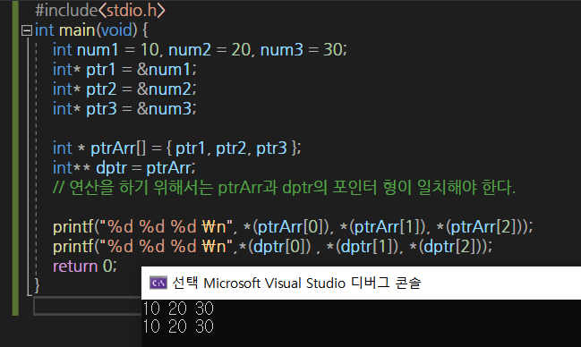

## 더블 포인터

```c
#include<stdio.h>
int main(void) {
	double num = 3.14;
	double * ptr = &num; // 변수 num의 주소 값 저장
	double ** dptr = &ptr;
	double * ptr2;

	printf("%9p %9p \n", ptr, *dptr);
	printf("%9g %9g \n", num, **dptr);
	ptr2 = *dptr; // ptr2 = ptr과 같은 문장
	*ptr2 = 10.99;
	printf("%9g %9g \n", num, **dptr);
	return 0;
}
```


* 포인터 변수 대상의 Call-by-reference

  ```c
  void Swap(int * ptr1, int * ptr2){
      int temp = * ptr1;
      *ptr1 = * ptr2;
      *ptr2 = temp;
  }
  ```

* **포인터 배열**

  ```c
  int * arr1[20]; //길이가 20인 int형 포인터배열 arr1
  ```

  * `arr1`이 가리키는 첫 번재 요소는 int형 실글 포인터 이니, `배열 arr1`은 int형 double포인터가 된다.

    

* **다중 포인터 변수**

  ```c
  //삼중 포인터 변수
  int ***tptr;
  ```

  * **삼중 포인터** 변수 : 이중 포인터 변수를 가리키는 용도로, 이중 포인터 변수의 주소 값을 저장하는 용도로 사용된다.


# 포인터 복습

> 메모리의 특정 위치를 가리킬 때 사용한다.

```markdown
자료형 * 포인터이름;
포인터 = & 변수;
```

```c
#include<stdio.h>
int main(){
    int *numPtr; //포인터 변수 선언
    int num1 = 10;
    numPtr = &num1; //변수의 주소를 구해 포인터 변수에 저장한다.
    //numPtr은 10이 저장된 메모리 공간을 가리킨다.
    // 즉, 변수 num1이 있는 공간을 가리킨다.
    printf("%p\n", numPtr);
    printf("%p\n", &num1);
    printf("%d\n", *numPtr); //역참조 연산자로 num1의 메모리 주소에 접근하여 값 가져온다.
    return 0;
}
```

* 포인터를 선언할 때 `*`는 **"이 변수가 포인터다"**라고 알려주는 역할이고, 포인터에 사용할 때 `*`는 **"포인터의 메모리 주소를 역참조하겠다"**라는 뜻

* `*포인터 = 값;` : 포인터 변수에 역참조 연산자를 사용한 뒤 값을 저장(할당)

  

* 비교

  | num1        | 메모리 주소를 몰라도 값을 가져오거나 저장할 수 있다.         |
  | ----------- | ------------------------------------------------------------ |
  | **&num1**   | 주소 연산자`&`는 변수의 메모리 주소를 구한다.                |
  | ***numPtr** | 역참조연산자`*`는 메모리에 저장된 값에 접근할 수 있다.<br />즉, 메모리 주소에 접근하여 값을 가져오고 저장한다. |
  | **numPtr**  | 포인터는 변수의 메모리 주소만 가리킨다.                      |

  

## 역참조 연산자

```c
int main(){
    int *numPtr;
    int num1 = 10;
    numPtr = &num1; //num1의 메모리 주소를 포인터 변수에 저장
    *numPtr = 20; //역참조 연산자로 메모리 주소에 접근하여 20 저장.
    printf("%d\n", *numPtr); //20 : 역참조 연산자로 메모리 주소에 접근하여 가져옴
    printf("%d\n", num1);   // 20 : 실제 num1의 값도 바뀐다.
}

```

기본적으로 C는 자료형이 다른 포인터끼리 메모리 주소를 저장하면 컴파일 경고가 발생한다.

 하지만 **void 포인터**는 자료형이 정해지지 않은 특성 때문에 **어떤 자료형으로 된 포인터든 모두 저장**할 수 있다. 반대로 다양한 자료형으로 된 포인터에도 void 포인터를 저장할 수 있다.

> void 포인터 = 범용 포인터

```c
int main(){
    int num1 = 10;
    char c1 = 'a';
    int *numPtr1 = &num1;
    char *cPtr1 = &c1;
    
    void * ptr; //void 포인터
    
    //자료형이 다르다.
    ptr = numPtr1; //오류 발생 x
    ptr = cPtr1;
    
    numPtr1 = ptr;
    cPtr1=ptr;
    return 0;
}
```

## 메모리 할당

```markdown
# 메모리를 사용하려면 malloc 함수로 사용할 메모리 공간을 확보해야 한다.
(memory allocation)
```

* 포인터 = malloc(크기);
  * void *malloc(size_t_size);
  * 성공하면 메모리 주소를 반환, 실패하면 NULL을 반환

```c
#include<stdlib.h> // malloc, free 함수가 선언된 헤더 파일

int main(){
    int num1 = 20;
    int *numPtr1 ;
    numPtr1 = & num1;
    
    int *numPtr2;
    numPtr2 = malloc(sizeof(int)); //int크기의 4바이트만큼 동적 메모리 할당
    
    printf("%p\n", numPtr1); //num1의 메모리 주소 출력
    printf("%p\n", numPtr2); //새로 할당된 메모리의 주소 출력
    
    free(numPtr2); //동적으로 할당한 메모리 해제
    return 0;
}

```

* 변수는 stack에 생성된다.

* malloc함수는 heap부분의 메모리를 사용한다.

* stack과 heap의 차이점은 **메모리 해제**이다. 스택에 생성된 변수는 사용한 뒤 따로 처리해주지 않아도 되지만, malloc함수를 사용하여 할당한 메모리는 반드시 해제를 해주어야 한다.

  * 따라서 `free함수`로 메모리를 해제해 준다.
  * 메모리 해제는 선택이 아닌 필수 ! 
  * 메모리를 해제하지 않아 메모리 사용량이 계속 증가하는 현상 = 메모리 누수(memory leak)

* 메모리에 값 저장하기

  * **포인터를 역참조한 뒤** 값 저장

  ```c
  int main(){
      int *numPtr;
      numPtr = malloc(sizeof(int));
      *numPtr = 10; //포인터 역참조 하여 값 할당
      printf("%d\n", *numPtr);
      free(numPtr);//동적 메모리 해제
      return 0;
  }
  ```

* **memset** : 메모리의 내용을 원하는 크기만큼 특정값으로 설정할 수 있다.(memory set)

  * memset함수를 사용하려면 `string.h` 또는 `memory.h` 헤더파일을 포함해야 한다.

  ```markdown 
  memset(포인터, 설정할 값, 크기)
  * void *memset(void *_Dst, int_Val, size_t_Size);
  * 값 설정이 끝난 포인터를 반환
  ```

  ```c
  int main(){
      long long * numPtr = malloc(sizeof(long long)); 
      memset(numPtr, 0x27, 8); //numPtr이 가리키는 메모리를 8바이트만큼 0x27로 설정
      printf("0x%11x\n", *numPtr);
      free(numPtr); //동적으로 할당한 메모리 해제
      return 0;
  }
  ```

  * `memset`함수는 주로 설정 값을 0으로 지정하여 메모리의 내용을 모두 0으로 만들 때 주로 사용한다.

  ```c
  memset(numPtr, 0, 8);//numPtr이 가리키는 메모리를 8바이트만큼 0으로 설정
  ```

* **널포인터**(Null Pointer)

  * 메모리가 할당되지 않은 포인터

  ```c
  int main(){
      int * numPtr1 = NULL; 
      printf("%p\n" numPtr1); 
  }
  ```


