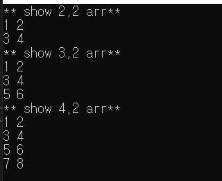

## #2차원 배열 이름의 포인터 형

* 2차원 배열이름의 포인터 형에는 다음과 같은 정보가 포함되어야 한다.
  * 가리키는 대상은 무엇인가?
  * 배열이름을 대상으로 1증가, 감소 시 실제로는 얼마나 증가 및 감소하였는가?

```markdown
가리키는 대상이 int형 변수이면서 포인터 연산 시 `sizeof(int)*4` 의 크기 단위로 증가 및 감소하는 포인터 변수 ptr?
=> int (*ptr)[4];
```

```c
# include<stdio.h>
int main(void) {
	int arr1[2][2] = {
		{1,2}, {3,4}
	};
	int arr2[3][2] = {
		{1,2}, {3,4}, {5,6}
	};
	int arr3[4][2] = {
		{1,2}, {3,4}, {5,6}, {7,8}
	};

	int(*ptr)[2];
	int i;

	ptr = arr1;
	printf("** show 2,2 arr** \n");
	for (i = 0; i < 2; i++)
		printf("%d %d \n", ptr[i][0], ptr[i][1]);

	ptr = arr2;
	printf("** show 3,2 arr** \n");
	for (i = 0; i < 3; i++)
		printf("%d %d \n", ptr[i][0], ptr[i][1]);

	ptr = arr3;
	printf("** show 4,2 arr** \n");
	for (i = 0; i < 4; i++)
		printf("%d %d \n", ptr[i][0], ptr[i][1]);
	return 0;
}
```



> 주의 ! **배열 포인터**와 **포인터 배열**을 혼동하지 말자

```c
int * whoA[4]; //포인터 배열 - 배열 선언
int (*whoB)[4]; //배열 포인터 - 포인터 변수 선언
```

* 포인터 배열

  ```c
  int num1 = 10, num2 = 20, num3 = 30, num4 = 40;
  int* whoA[4] = { &num1, &num2, &num3, &num4 };  // 포인터 배열
  printf("%d %d %d %d \n", *whoA[0], *whoA[1], *whoA[2], *whoA[3]);
  // 10 20 30 40
  ```

* 배열 포인터

  ```c
  	int arr2d[2][4] = { 1,2,3,4,5,6,7,8 };
  	int i, j;
  	int(*whoB)[4] = arr2d;  // 배열 포인터
  
  	for (i = 0; i < 2; i++) {
  		for (j = 0; j < 4; j++)
  			printf("%d ", whoB[i][j]);
  		printf("\n");
  	}
  /*
  1 2 3 4
  5 6 7 8
  */
  ```


* **2차원 배열을 함수의 인자로 전달**
  * arr1의 주소 값을 전달받을 수 있는 매개변수 이름을 parr1이라 하고, arr2의 주소값을 전달받을 수 있는 매개변수 이름을 parr2라고 한다면.

```c
int main(void){
    int arr1[2][7];
    double arr2[4][5];
    SimpleFunc(arr1, arr2);
}
```


* 2차원 배열에서도 `arr[i]`와 `*(arr+i)`는 같다.
* 

