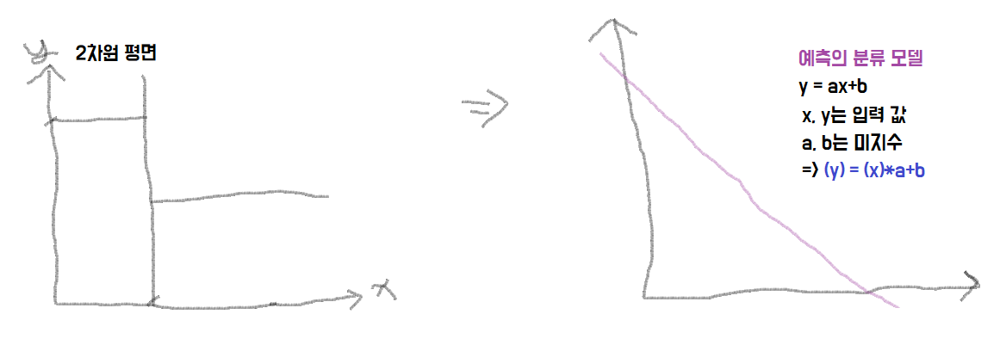
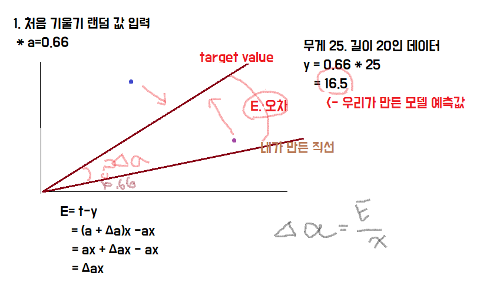
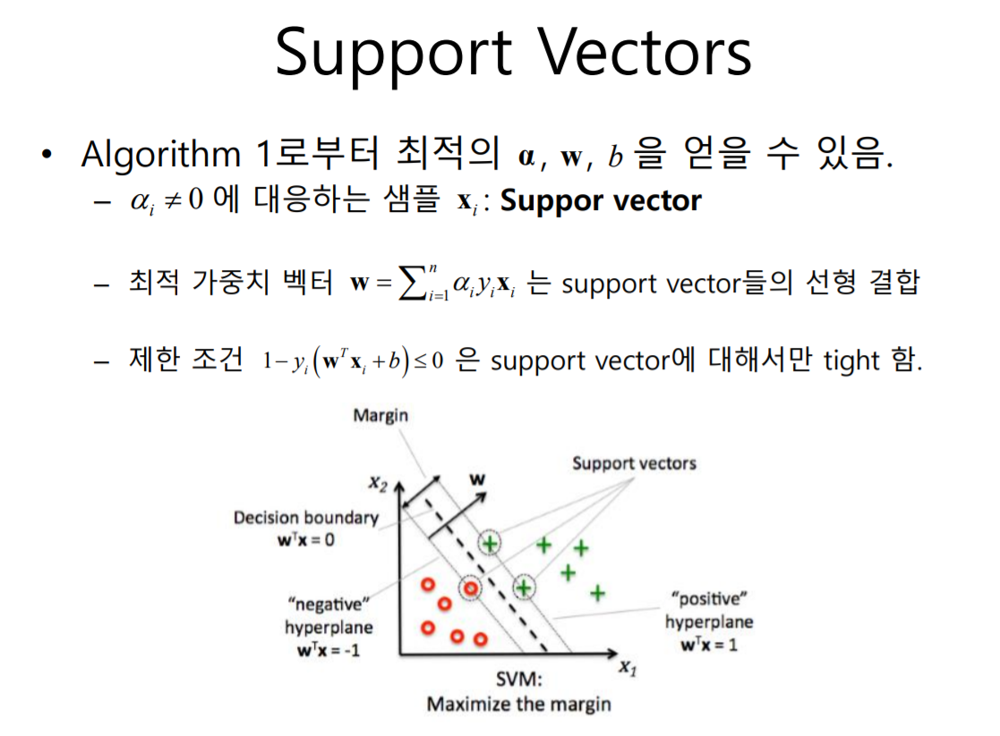
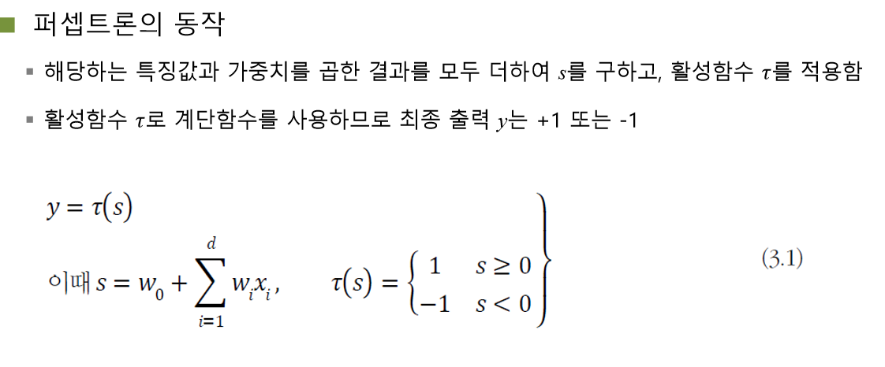
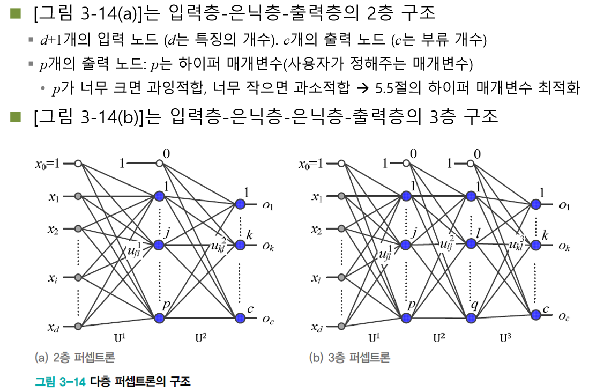
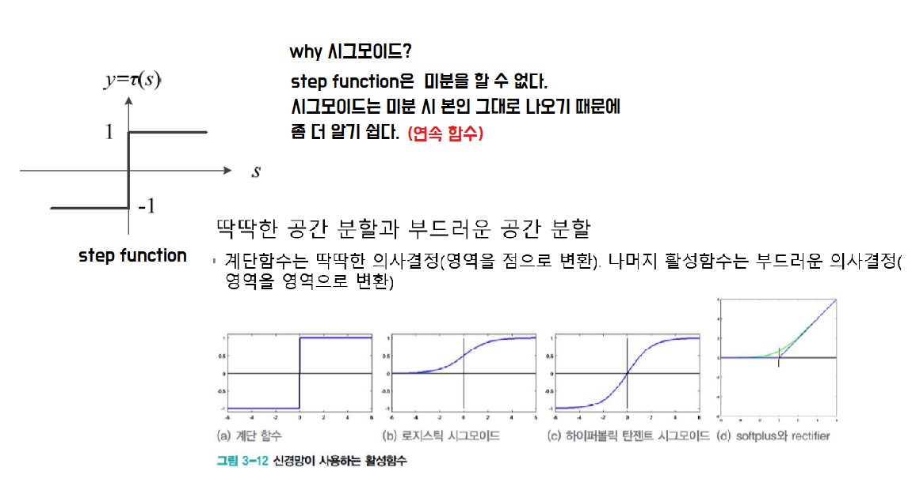

## 딥러닝

## 1.영상처리

* segmentation 

  ex) 자율 주행 시 도로, 사람, 차 등을 구분할 수 있는 기능

* Super Resolution

  저화질에서 고화질로 바꾸어 주는 기술

* SLAM

  로봇이 주변 환경에서 자기 위치를 인식하는 기술

  ex ) 로봇 청소기

#### 딥러닝 기반 차량 번호 인식?

* **ITS - Parking customers**
* 기존 영상 기법의 한계 극복
  * 30% of camera images ; 조명, 카메라의 방향에 따라 읽어내지 못함
  * Failed on existing tech 

* 심전도 신호 분석
  * 이상 탐지 영역

https://paperswithcode.com/

데이터 가공 업체 : crowdworks

## 자율주행자동차

* 차량에서 발생하는 데이터를 전송시킬 수 있으려면 촘촘한 통신, 관제 솔루션이 필요해서 5g 대두되고 있음.

* 자율주행차 책임 증대로 ICT/인프라 기술 융합이 필수.

* ROS 기반 소프트웨어 구조
  * SLAM
    * GNSS..
  *  Lidar object detect
    * Lidar, Radar, Camera(신호 처리)

## EASY MILE

> 상용화된 자율 주행 차량

- LIDARs (Laser Detection And Ranging)
- Cameras
- Radars
- Differential GPS
- Inertial Measurement Unit (IMU)
- Odometry

추가로 **DONKEY CAR** 도 알아보기

* AWS 기반 딥 러닝

  서버가 존재하지 않아도, 계정 만들면 바로 실행 가능.

# Parameter Learning

## Abstract

* 최적의 모델 파라미터를 찾아 모델을 데이터에 맞추기 

* 모델에 사용될 속성

  * **Domain knowledge**

  * **Data Mining**

### 함수 이용 분류

* 트리 모델을 객체 공간 그래프로 변환

  

  * 데이터를 모델에 맞춰서 1차식으로 표현

* 선형 판별 함수

  * 각 항목 속성이 Xi로 구성되는 특징벡터 X가정

  * 가중치(weigth) - 가중치의 합 = **기울기** 
  * f(x) = w0+w1x1+w2x2+...

* 기울기 업데이트 하는 방법이 가지고 있는 문제점은?

  * 마지막 데이터의 영향력이 강하다.

  * **학습률** 이용

  * DM에서 최적의 목적함수를 찾기는 불가능하다

    * 로지스틱 회귀분석
    * SVM

    

  * **F(X) = 0 ?** 선위에 있는 값

    * 분류 불가능
    * Class label이 자주 바뀌는 애들은 그 계층에 속할 확률이 작다.

  * 회귀 분석

    * 추세를 예측한다.
    * 승산 

## 퍼셉트론

 퍼셉트론은 **원시적 신경망**이지만, 딥러닝을 포함한 현대 신경망은 퍼셉 트론을 병렬과 순차 구조로 결합하여 만듬

[진행 순서]

* Linear Classfier
* **Perceptron**
* Artificial Neural Network
* Deep Learning

* hidden Layer 2개 이상부터가 딥러닝.

  * hidden Layer가 많아지면 가중치(w)가 많아져 성능이 좋아져야한다. 

    

* 미분 : 상대적인 변화량

  미분을 통해 가중치를 구할 수 있다.

https://www.udemy.com/ko/courses/development/

