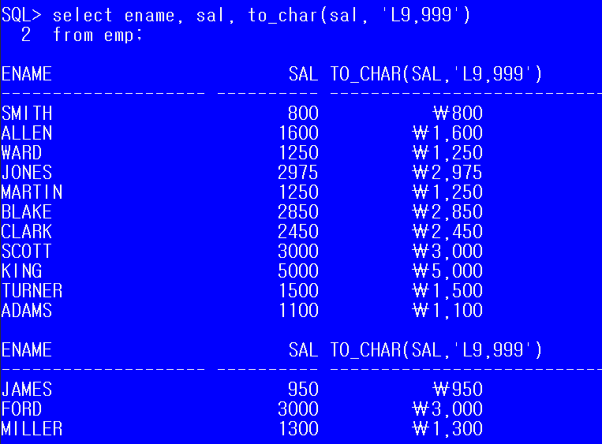

##   함수의 종류

### 1. 단일행 함수

* **단일행 함수**를 정의하면 테이블의 모든 행에 각각 함수가 적용된다.

  * `select`, `where`,`order by`절에 모두 사용할 수 있다.
  * 문자, 숫자 ,날짜, 변환, null

* 한 행 한 행 검사하고 작성 (where절)

  * 문자함수

    * `lower`(문자열 or 컬럼명) : 값을 소문자로 변환
    * `upper`(문자열 or 컬럼명) : 값을 대문자로 변환
    * `initcap`(문자열 or 컬럼명) : 전달된 값의 첫 글자만 대문자로 변환

    ```sql
    SQL> select lower('TEST'),upper('test'),initcap('test')
      2  from dual;
    ```

    * `substr`(대상 문자열or컬럼명, 잘라낼 시작위치, 잘라낼 문자열의 갯수)

    ```sql
    SQL> select substr('oracle',2)
      2  from dual;
    
    SUBSTR('OR
    ----------
    racle
    ```

    ```SQL
    SQL> select substr('oracle',2,2) from dual;
    
    SUBS
    ----
    ra
    ```

    * `length`(문자열 or 컬럼명): 문자열의 길이를 반환

    ```sql
    SQL> select length('오라클') from dual;
    
    LENGTH('오라클')
    ----------------
                   3
    ```

    * `instr`(문자열 or 컬럼명, 찾을 문자 지정,찾을 위치, n번째 문자) 

      ​	: 특정 컬럼이나 문자열에서 문자의 위치를 찾을 때 사용하는 함수

      ​    : 문자가 몇개가 있던 첫번째 문자의 위치를 찾는다.	

      * 찾을 위치나 n번째 문자에 대한 매개변수는 생략이 가능
      * 찾을 위치를 -1로 정의하면 문자열의 오른쪽 끝에서 문자를 찾는다

    ```SQL
    SQL> select instr('oracle oracle oracle','a')from dual;
    
    INSTR('ORACLEORACLEORACLE','A')
    -------------------------------
                                  3
    ```

    ``` sql
    SQL> select instr('oracle oracle oracle','a',-1,2)from dual;
    
    INSTR('ORACLEORACLEORACLE','A',-1,2)			--- -1은 lastofindex와 같다.
    ------------------------------------			--- 끝에서부터 찾는다
                                      10
    ```

    ```sql
    SQL> select instr('oracle oracle oracle','a',5,2)from dual;
    
    INSTR('ORACLEORACLEORACLE','A',5,2)
    -----------------------------------   해당 문자열의 5번째문자부터 a를 찾아 위치를 반환한다.
    								---   단, 2번째 a 위치를 반환.
                                     17
    ```

    

    * `concat`(문자열 or 컬럼명,문자열or컬럼명 ) : `||`연산자와 동일 (문자열 연결)

      * 문자열 연결의 경우, 결합하는 문자가 `NULL`이면 결과도 `NULL`이 된다.

    * `LPAD` (문자열 or컬럼명, 출력할 문자열의 길이, 채움문자)

      : **전체 출력할 문자열의 길이**에 문자열을 출력한 후 남는 공간에 정의한 문자를 채워 출력해주는 함수(왼쪽)

    * `RPAD` : (문자열 or컬럼명, 출력할 문자열의 길이, 채움문자)

      : **전체 출력할 문자열의 길이**에 문자열을 출력한 후 남는 공간에 정의한 문자를 채워 출력해주는 함수(오른쪽)

    * `ltrim`(문자열 or 컬럼명, 제거할 문자)

      :컬럼에서 매개변수로 정의한 문자를 왼쪽에서 찾아 모두 제거

      연속된 문자만 제거.

    * `rtrim`(문자열 or 컬럼명, 제거할 문자)
  
      :컬럼에서 매개변수로 정의한 문자를 오른쪽에서 찾아 모두 제거

``` sql
SQL> select lpad('oracle',10,'*')from dual;

LPAD('ORACLE',10,'*'
--------------------
****oracle
```

``` sql
SQL> select rtrim('oracleaaaaaaaaaaaaaaaaaaaa','a') from dual;

RTRIM('ORACL
------------
oracle
```

``` sql
SQL> select('                 oracle) form dual;
ERROR:
ORA-01756: quoted string not properly terminated


SQL> select('                oracle') from dual;

('ORACLE')
--------------------------------------------
                oracle

SQL> select 'oracle' from dual;

'ORACLE'
------------
oracle

SQL> select ltrim('            oracle',' ')from dual;

LTRIM('ORACL
------------
oracle
```

``` sql
SQL> select concat('oracle','dbms') from dual;

CONCAT('ORACLE','DBM
--------------------
oracledbms
```

* 숫자 함수
  * `ABS` : 절댓값 구하는 함수
  * `MOD`(n,p) : (n%p), 나머지 값을 구하는 함수
  * `round`(숫자, 반올림할 위치) : 반올림

| -2   |  -1  |     0     |      1      |  2   |  3   |
| ---- | :--: | :-------: | :---------: | :--: | :--: |
|      |      | 일의 자리 | 소수점 자리 |      |      |

```sql
SQL> select round(125.888,1) from dual;

ROUND(125.888,1)
----------------
           125.9

SQL> select round(125.888,-1) from dual;

ROUND(125.888,-1)
-----------------
              130
```

* 변환함수

  * 데이터의 타입을 변환하기 위한 함수

  * 또 다른 함수의 매개변수로 사용하게 될 경우 **타입이 컬럼의 타입과 일치해야 하므로 **

  * **cast**( 값 or 컬럼명 as `타입`

    ​									-------- 날짜 : date

    ​								   ---------숫자 : integer

    ​	**to_char**(변환할 데이터, 표시할 format)

    * 숫자를 문자로 변환 : 세자리마다 `,`를 출력하고 싶은 경우
      * 숫자의 한 자리를 표시 => 9 , 0
      * 콤마 => `,`
      * 소수점 => `.`
        * 통화기호 =>` \`, `$`,`L`(지역의 통화기호 출력)
    * 날짜를 문자열로 변환 : 년, 월, 일 각각의 데이터를 추출하고싶은 경우
      * 년도 => YYYY (2019)
      * 월  => MM (12)
      * 일 => DD(19)

  ``` sql
  SQL> select cast ('2019/11/11'as date) from dual;
  
  CAST('20
  --------
  19/11/11
  ```

  ``` sql
  SQL> select cast('0001' as integer) from dual;
  
  CAST('0001'ASINTEGER)
  ---------------------
                      1
  ```

  

* ```sql
  SQL> select ename, to_char(hiredate, 'MON')월,
    2                to_char(hiredate, 'MONTH')월
    3  from emp;
  ```

  ```sql
  SQL> select ename, hiredate, to_char(hiredate,'MM')
    2  from emp;
  ```

  ``` sql
  SQL> select ename, hiredate, to_char(hiredate,'YYYY')
    2  from emp;
  ```

  

* 날짜함수

  * **current_date** : 현재 날짜
  * **current_timestamp** : 날짜까지 포함된 형태로 출력  ( 현재 일시 )
  
  ``` sql
  SQL> select current_timestamp from dual;
  ---------------------------------------
  19/12/22 17:13:13.044000 +09:00
  ```
  
  * **sysdate** - 오늘 날짜 ( 날짜 데이터는 연산이 가능하다)

``` sql
SQL> select sysdate-5, sysdate,sysdate+5 from dual;
```

​	SYSDATE  -  SYSDATE      SYSDATE+
-------- -------- --------
​	19/12/14 	19/12/19 	19/12/24

* **extract** : 날짜 요소 추출하기		

``` sql
 extract(YEAR  from current_timestamp) as year,
 extract(MONTH from current_timestamp) as month
 from dual;
 
     YEAR      MONTH
--------- ----------
     2019         12
```


* null 처리 함수

  * nvl(컬럼, null인 경우 처리할 식이나 값)  - null인 경우 대신할 식이나 값을 명시

  ``` sql
  SQL> select ename, sal, comm, nvl(comm, 0)
    2  from emp;s
  ```

  ``` sql
  SQL> select ename, sal, comm, nvl(to_char(comm), '신입사원')
    2  from emp;
    --comm(number) 과 '신입사원'의 형태를 맞춰줘야한다.
  ```

  

  * nvl2(컬럼, 표현값 1, 표현값 2) 

    ​				       ㄴ null이	ㄴnull인경우

    ​						  아닌경우	

  ``` sql
  SQL> select ename, sal,comm, nvl2(to_char(comm),'영업부','타부서')
    2  from emp;
  ```

  

### 2. 그룹 함수

* **그룹함수**는 그룹으로 묶인 데이터에 적용되므로, **where절에 그룹함수를 사용할 수 없다.**

* 우리말로 '~마다' , '~별', '~단위' 등으로 표현되는 문구가 `group by`이다. 

* `groub by`를 적용한 후에 사용할 함수
  
	``` sql
  SQL> select deptno,count(empno)
    2  from emp
    3  group by deptno;
  ```
  
  * 그룹으로 묶이지 않으면 작성할 수 없다.
  * `sum`,`avg`,`max`,`min`,`count` 등 통계, 집계관련 함수
    * **count(*)** 로 지정시 **null 포함** 한 모든 행을 집계한다.
    * **count(컬럼명)**은 null을 제외한 행 수 계산.

```sql
SQL> select ename, sal, comm
  2  from emp
  3  where sal >= avg(sal);
where sal >= avg(sal)
             *
ERROR at line 3:
ORA-00934: group function is not allowed here
```


```sql
SQL> select sum(sal),avg(sal),max(sal),min(sal),count(sal)
  2  from emp
  3  where deptno=10;

  SUM(SAL)   AVG(SAL)   MAX(SAL)   MIN(SAL) COUNT(SAL)
---------- ---------- ---------- ---------- ----------
      8750 2916.66667       5000       1300          3
```

그룹으로 묶이지는 않았지만, 10번 부서에 대한 통계값을 구함으로써 출력이 될 수 있음.

* **그룹화 순서**
  
  ```  sql
  select 컬럼...
  from 테이블...
  where 조건...
  group by 그룹화할 컬럼명(함수를 포함한 식도 가능)
  having --group by 한 결과에 적용할 조건. 
  order by 정렬할 컬럼명
  ```
  
  * 테이블에 저장된 레코드를 그룹화하여 분류하고 싶은 경우 사용
  * `select` 절에는 `group by` 절에 **명시한 컬럼명과 그룹함수만** 사용할 수 있다.
  * `group by구`는 `select 구`에서 사용한 별명을 사용할 수 없다.
  * 데이터가 복잡한 경우 **group by절에 두 개 이상의 컬럼을 명시**할 수 있다.
    * 실행 순서 : FROM - WHERE - GROUP BY - SELECT


``` sql
SQL> select job, avg(sal) 임금평균
  2  from emp
  3  group by job;
```

``` sql
SQL>  select deptno, job, count(empno)
  2   from emp
  3   group by deptno,job
  4  order by deptno;
```

``` sql
SQL> select job,deptno,count(empno),max(sal)
  2  from emp
  3  group by job, deptno
  4  order by job;
```

* **group by 하기 전에 적용해야 하는 조건**은 **where절**에 정의
* group by 한 **결과에 조건을 적용**해야 하는 경우 having 절 이용
  *  **조건에 그룹함수 써야하면 having에 추가.**
  *  즉, 그룹함수를 사용할 수 있는 곳은 `SELECT구` 와 `HAVING구`(그리고`ORDER BY구`) 뿐이다.

```sql
SQL> select job,avg(sal)
  2  from emp
  3  where ename not like '%H'
  4  group by job
  5  having avg(sal)>=2000;
```


####   #세션 설정

``` sql
SQL> alter session set nls_language='american';
--영문 세션으로 변경
```

```sql
SQL> alter session set nls_language = 'korean';
--한글 세션으로 변경
```

### # HR 계정

* 샘플 계정인 hr계정의 lock을 풀어야 한다.


* 계정 접속

  

  ㄴ

### 3. 함수 응용

>  직업별 평균 급여 출력하고. 평균 급여가 2000이 넘는 데이터만 출력해라. 
>
>  단 ,이름 끝에 'H'가 들어가는 직원 출력하기

``` sql
SQL> select *
  2  from emp
  3  where substr(ename,-1,1)='H';
```

``` sql
SQL> select *
  2  from emp
  3  where substr(ename,length(ename),1)='H';
  -- 이름의 끝에서 시작
```

``` sql
SQL> select *
  2  from emp
  3  where ename like '%H';
```

[출력]

 EMPNO ENAME                JOB                       MGR HIREDATE        SAL       COMM     DEPTNO

------ -------------------- ------------------ ---------- -------- ---------- ---------- ----------
  7369 SMITH                   CLERK             	   7902 80/12/17        800                			    20

```sql
SQL> select *
  2  from emp
  3  where ename not like '%H';
 -- 'H'가 들어가지 않는 직원 ?
```

> 직업별 인원수 구하기
>
> 단, 1983년 입사자는 제외하고 최종 결과로는 인원수가 3명 이상인 직업만 출력하기.

```sql
SQL> select job, count(empno) 인원수
  2  from emp
  3  where hiredate not like '83%'
  4  group by job
  5  having count(empno)>=3
  6  order by job;
  --count(기본키[절대 null사용 x])
```

``` sql
SQL> select job, count(empno) num
  2  from emp
  3  where hiredate not like '83%'
  4  group by job
  5  having num >=3;
  -- num은 가장 마지막에 실행되기 때문에 인식이 되지 않는다.
  "NUM": invalid identifier
```


``` sql
SQL> select to_char(hire_date,'mm') 월,count(employee_id) 입사자수
  2  from employees
  3  group by to_char(hire_date,'mm')
  4  order by 월;
```

```sql
SQL> select nvl(to_char(department_id),'no department') 부서번호 											,round(avg(salary),0) 평균급여 
2 from employees
3 group by department_id
4 having avg(salary)>6000;
```

## 2. 카티션 프로덕트

``` sql
SQL> select dname, ename, sal
  2  from emp, dept;
```

- 두 테이블을 썼는데, 비교값을 명시하지 않아서 emp의 레코드 한개를 dept에 전부 대입을 하게 된다. 

  - 곱하기 한 결과가 뜨기 때문에 명확한 기준을 정해줘야한다.  => **조인** [ 테이블 정규화 ]

  ``` sql
  select dname, ename, sal
  from emp, dept
  where emp.deptno = dept.deptno;
  ```

  

  