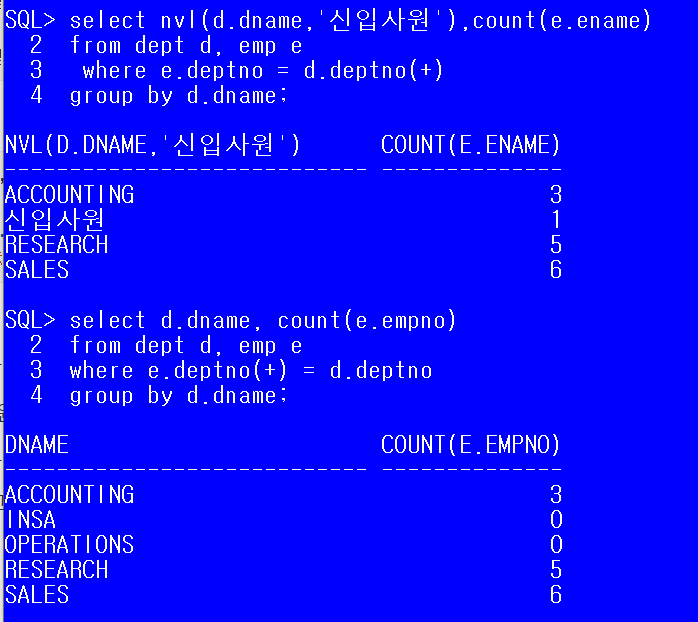

## 1. JOIN( 결합 )

> JOIN은 정규화된 테이블이나 혹은 일반적으로 작성된 여러 테이블의 컬럼을 이용해서 데이터를 조회하는 것.

- 조인은 관계형 데이터 베이스에서 반드시 알아야하는 개념이다.

- 기본키와 외래키의 관계를 이용해서 테이블을 조인한다.

  - 외래키를 가지고 기본키 테이블에서 값을 비교하여 작업이 진행된다.

  - 조인을 하는 경우 무조건 where절에 조인조건을 정의해야한다.
  - 테이블을 여러개 사용하는 경우 모든 테이블의 조인조건을 정의해야 하며, select 절에서 사용하지 않고 조건으로만 사용한다고 하더라도 조인조건은 정의해야한다.

- (PK, FK관계)두 테이블의 연관성 있는 컬럼을 통해 내가 원하는 데이터(하나의 결과)를 가져다 쓰는 것.

### [ 조인방법]

1. from 절에 조회하고 싶은 데이터가 저장된 테이블을 모두 명시한다.

2. 조인을 하는 경우 컬럼이 어떤 테이블의 컬럼인지 명확하게 정의하기 위해 **테이블명.컬럼명**으로 액세스 한다.

3. from절에 테이블명을 정의하면서 alias를 함께 추가하여 alias를 통해 액세스하도록 한다.

   ``` sql
   select alias.컬럼명, alias.컬럼명...
   from 테이블1 alias1, 테이블2 alias2
   ```

4. where절에는 반드시 조인조건을 추가하며 조인조건에는 두 테이블의 값을 비교하기 위해 정의하는 것이므로 외래키와 기본키를 정의한다. 

   - 외래키 테이블(Child 테이블)에 정의된 컬럼값을 기본키 테이블(Parent 테이블)에서 비교하여 정확하게 일치하는 경우 값을 가져온다.
     - 테이블 2개 -> 조인조건 1개
     - 테이블 3개 -> 조인조건  2개

``` sql
SQL> select d.dname, e.ename,e.sal
  2  from emp e, dept d
  3  where e.deptno = d.deptno -- 비교해서 일치하는 것의 네임 표기
  			and sal>=300;
```

[예제]

**부서별 인원수 구하기(단, 부서명으로 출력하기)**

``` sql
SQL> select d.dname,count(e.empno)
  2  from emp e, dept d
  3  where e. deptno = d. deptno
  4  group by d.dname;
```
**DALLAS에근무하는사원중급여1500 이상인사원의이름,급여,업무, 입사일, 보너스를조회**

``` sql
SQL> select e.ename, e.sal,d.dname,e.hiredate,e.comm
  2  from emp e, dept d, locations l
  3  where e. deptno = d. deptno and d.loc_code = l.loc_code and e.sal>=1500 and 						l.city='DALLAS';
```

- emp 와 dept 테이블 두개만 쓴다고 하더라도, where 절의 사용을 위해 locations을 조인조건에 언급해줘야 한다.

  

floor(숫자): 버림

trunc(숫자, 버림할 위치): 버림

ceil(숫자) : 올림

``` sql
select ceil(125.2) from dual;
```

* group by 두개를 명시한다?

  * 내가 가진 record를 기준을 정해놓고 다시 소분류로 명시한다.

  * | 대분류 |  소분류  |
    | :----: | :------: |
    |  food  |    물    |
    |  food  |    물    |
    |  food  |    빵    |
    |  food  |    빵    |
    |  etc   |   비닐   |
    |  etc   |   비닐   |
    |  etc   | 고무장갑 |

## [조인 종류]

- **equi join (inner join)** : 두 테이블에서 정확하게 일치하는 컬럼에 대한 데이터만 조인

- **outer join** : 두 개 이상의 테이블에 조인을 적용했을 때 join조건을 만족하지 않아도 데이터를 조회하고 싶은 경우 사용.
  - 조인조건에 (+)를 추가한다
  - join 조건을 만족하지 않아도 한 쪽 테이블의 모든 데이터를 출력하고 싶을 때 사용하는 조인방식으로 정보가 부족한 테이블의 컬럼에 (+)를 추가한다.
    - (+)	기호는 한쪽에만 사용한다.
    - 데이터가 확장되어야 하는 곳에 추가한다.

``` sql
select 테이블 alias, 컬럼명...
from 테이블 alias
where 테이블 alias.컬럼명 = 테이블alias.컬럼명(+)
or
where 테이블 alias.컬럼명(+) = 테이블alias.컬럼명
```


```sql
 select dname,ename,hiredate
 from emp e,dept d
 where e.deptno = d.deptno(+);
 -- (채워져야 하지만 채워지지 않은 ) 부족한 데이터 뒤에 (+) 붙인다. 
```

[실습예제]

1. 부서별 인원수 출력하기

단, 부서명을 출력하고 인원이 없는 부서명도 모두 출력한다.

 2. 부서별 인원수 출력하기

    단, 부서명을 출력하고 부서가 배치되지 않은 사원은 "신입사원으로 표시한다.



* **self join** : 두 개 이상의 테이블에서 조인하지 않고 같은 테이블의 컬럼들을 이용해서 조인한다.
  * 하나를 가상 테이블로 만든다.

```sql
SQL>  select e.empno, e.ename, e.mgr , m.ename
  2   from emp e, emp m
  3  where e.mgr = m.empno;
  -- 사원 테이블의 사원 번호(emp)를 관리자테이블의 관리자번호(emp)로 사용한다
```

[실습 예제]

관리자별 인원수 구하기

``` sql
SQL>  select m.ename 관리자명, count(e.empno)
  2   from emp e, emp m
  3   where e.mgr = m.empno(+)
  4   group by m.ename;
```

## 2. Query

1. 기본 select

2. 함수

3. group by ~ having

4. join

5. **Sub Query** : SQL문 안에 삽입되는 또 다른 SQL문 ( = 일회용 뷰)

   ---

   ## 3. VIEW

   table : 물리적으로 

   VIEW  : 실행 결과로 보여지는 가상의 테이블

``` sql
SQL> conn system/manager
SQL> grant create view to scott;

Grant succeeded.

SQL> conn scott/tiger
Connected.
SQL>
SQL> create view countdata
  2  as
  3  select deptno, avg(sal) empcount
  4  from emp
  5  group by deptno;

```


## 3. Sub Query(서브 쿼리)

**서브쿼리**란?

* SQL문에 삽입된 Query
* select문에서 주로 사용하고, select문에 삽입된 select문
  * 바깥쪽의 query를 main query, 안쪽에 삽입된 query를 sub query라고 한다.
  * sub query는 괄호로 묶어 주어야 한다.		
* sub query는 메인쿼리가 실행되기 전에 한 번 실행되며, 그 실행 결과를 메인쿼리에 사용한다.

[실습]

10번 부서의 평균급여보다 급여를 많이 받는 사원들을 조회

```sql
SQL> select ename,sal
  2  from emp
  3  where sal>(select avg(sal)
  4             from emp
  5             where deptno = 10);
```


**[서브쿼리의 종류]**

### 1) 단일행 서브쿼리 - 결과가 1행 1열인 서브쿼리

* `>`,`>=`,`<`,`<=, 연산자와 함께 사용할 수 있다.
* 비교 연산자 오른쪽에 서브쿼리를 추가해야 한다.


[실습]

-전체 평균보다 높은 급여를 받는 사원의 목록(ename,sal)

``` sql
SQL>  select ename,sal
  2   from emp
  3   where sal>(select avg(sal)
  4              from emp);
```

-smith와 같은 job을 갖고있는 사원의 목록(ename,job,hiredate)

``` sql
SQL> select ename,job,hiredate
  2  from emp
  3  where job = (select job
  4              from emp
  5              where ename='SMITH');
```

-10번 부서에 근무하는 사원들의 job과 같은 job을 갖고있는 사원의 목록

``` sql
SQL> select ename
  2  from emp
  3  where job = (select job
  4             from emp
  5             where deptno = 10);
  ----------------------------------
where job = (select job
             *
ERROR at line 3:
ORA-01427: single-row subquery returns more than one row
```


### 2) 다중행서브쿼리

- 서브쿼리의 실행결과가 열 하나의 행이 여러개인 경우

* `=`연산자와 같은 비교연산자를 사용할 수 없다.
* `in`,`any`,`all`
  * `in` : 컬럼의 값이 정확하게 일치하는 경우
  * `<any` :  서브쿼리 결과의 최대값보다 작은 값을 구하는 경우.
  * `>any` :  서브쿼리 결과의 최소값보다 큰 값을 구하는 경우.
  * `<all` : 서브쿼리 결과의 최소값보다 작은 값을 구하는 경우.
  * `>all` : 서브쿼리 결과의 최대값보다 큰 값을 구하는 경우.

``` sql
SQL> select sal
  2  from emp
  3  where deptno = 10;

       SAL
----------
      2450
      5000
      1300
SQL> select ename, sal
  2  from emp
  3  where sal < any(select sal
  4                  from emp
  5                   where deptno =10); -- 5000보다 작은 값들 출력
SQL> select ename, sal
  2  from emp
  3   where sal < all(select sal
  4  				  from emp
  5   				  where deptno =10);  -- 1300보다 작은 값들 출력
  ------------
  > any : 1300보다 큰 값들 출력
  > all : 5000보다 큰 값들 출력
```


**[실습]**

이름에 'T'를 포함하고 있는 사원과 같은 부서에서 근무하는 사원의 이름과 사원번호 출력

``` sql
SQL> select ename,empno
  2  from emp
  3  where deptno in(select deptno
  4             from emp
  5  			where ename like ('%T%'));
```

-10번 부서에 근무하는 사원들의 job과 같은 job을 가지고 있는 사원의 목록

-각 부서별로 최소급여를 받는 사원의 정보를 출력(사원명, 부서코드, 급여,입사일)

### 3) 다중열 서브쿼리(다중컬럼 서브쿼리)

* 두 개 이상의 컬럼과 다중행을 반환하는 서브쿼리

  * 메인쿼리의 비교 컬럼의 갯수, 종류가 서브쿼리의 반환 결과와 동일하다.

  * ``` sql
 ...........
    where (컬럼1,컬럼2) in (Select 컬럼1,컬럼2
                       			............)
    ```


[실습]

-각 부서별로 최소급여를 받는 사원의 정보를 출력(사원명, 부서코드, 급여,입사일)

``` sql
SQL> select deptno, ename,sal,hiredate
  2  from emp
  3  where (deptno,sal) in (select deptno,min(sal)
  4                         from emp
  5                         group by deptno);
```

### 4) 상관형 서브쿼리(상호연관 서브쿼리)

* 메인쿼리의 값이 서브쿼리에서 사용되는 경우

* 메인쿼리 한 row에 대해 서브쿼리가 한 번씩 실행된다.

* 메인쿼리의 값이 어떤 값이냐에 따라 서브쿼리의 결과가 달라진다.

  * 실행 흐름

  > 1. 메인쿼리에서 비교할 값을 가져온다.
  > 2. 메인쿼리에서 받은 값을 이용해서 서브쿼리가 실행된다.
  > 3. 서브쿼리의 실행결과로 메인쿼리가 실행된다.
  > 4. 메인쿼리의 레코드 수 만큼 반복된다.

[실습]

소속부서의 급여 평균보다 급여가 많은 사원들의 정보 출력

  ``` sql
SQL> select ename,deptno,sal
  2  from emp outer
  3  where sal > (select avg(sal)
  4              from emp e
  5              where e.deptno = outer.deptno);
  ```

### 5) from절에서 사용하는 서브쿼리(**inline view**)

* from절에 서브쿼리를 추가해서 사용
* 서브쿼리 결과를 **가상 테이블**로 사용하겠다는 의미.
  * 중요한 정보는 전부 암호화시켜서 저장해야한다. 그래서 from 절에서 서브쿼리를 함부로 만들어서 사용해서는 안된다.
* from절에 추가되는 서브쿼리는 alias를 정의해야한다.
* from절에 추가되는 서브쿼리 내부의 컬럼은 *실제 컬럼처럼 메인쿼리에서 사용*해야 하므로 컬럼도 **컬럼명이 존재**하거나 **alias를 정의**해야 한다.

``` sql
select 컬럼명1,...
from ( select 컬럼....
     	from 테이블명
     	where....
     	group by ...) alias
```

``` sql
SQL> select deptcode, countdata
  2  from (select deptno as deptcode,count(empno) as countdata
  3        from emp
  4        group by deptno) mytable;
```

[실습]

소속부서의 급여 평균보다 급여가 많은 사원들의 정보 출력

*조인과 from절에 추가하는 서브쿼리를 이용해서 작업하기.*

``` sql
SQL> select e.ename,e.deptno,e.sal,d.avgsal
  2  from emp e, (select deptno,avg(sal) avgsal
  3             from emp
  4             group by deptno) d
  5  where e.deptno = d. deptno
  6  and e.sal>d.avgsal;
  
  -- d.avgsal을 가상테이블로 만든다.
```


## 4. 문법

#### update(갱신, 수정)

- 데이터 조작 명령어.

( roll back ; 작업 취소)

``` sql
SQL> update member
  2  set addr = (select addr
  3             from member
  4             where id = 'jang')
  5  where id ='lee';
```

``` sql
SQL>  update emp
  2   set deptno =20, sal = 1300
  3   where empno = 7777;
```

#### insert into

``` sql
SQL> create table member(
  2         id varchar2(10),
  3         pass varchar2(10),
  4         addr varchar2(20));
```

``` sql
SQL>  insert all
  2          into member values('lee','1234','인천')
  3          into member values('hong','1234','안산')
  4          into member values('kang','1234','수원')
  5  select * from dual;
  -- for문 돌려서 생성할 수 있음.
```

``` sql
SQL> insert into member values('jjang',null,null);
-- 아무것도 넣지 않을 때.
```

### delete

``` sql
delete member ;
delete from member ;  -- from은 생략 가능.
```

delete문의 삭제 대상은 테이블이나 열이 아니라 레코드(행)이다.

``` sql
SQL> delete from member
  2  where id = 'jjang'; -- 레코드 삭제
```

``` sql
SQL> delete
  2  from member
  3  where addr = (select addr
  4               from member
  5               where id='jang');
```


