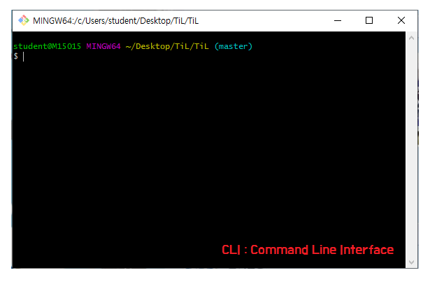

# Git ?

**분산형 버전 관리 시스템(DVCS - Version Control System)**

by 리누스 토르발즈


> git status

window : **graphical user interface** - gui


## 1. 기초 명령어 실습



> ls


> ls -al     
>
> * (숨긴 파일까지 조회)


> git init
>
> * /.git 이라는 폴더 생성
>   * 하위 폴더에서 init 하는 실수는 절대 하지 않아야 한다.


> git status


> touch a.txt
>
> * 파일 생성


> git rm --cached a.txt
>
> * 커밋 취소


* 물리적으로 삭제되는 것이 아니라 커밋 내역에서만 삭제된다. 
  * 이것을 해주지않으면 git ignore가 먹히지 않는다.

> git log
>
> * 커밋 내역 정리


* 한 줄로 보기


> git status


> git restore --staged <file>...
>
> * add 취소 명령어

> git commit --ammend
>
> >  esc i  :wq


> git restore <file>


> git ignore


> git remote -v
>
> * 원격 저장소 조회


> git config --global -l
>
> git config -l
>
> * 환경 설정 보기


> git config --global user.email
>
> * 유저 이름 바꾸기


## 2. Git status를 통해 정리하기

### 기초 명령어 정리

```bash
# list (파일 목록)
$ ls
# change directory
$ cd
# 빈 파일 생성
$ touch <파일명>
```

### 상황

#### 1. `add` 

```bash
$ touch a.txt
$ git status
On branch master

No commits yet
# 트래킹x - ? 새로 생성된 파일.
Untracked files:
	# 커밋을 하기 위한 곳에 포함시키려면
	# Staging area로 이동시키려면, git add 
  (use "git add <file>..." to include in what will be committed)  
        a.txt
# working directory에 새로운 파일 존재. Staging area에 어떠한 파일도 없다는 총평
nothing added to commit but untracked files present (use "git add" to track)
```


```bash
$ git add a.txt
$ git status
On branch master

No commits yet
# 커밋될 변경사항들(staging area O)
Changes to be committed:
#unstage를 위해서 활용할 명령어 (add 취소)
  (use "git rm --cached <file>..." to unstage)

```


#### 2. `commit`

```bash
$ git commit -m 'Create a.txt'
[master (root-commit) b69dfc0] Create a.txt
 261 files changed, 25769 insertions(+)
$git status
```

* 커밋 내역 확인

```bash
$ git log
commit b69dfc0d961a5f9d549f8e1d63bb4b5ff6fc835e (HEAD -> master)
Author: So-Youn <soyoun3963@gmail.com>
Date:   Thu Apr 23 10:37:18 2020 +0900

    Create a.txt

```

#### 3. 추가 파일 변경 상태

```bash
$ touch b.txt
$ git status
On branch master
Changes not staged for commit:
  (use "git add <file>..." to update what will be committed)
  (use "git restore <file>..." to discard changes in working directory)
        modified:   a.txt

Untracked files:
  (use "git add <file>..." to include in what will be committed)
        b.txt

no changes added to commit (use "git add" and/or "git commit -a")

$ git add a.txt
$ git status
On branch master
Changes to be committed:
  (use "git restore --staged <file>..." to unstage)
        modified:   a.txt

Untracked files:
  (use "git add <file>..." to include in what will be committed)
        b.txt

```

#### 4. 커밋 메시지 변경

> **주의 !!!** 커밋 메시지 변경 시 해시값 자체가 변경되어,
>
> 이미 원격저장소에 push 한 이력에 대해서는 메시지 변경을 하면 안된다.

```bash
$ git commit --amend
[master f24bc84] a.txt 추가중입니:w다
 Date: Thu Apr 23 10:47:55 2020 +0900
 1 file changed, 6 insertions(+), 1 deletion(-)
```

* `vim`텍스트 편집기가 실행된다
  * `i` : 편집 모드 
  * `esc` : 편집모드 종료하고, 명령모드에서
    * `:wq` : write +quit 

##### 4-1 특정 파일을 빼놓고 커밋했을 때

```bash
$ git add <omit_file>
$ git commit --amend
```

* 빠뜨린 파일을 `.add` 한 이후에 `commit --amend`를 하면, 해당 파일까지 포함하여 재 커밋이 이뤄진다.

```bash
  (use "git restore <file>..." to discard changes in working directory)
        modified:   a.txt
        
 $ git restore a.txt
```

#### 5. 작업 내용을 이전 버전으로 되돌리기

* a.k.a 작업하던 내용 버리기

```bash
$ git status
On branch master
Changes not staged for commit:
  (use "git add <file>..." to update what will be committed)
  # wd 변경사항을 버리기 위해서는 restore
  (use "git restore <file>..." to discard changes in working directory)
        modified:   a.txt

no changes added to commit (use "git add" and/or "git commit -a")
$ git restore
$ git status
On branch master
nothing to commit, working tree clean

```

#### 6.  특정 파일/폴더 삭제 커밋

> 해당 명령어는 실제 파일이 삭제되는 것은 아니지만, git에서 삭제되었다라는 이력을 남기는 것

```bash
 $git rm --cached b.txt
 
 Changes to be committed:
  (use "git restore --staged <file>..." to unstage)
        deleted:    b.txt

Untracked files:
  (use "git add <file>..." to include in what will be committed)
        b.txt
# 주의 !! 해당 파일이 물리적으로 삭제 된 것은 아니다.
```

* 일반적으로는 `.gitignore`와 함께 활용한다.

  1. `gitignore`에 해당 파일 등록
  2. `git rm --cached`를 통해 삭제 커밋

  * 이렇게 작업하면, 실제 파일은 삭제되지 않지만 이후로 git으로 전혀 관리되지 않는다.

#### 7. [git ignore](https://www.gitignore.io/)

> git으로 관리하고 싶지 않은 파일(환경 설정이나 공개,,,)을 등록하여 활용할 수 있다.

* 일반적으로 프로젝트 환경 (IDE, OS 등)에 관련된 정보나 추가적으로 공개되면 안되는 데이터 파일 등을 설정한다.

*  일반 프로젝트 환경에 대한 정보는 우선 [Gitignore](https://www.gitignore.io/)에서 프로젝트를 시작할 때마다 정의하는 습관을 가지자.

 


* git ignore : 
  * 이미 한번 tracking 이 되면 ignore가 먹히지 않는다.
  * 이럴 때는 rm --cached와 ignore를 동시에 해주어야 이력이 남지 않는다.

```bash
# 특정 파일
secret.csv
# 특정 폴더
idea/
# 특정 확장자
*.csv
#특정 폴더에서 특정 파일 빼고
!idea/a.txt
```

#### 8. 원격 저장소 활용 명령어

```bash
# 원격 저장소 설정
$ git remote add origin  https://github.com/So-Youn/TiL.git
$ git remote add origin {URL}
# 깃아 원격저장소에 추가해줘 오리진이라고 url을...
# 원격저장소 목록 조회
git remote -v
# 원격 저장소 설정 삭제
git remove rm {원격저장소 이름}
```


