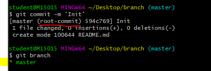
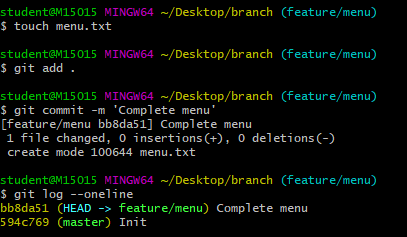
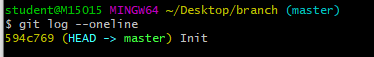
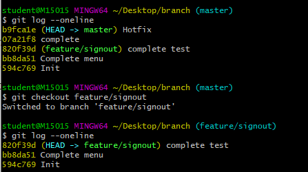
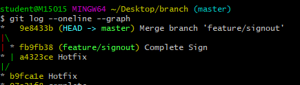
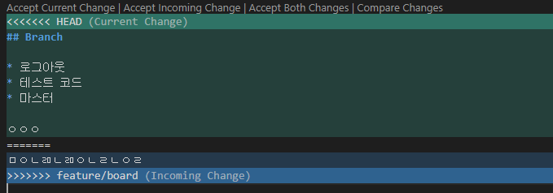
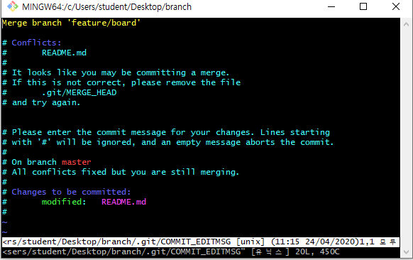
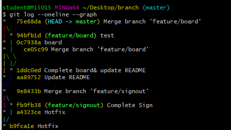

# Git branch

[Git 추천 책](https://git-scm.com/book/ko/v2) 

* 동시 작업 시 독립적인 작업흐름을 위함.

  

  ```bash
  $ git checkout feature/menu
  
  Switched to branch 'feature/menu'
  
  $ git checkout master
  
  Switched to branch 'master'
  ```

  

  

  * `git log` 시 이력이 다를 뿐 파일이 사라지는 것이 아니다. 
  * branch는 병합이 되면 가지가 끊기기 때문에 병합이 완료된 브랜치는 삭제한다.
  * 이후, master로부터 새로운 이름의 브랜치를 만들어 작업해야 한다.

  

## 1. branch 관련 명령어

> Git 브랜치를 위해 root-commit을 발생시키고 진행

1. 브랜치 생성

    ```bash
    (master) $ git branch {브랜치명}
    ```

2. 브랜치 이동

    ```bash
    (master) $ git checkout {브랜치명}
    ```

3. 브랜치 생성 및 이동

    ```bash
    (master) $ git checkout -b {브랜치명}
    ```

4. 브랜치 삭제

    ```bash
    (master) $ git branch -d {브랜치명}
    ```

5. 브랜치 목록

    ```bash
    (master) $ git branch
    ```

6. 브랜치 병합

    ```bash
    (master) $ git merge {브랜치명}
    ```

	* master 브랜치에서 {브랜치명}을 병합

## 2. branch 병합 시나리오

> branch 관련된 명령어는 간단하다.
>
> 다양한 시나리오 속에서 어떤 상황인지 파악하고 자유롭게 활용할 수 있어야 한다.

### 상황 1. fast-foward

> **fast-foward**는 feature 브랜치 생성된 이후 master 브랜치에 변경 사항이 없는 상황

1. feature/test branch 생성 및 이동

   ```bash
   (master) $ git checkout -b feature/test
   
   Switched to a new branch 'feature/test'
   (feature/test)$
   ```

   

2. 작업 완료 후 commit

   ```bash
   $ touch test.txt
   $ git add .
   $ git commit -m 'Complete test'
   ```


3. master 이동

   ```bash
   (feature/test) $ git checkout master
   Switched to branch 'master'
   (master) $
   ```
   
   


4. master에 병합

   ```bash
   (master) $ git merge feature/test
       Updating bb8da51..820f39d
       Fast-forward
        test.txt | 0
        1 file changed, 0 insertions(+), 0 deletions(-)
        create mode 100644 test.txt
   
   ```
   
   


5. 결과 -> **fast-foward** (단순히 HEAD를 이동)

   ```bash
   $ git log --oneline
   820f39d (HEAD -> master, feature/test) complete test
   bb8da51 Complete menu
   594c769 Init
   ```

   

6. branch 삭제

   ```bash
   $ git branch -d feature/test
   Deleted branch feature/test (was 820f39d).
   ```
   
   

---

### 상황 2. merge commit - 충돌 발생 x

> 서로 다른 이력(commit)을 병합(merge)하는 과정에서 **다른 파일이 수정**되어 있는 상황
>
> git이 auto merging을 진행하고, **commit이 발생된다.**

1. feature/signout branch 생성 및 이동

   ```bash
   $ git checkout -b feature/signout
   ```

   

2. 작업 완료 후 commit

   ```bash
   $ touch signout.txt
   $ git add .
   $ add commit -m 'Complete signout'
   ```

   

3. master 이동

   ```bash
   2dfe2d8 (HEAD -> feature/signout) Complete signout
   4580910 Complete test
   a897640 Complete menu
   65b6242 Init
   
   07c50a5 (HEAD -> master) Hotfix
   4580910 Complete test
   a897640 Complete menu
   65b6242 Init
   ```

   

   

   ```bash
   
   ```

   

4. *master에 추가 commit 이 발생시키기!!*

   * **다른 파일을 수정 혹은 생성하세요!**

   ```bash
   $ touch Hotfix.txt
   $ git add .
   $ git commit -m 'Hotfix'
   ```

   

5. master에 병합

   ```bash
   (master) $ git merge feature/signout
   Merge made by the 'recursive' strategy.
    signout.txt | 0
    1 file changed, 0 insertions(+), 0 deletions(-)
    create mode 100644 signout.txt
   ```

   

6. 결과 -> 자동으로 *merge commit 발생*

   ```bash
   $ git log --oneline
   3348e1f (HEAD -> master) Merge branch 'feature/signout'
   07c50a5 Hotfix
   2dfe2d8 (feature/signout) Complete signout
   4580910 Complete test
   a897640 Complete menu
   65b6242 Init
   ```

   

   * vim 편집기 화면이 나타납니다.

   * 자동으로 작성된 커밋 메시지를 확인하고, `esc`를 누른 후 `:wq`를 입력하여 저장 및 종료를 합니다.
      * `w` : write
      * `q` : quit
      
   * 커밋이  확인 해봅시다.

7. 그래프 확인하기

   ```bash
   $ git log --oneline --graph
   ```

   

8. branch 삭제

   ```bash
   $ git branch -d feature/signout
   ```

   

---

### 상황 3. merge commit 충돌

> 서로 다른 이력(commit)을 병합(merge)하는 과정에서 **같은 파일의 동일한 부분이 수정**되어 있는 상황
>
> git이 auto merging을 하지 못하고, 충돌 메시지가 뜬다.
>
> 해당 파일의 위치에 표준형식에 따라 표시 해준다.
>
> 원하는 형태의 코드로 직접 수정을 하고 직접 commit을 발생 시켜야 한다.

1. feature/board branch 생성 및 이동

   ```bash
   $ git checkout -b feature/board
   ```

   

2. 작업 완료 후 commit

   ```bash
   $ touch board.txt
   $ git add.
   $ git commit -m '게시판 기능 구현 완료'
   ```
   
   


3. master 이동

   ```bash
   $ git checkout master
   ```
   
   


4. *master에 추가 commit 이 발생시키기!!*

   * **동일 파일을 수정 혹은 생성하세요!** 

5. master에 병합

   ```bash
   $ git merge feature/board
   ```
   
   


6. 결과 -> *merge conflict발생*

   > git status 명령어로 충돌 파일을 확인할 수 있음.
   
   ```bash
   $ git status
   On branch master
   You have unmerged paths.
     (fix conflicts and run "git commit")
     (use "git merge --abort" to abort the merge)
   
   Unmerged paths:
     (use "git add <file>..." to mark resolution)
           both modified:   README.md
   ```
   
   


7. 충돌 확인 및 해결

   * 해당 파일을 원하는 대로 수정
   
   ```t
   <<<<<Head
   * 마스터 작업
   ===========
   >>>>>>>>feature/board
   ```
   
   * 이후 commit
   
     ```bash
     $ git add .
     $ git commit
     ```
   
     
   
   * visual code에서 해결해주어도 된다.
   
   


8. merge commit 진행

    ```bash
    $ git commit
    ```

   * vim 편집기 화면이 나타납니다.
   
   
   
   * 자동으로 작성된 커밋 메시지를 확인하고, `esc`를 누른 후 `:wq`를 입력하여 저장 및 종료를 합니다.
      * `w` : write
      * `q` : quit
   * 커밋을  확인 해봅시다.
   
   ```bash
   $ git commit
   [master 75e88da] Merge branch 'feature/board'
   ```
   
   
   
9. 그래프 확인하기

    


10. branch 삭제

    