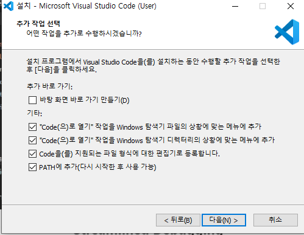
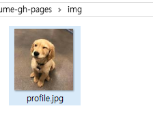
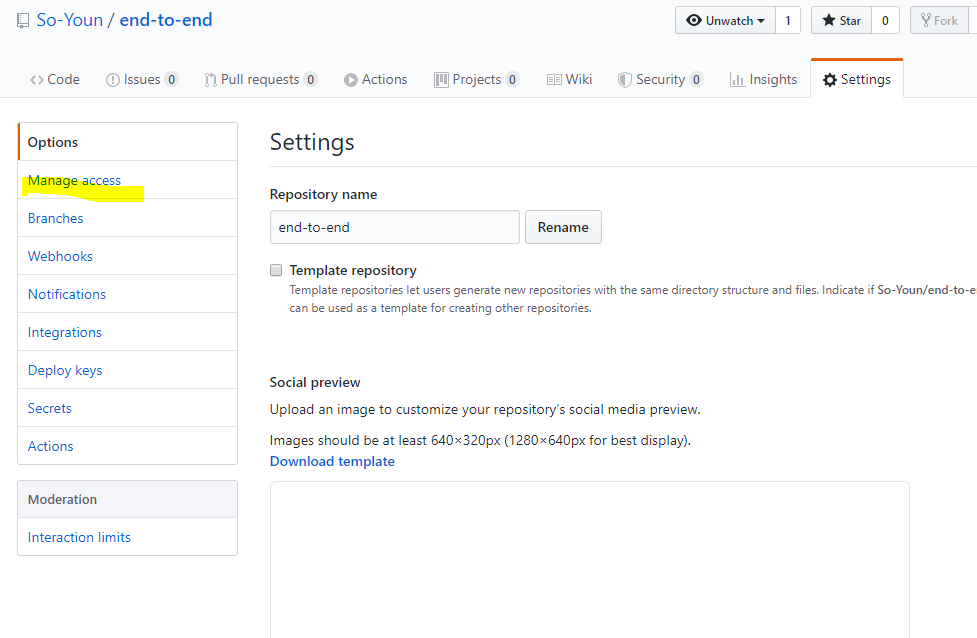

## Github Pages

## 정적 사이트 생성기 (generator)

.md ===> HTML/CSS , JS


jekyll(ruby)

- 오래되고 자료가 많다.

gatsby (js, react + graphql)

* 최신, 근데 유명해서 자료도 많음

### Visual studio code


* [start bootstrap](https://startbootstrap.com/)

* [visual studio code](https://code.visualstudio.com/docs/?dv=win) 



* image 수정



# Branch 병합 

*git branch 파일 새로 만들었음 참고*


```bash
$ git branch feature/menu

$ git branch
  feature/menu
* master

```

* 브랜치 이동 명령어 


HEAD : LinkedList 

* 이력이 다르게 관리될 뿐 파일이 사라진 것은 아니다.


```bash
$ git merge feature/menu

Updating 594c769..bb8da51
Fast-forward
 menu.txt | 0
 1 file changed, 0 insertions(+), 0 deletions(-)
 create mode 100644 menu.txt
```

```bash
$ git branch -d feature/menu
Deleted branch feature/menu (was bb8da51).
```




## Stash

> 작업 내역을 임시 저장할 수 있음

### 기본 명령어

1. stash 공간에 작업 내역 저장

   ```bash
   $ git stash
   ```

2. stash list 보기

   ```bash
   $ git stash list
   ```

3. 임시 공간 내용 가져오기

   ```bash
   $ git stash pop
   ```

   

#### 예시]

* 로컬에서 작업하고 있던 중, pull을 받아서 원격 저장소에  새로운 내용을 반영해야 하는 경우

```bash
$ git pull origin master

```

* 해결 방안

```bash
$ git stash
$ git pull origin master
# 만약 동일 파일 수정이 있으면, conflict 를 발생시킨다.
$ git stash pop
```


### reset vs revert

1. reset

   * 특정 버전으로 되돌아가는 작업

   ```bash
   $ git reset {커밋해시코드}
   ```

   * reset 명령어의 결과는 다음과 같다

   ```bash
   $ git log --oneline
   275a7e2 ddd
   00d69a4 (origin/master) update README.md
   $ git reset 00d69a4
   $ git log --oneline
   ```
   
   * reset 옵션
     * 기본 : 이전 이력의 변경 사항을 WD에 보존
     * --hard : 이전 이력의 병경 사항은 모두 삭제, 주의
   
2. revert 

   * 특정 시점을 되돌렸다는 커밋 발생

   ```bash
   $ git log --oneline
   275a7e2 ddd
   00d69a4 (origin/master) update README.md
   $ git reset 00d69a4
   $ git log --oneline
   bca6426 (HEAD->master) Revert 'ddd'
   275a7e2 ddd
   00d69a4 (origin/master) update README.md
   ```

   

hard : 과거 시점으로 돌아가, 이력이 보존되지 않는다.


```bash
$ git revert {시점}
```

