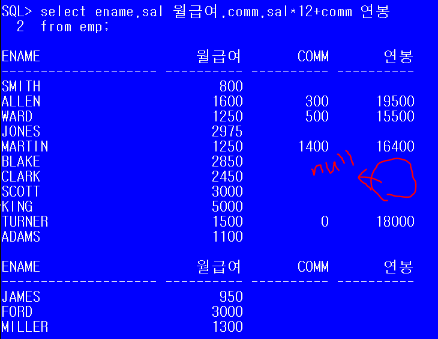

## 1. 클래스의 구성요소

*어떤 데이터가 필요한지, 어떤 기능이 있는지 중요!*

> `클래스`  객체를 정의해놓은 것.  or 객체의 모든 속성과 기능이 정의되어 있다.
>
> 클래스는 객체를 생성하는데 사용되며, 객체는 클래스에 정의된 대로 생성된다.
>
> `객체`는 실제로 존재하는 것. 사물 또는 개념
>
> 객체가 가지고 있는 기능과 속성에 따라 다르다.

클래스로부터 객체를 만드는 과정을 클래스의 인스턴스화(instantiate), 어떤 클래스로부터 만들어진 객체를 그 클래스의 `인스턴스(instance)`라고 한다.
```java
Tv t;				//Tv 클래스의 참조변수 t 선언. 
					//메모리에 참조변수 t를 위한 공간이 마련된다.
t = new Tv();		//연산자 new에 의해 Tv 클래스의 인스턴스가 메모리의 빈 공간에 생성.
					//생성된 객체의 주소값이 참조변수 t에 저장된다.(instance 접근 가능)
// Tv t = new Tv();
t.channel = 7;		//instance의 멤버변수 channel에 7 저장
t.channelDown();	//channelDown메서드 호출
Tv[] tvArr = new Tv();  	//객체 배열
```

### 1.1 멤버변수(데이터타입 데이터 ;)

>클래스 정의하고 멤버변수 정의(api에 있는 class와 사용방법 동일)
> * 멤버변수 정의할 때는 특별한 경우를 제외하고 초기값을 주지 않는다
> * 초기값을 정의하지 않아도 참조형은 null, 정수형은 0, 실수형은 0.0, boolean은 false
> * 멤버변수를 정의할 때 접근 제어자를 추가해서 접근을 제어할 수 있다.
> * 추가할 수 있는 접근 제어자의 종류 : 
>    * 		public
>    * 		default
>    * 		protected
>    * 		private  : 외부에서 보지 못하게 감춘다. (같은 패키지의 클래스에서도 접근 불가능)
> * 	클래스를 정의할 떄 멤버변수는 private으로 선언해서 외부에서 접근할 수 없도록 정보를 은닉하고 `public 메소드`를 통해서 접근할 수 있도록 구현한다.

```java
		//메소드명 : set + 멤버 변수 명(첫 글자를 대문자로 바꾼)
		// 		 setName
		public void setName(String name) { 	//setter메소드
			this.name = name;
		}
		
		//name변수에 저장된 값을 호출하는 곳으로 넘겨줄 메소드
		//메소드명 : get + 멤버 변수명(첫 글자를 대문자로 바꾼)
		// 		 getName
		public String getName() {			//getter메소드
			return this.name;
		}
		Person p1 = new Person();			//new 연산자
		p1.setName("장동건");
```


### 1.1.2 지역변수(local variable)

> 메서드 내에 선언된 변수들은 그 메서드 안에서만 사용 가능.
>
> 서로 다른 메서드라면 같은 이름의 변수 선언 가능

```java
int add(int x, int y){
    int result = x + y;
    return result;
}
int multiple(int x, int y){
    int result = x * y;
    return result;
}

int result = add(3,5); // 메서드 호출
```


### 1.2 메소드(기능)

속성(property) -> 멤버변수(variable)

기능(function) -> 메서드(method) 

>  객체는 속성과 기능, 두 종류의 구성요소로 이루어져 있으며,  일반적으로 객체는 다수의 속성과 다수의 기능을 가진다.
>
> `메서드(method)` 는 특정 작업을 수행하는 일련의 문장들을 하나로 묶은 것.

* 메서드를 사용하는 이유
  * 높은 재사용성
  * 중복된 코드의 제거
  * 프로그램의 구조화

```java
public return타입 메소드이름 (데이터타입 타입변수명,...)			//선언부(header)
{
    //메서드 호출시 수행될 코드
    //구현부(body)
}
public int add(int num1, num2 ){	//숫자 2개를 매개변수로 전달받아 더해서
    								//결과를 리턴하는 메소드
    int result = num1 + num2;
    return result; 		//호출한 메서드로 결과 반환.
}
    

```

* 반환값이 없는 경우 ( =실행 결과가 없는 경우) return type :  void
  * 반환타입이 void 가 아닌 경우, 구현부 {} 안에 반드시 `return 반환값;`  이포함
  * 이 값의 타입은 변환타입과 일치하거나, 적어도 자동 형변환이 가능해야 함.

#### [예제]	

```java
public class Account {
	private String account;
	private int balance;
	private double interestRate;
public String getAccount() {
	return account;
}

public void setAccount(String account) {
	this.account = account;
}

public int getBalance() {
	return balance;
}
public void setBalance(int balance) {
	this.balance = balance;
}
public double getInterestRate() {
	return interestRate;
}

public void setInterestRate(double interestRate) {
	this.interestRate = interestRate;
}
public double calculateInterest() {
	double interest = this.balance *this.interestRate;
	return interest;
}
public void deposit(int money) {
	this.balance = balance + money;
}
```


```java
public class AccountTest {

	public static void main(String[] args) {
		Account s1 = new Account();
		s1.setAccount("441-0290-1203");
		s1.setBalance(500000);
		s1.setInterestRate(0.073);

		s1.print();
		s1.deposit(20000);
		s1.print();
		
	
		double interest = s1.calculateInterest();
		
		System.out.println(+interest);
	}

}
```



### 1.3생성자

## 2. OOP 특성

### 2.1 캡슐화

### 2.2 상속성

### 2.3 다형성

