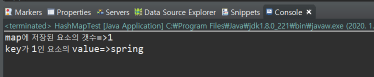
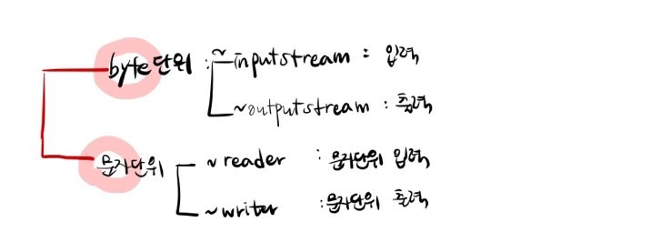
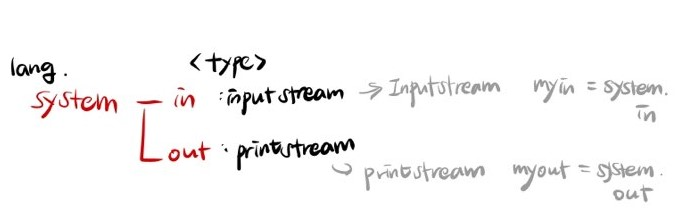
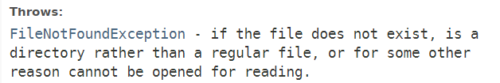
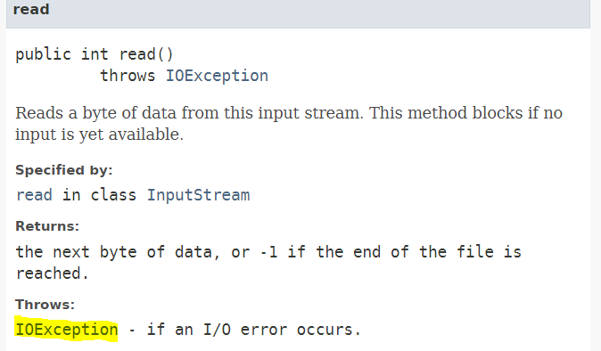
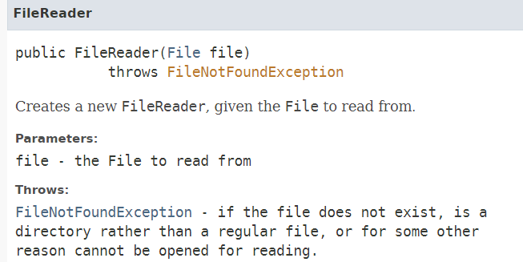
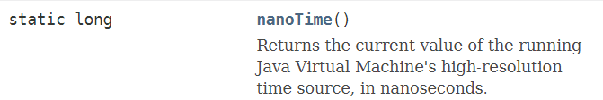
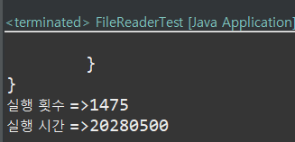
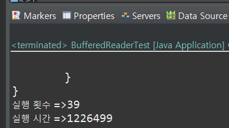

# Util Package

## 1. HashSet

1. set에 저장된 요소를 추출


```java
HashSet<String> set1 = new HashSet<String>();
```

* HashSet 데이터를 표준 인터페이스인 **Iterator** 로 변환
  * **Iterator** : 모든 자료구조에 담긴 데이터를 변환해서 담을 수 있도록 제공되는 추출전용 인터페이스 

```java
Iterator<String> it = set1.iterator();
```

2. 변환한 후 추출

* **hasNext()** : Iterator안에 저장요소가 있는지를 확인 
  * `boolean`  리턴
  *  `Iterator` 가 가리키는 데이터저장소의 현재 위치에서 이동할 항목이 있는지 체크 ( 순방향 )
* **next()** : Iterator에 저장된 요소를 하나씩 꺼내서 반환
  * 실제로 Iterator가 자신이 가리키는 데이터저장소에서 현재위치를 순차적으로 하나 증가해서 이동하는 것

```java
while(it.hasNext()) {
			String data = it.next(); 
			System.out.println("꺼낸 요소 :"+ data);
			//순서대로 반환되지 않는다
		}
		for(String data:set1) {
			System.out.println("set에 저장된 요소:"+data);
		}
```

* 합집합 
  * `Set`객체를 생성할 때 합집합으로 표현할 `Set`을 생성자의 매개변수로 전달

```java
HashSet<String> set2 = new HashSet<String>(set);
		set2.add("servlet");
		print(set2,"set2");
```

* 교집합
  * for문을 돌려서 일일이 비교하지 않기 위해 set과 set3에 저장된 요소 중 중복되는 요소만 가지고 새로운 set구조를 만든다
  * set과 set3을 비교해서 일치하는 것만 남기고 나머지는 제거된다.

```java
HashSet<String> set3 = new HashSet<String>();
set.retainAll(set3);
```

## 2. HashMap

**HashMap** : `key`와 `value`를 한 쌍으로 저장

* Generic `<>`으로 데이터 타입을 명시할 때도 `key`에 대한 타입, `value`에 대한 타입을 같이 정의해야 한다.

  * map에서는 key로 요소를 구분하기 때문에 key가 같으면 덮어쓴다.

  ```java
  map.put(1, "servlet");
  		map.put(1, "jsp");
  		map.put(1, "spring");
  		System.out.println("map에 저장된 요소의 갯수=>"+map.size());
  		System.out.println("key가 1인 요소의 value=>"+map.get(1));
  ```

  

  * map은 key를 이용해서 저장될 위치를 계산하기 때문에 저장된 순서대로 출력되지 않는다.

* map에 저장된 데이터 모두 출력하기

  ```java
  		//1.key 목록을 추천한다
  		Set<String> keylist = map2.keySet();
  		//2.반복문 안에서 key 이용해서 value를 추출한다.
  		for(String key : keylist) {
  			String value = map2.get(key);
  			System.out.println(key+":"+value);
  		}
  ```

* **keySet()**  : Returns a **set<k>** view of the keys contained in this map.

* **get(Object key)** : Returns the value to which the specified key is mapped, or `null` 

# IO Package



## 1. File


- `File(String pathname)` Creates a new `File` instance by converting the given pathname string into an abstract pathname.

```java
File file= new File("c:/iot/iotest");
```

* `listFiles()` Returns **an array - File[]** of abstract pathnames denoting the files in the directory denoted by this abstract pathname.

```java
File[] list = file.listFiles();
for(int i=0;i<list.length;i++) {
			if(list[i].isDirectory()) {
				System.out.println(list[i].getName()+"-----[폴더]");
			}else {
				System.out.println(list[i].getName()+"-----[파일:("+list[i].length()+")]");
			}
		}
```

***exists()는*** ***지정한 경로에*** ***디렉토리/파일 구분없이 존재하는지를 확인***

***isFile()은 지정한 경로에 파일이 있는지 확인***

***isDirectory()는 지정한 경로에 디렉토리(폴더)가 있는지 확인하고 있음***



### 1] FileInputStream

* A `FileInputStream` 는 file system의 file로부터 input bytes를 얻는다.





### 2] FileReader







### 3] BufferedReader

* `BufferedReader`는 **보조스트림** 으로 원시데이터와 연결할 수 없으므로 원시데이터를 읽을 수 있는 기본스트림을 생성해서 넘겨주어야 한다.

```java
 BufferedReader in
   = new BufferedReader(new FileReader("foo.in"));
```

* 버퍼를 거쳐서 간접적으로 출력장치로 전달되기에 **시스템의 데이터처리 효율성을 높여주며** 버퍼스트림을 `InputStreamReader` / `OutputStreamWriter`를 같이 사용하여 버퍼링을 하게 되면 입출력 스트림으로부터 미리 버퍼에 데이터를 갖다 놓기 때문에 보다 **효율적인 입출력이 가능** 합니다.

* **String readLine()**  : 스트림으로부터 **한 줄**을 읽어 문자열로 리턴
  * 리턴값이 `String`으로 고정되기에 String이 아닌 다른타입으로 입력을 받을려면 형변환을 해주어야한다

```java
while (true) {
				String data = br.readLine();
				if (data == null) {
					break;
				}
				count++;
				System.out.println(data);
			}
```

* FileReader 보다 실행 횟수가 훨씬 적다. -> 효율적



### 4]  FileWriter

* file 출력은 매개변수로 전달된 파일이 있으면 해당 파일을 열고 작업하지만 없는 경우 새로 파일을 생성하여 작업한다.

```java
public FileWriter(File file,
                  boolean append)
           throws IOException
```

* write메소드가 호출될 때마다 파일에 내용을 추가 
  *  `append` 를 `true` 로 준다

```java
FileWriter fw = new FileWriter("src/data/output2.txt",true);
```

* 파일 액세스
  * `write()` 

## InputStream

* 모든 `inputStream`으로 나타내는 클래스의 상위 클래스 (추상 클래스)
*  `InputStream` 의 서브클래스로 정의되는 Applications은 항상 `the next byte of input` 을 반환해야 한다.

```java
public abstract int read()
                  throws IOException
```

* **read()** 는 `inputStream` 의 다음 1byte를 읽는다. 
  * return : `int`


